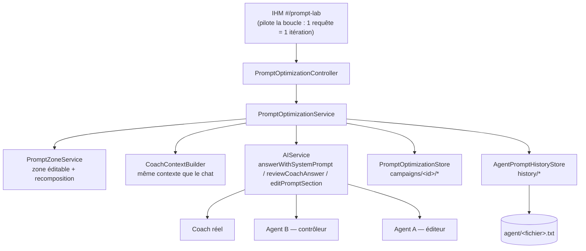
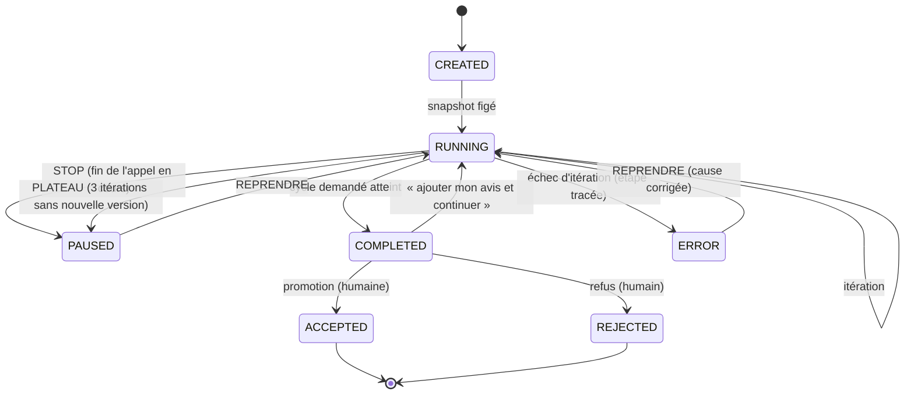

# Atelier d'amélioration itérative des prompts — livrable

> **Agent A** (éditeur de prompts) ↔ **Agent B** (contrôleur qualité), pilotés par un humain.
> Version : 2026-09-16 · POC « Coach financier » (Spring Boot 4.1.1 / Java 17 + React 19 / Vite).

Ce document est le **livrable final** demandé par la spécification `prompt/prompt_auto.md` (§51) :
fichiers créés et modifiés, architecture, endpoints, modèles, machine d'état, format de persistance,
règles de snapshot / STOP / REPRENDRE / promotion, prompts des deux agents, tests, limites restantes et
procédure de test manuel de bout en bout.

---

## 1. Objectif et principes

Améliorer un prompt « au feeling » ne prouve rien : on ne sait pas **ce qui** a changé, ni si le gain vient du
prompt ou d'une autre conversation. L'atelier transforme cette intuition en **expérience reproductible** :

| Principe | Traduction dans le code |
|---|---|
| **Reproductibilité** | Un *snapshot de référence* gèle la question, les données, la classification d'intention, le projet et le prompt hors zone (§6) |
| **Une seule zone modifiable** | Les prompts métier portent une zone `[[[ … ]]]` (jamais envoyée au LLM) ; le backend recompose le prompt lui-même |
| **Protection backend** | Toute proposition qui sort de la zone, contient un délimiteur, est vide ou trop longue est **rejetée** ; la version précédente est conservée |
| **Séparation stricte A / B** | L'Agent B **diagnostique**, l'Agent A **réécrit la zone** : aucun des deux ne peut faire le travail de l'autre |
| **Feedback humain prioritaire** | Un avis humain est appliqué par l'Agent A **avant** le prochain appel au Coach, et son application est tracée |
| **Arrêt gracieux** | `STOP` n'interrompt jamais un appel IA : la réponse en cours est sauvegardée, puis la campagne passe en pause |
| **Aucune modification automatique de production** | La **promotion** est une action humaine confirmée, avec sauvegarde préalable du prompt remplacé |
| **Historique complet** | Itérations, versions, diagnostics, avis et décisions restent consultables, y compris après un redémarrage |
| **Plafond backend** | 50 itérations **cumulées** par campagne (le plafond applicatif est réglable en dessous) |
| **Un fournisseur par étape** | Le coach, l'Agent B et l'Agent A peuvent utiliser des modèles **différents** (voir §17) |

---

## 2. Fichiers créés

### 2.1 Agents de l'atelier (prompts)

| Fichier | Rôle |
|---|---|
| `agent/prompt_controller.txt` (+ `src/main/resources/agent/`) | **Agent B** — contrôleur qualité : contrat JSON de diagnostic |
| `agent/prompt_editor.txt` (+ `src/main/resources/agent/`) | **Agent A** — éditeur : renvoie **uniquement** `editableSection` |

### 2.2 Backend

| Fichier | Rôle |
|---|---|
| `model/PromptOptimizationModels.java` | Diagnostics, versions, itérations, snapshot, campagne, statuts, libellés |
| `config/PromptOptimizationProperties.java` | `app.prompt-optimization.*` |
| `service/PromptZoneService.java` | Zone `[[[ … ]]]` : `parse`, `validateEditableSection`, `compose`, `hash` |
| `service/CoachContext.java` | Contexte complet d'un message (record) |
| `service/CoachContextBuilder.java` | Construction du contexte, **extraite** de `ChatController` |
| `service/PromptOptimizationStore.java` | Persistance des campagnes (JSON/JSONL atomiques, verrou) |
| `service/PromptOptimizationService.java` | Machine à états, itérations, avis humain, promotion |
| `service/AgentPromptHistoryStore.java` | Sauvegardes de prompts avant promotion (rollback) |
| `controller/PromptOptimizationController.java` | API REST `/api/prompt-optimization/**` |

### 2.3 Frontend

| Fichier | Rôle |
|---|---|
| `frontend/src/PromptLab.tsx` | Page `#/prompt-lab` (atelier complet) |
| `frontend/src/types.promptopt.ts` | Types TypeScript de l'API |

### 2.4 Tests ajoutés (11 suites)

`ai/AgentFilesPromptTest` · `ai/MockAIServiceAtelierTest` · `ai/RemoteAIServicePromptResolutionTest` ·
`controller/ChatControllerTest` · `controller/PromptOptimizationControllerTest` ·
`model/PromptOptimizationModelsTest` · `service/CoachContextBuilderTest` ·
`service/PromptOptimizationServiceTest` · `service/PromptOptimizationStoreTest` ·
`service/PromptZoneServiceTest` · `service/AgentPromptHistoryStoreTest`

---

## 3. Fichiers modifiés

| Fichier | Modification |
|---|---|
| `agent/principal.txt`, `assurance-auto.txt`, `assurance-emprunteur.txt`, `assurance-habitation.txt`, `credit-conso.txt`, `credit-immo.txt`, `epargne.txt` (+ copies `src/main/resources/agent/`) | Paire de marqueurs `[[[` / `]]]` ajoutée (zone éditable). `generic.txt` **non** marqué : c'est le gabarit figé (`[agent_principal]`, `[agent]`) |
| `ai/AgentFiles.java` | `ZONE_START` / `ZONE_END`, `composeSystemPrompt(...)` **pure**, `stripZoneMarkers(...)`, accès aux prompts des deux agents de l'atelier |
| `ai/AIService.java` | `answerWithSystemPrompt(...)`, `reviewCoachAnswer(...)`, `editPromptSection(...)` |
| `ai/RemoteAIService.java` | Prompt système imposé (rejeu du prompt figé), timeouts HTTP explicites, appels Agent A / Agent B |
| `ai/MockAIService.java` | Refus explicite de l'atelier en mode démo |
| `service/AgentPromptStore.java` | Entrées `prompt_controller` et `prompt_editor` (éditables page `#/agents`, hors `agents.json`) |
| `controller/ChatController.java` | Réduit à l'orchestration (≈190 lignes) après extraction du contexte |
| `src/main/resources/application.yml` | Bloc `app.prompt-optimization` |
| `frontend/src/api.ts` | 12 fonctions (`fetchPromptCampaign`, `iteratePromptCampaign`, `stopPromptCampaign`, `resumePromptCampaign`, `sendPromptHumanFeedback`, `retainPromptVersion`, `promotePromptVersion`, `rejectPromptCampaign`, `fetchPromptComparison`, …) |
| `frontend/src/main.tsx` | Route `#/prompt-lab` |
| `frontend/src/App.tsx` | Lien d'en-tête « Atelier d'optimisation des prompts » |
| `frontend/src/styles.css` | Bloc `.plab-*` (campagne, diff, avis humain, versions) |
| `docs/doc-fonctionnel.md`, `docs/doc-technique.md`, `docs/flux-architectural.md` | Documentation du module |

---

## 4. Architecture retenue



Choix structurants :

1. **Aucun appel LLM n'est dupliqué** : l'atelier réutilise la même composition de prompt et le même
   `CoachContextBuilder` que le chat. La seule différence est que le prompt système est **imposé**
   (`answerWithSystemPrompt`) au lieu d'être relu du disque.
2. **Le backend recompose toujours le prompt** (`préfixe + zone + suffixe`) : ce que renvoie l'Agent A n'est
   jamais utilisé tel quel comme prompt.
3. **La boucle est pilotée par l'IHM** (pas de file de tâches, pas d'asynchrone) : un arrêt gracieux devient
   naturel — le frontend cesse simplement d'envoyer l'itération suivante.
4. **Une seule campagne à la fois** : l'IHM ne propose pas de « reprendre une campagne », donc une nouvelle
   campagne **clôt automatiquement** les précédentes (`CANCELLED`). Les fichiers restent sur disque mais ne
   sont plus utilisés : aucun blocage possible (rechargement de page, onglet fermé pendant une campagne).

---

## 5. Endpoints ajoutés

| Méthode | URL | Rôle |
|---|---|---|
| GET | `/api/prompt-optimization/agents` | Agents + zones optimisables, `maxIterations`, **`hardMaxIterations`** (50), `enabled`, `demoMode`, tables de libellés |
| GET | `/api/prompt-optimization/campaigns` | Campagnes connues (**non utilisée par l'IHM**, qui ne propose pas de reprendre une campagne passée) |
| POST | `/api/prompt-optimization/campaigns` | Démarre une campagne `{agentId, question, iterations, zoneKey, provider, controllerProvider, editorProvider, threadId}` (les fournisseurs B/A sont facultatifs et retombent sur `provider` ; `threadId` poursuit une conversation) → `{campaign, thread}` |
| GET | `/api/prompt-optimization/campaigns/{id}` | Vue complète en **un** appel : campagne + snapshot + itérations + versions + avis + **fil de conversation** |
| POST | `/api/prompt-optimization/campaigns/{id}/iterate` | **Une** itération (Coach → Agent B → Agent A → validation → persistance) |
| POST | `/api/prompt-optimization/campaigns/{id}/stop` | Arrêt gracieux |
| POST | `/api/prompt-optimization/campaigns/{id}/resume` | Reprise `{additionalIterations}` |
| POST | `/api/prompt-optimization/campaigns/{id}/feedback` | Avis humain `{content}` |
| POST | `/api/prompt-optimization/campaigns/{id}/promote` | **Promotion** `{version}` → `PromotionResult` |
| POST | `/api/prompt-optimization/campaigns/{id}/reject` | Refus de la campagne |
| GET | `/api/prompt-optimization/campaigns/{id}/versions` | Versions (promues, production) |
| GET | `/api/prompt-optimization/campaigns/{id}/compare` | Comparaison initiale ↔ courante (prompts + réponses) |
| GET | `/api/prompt-optimization/campaigns/{id}/usage` | Itérations, appels IA, caractères, durée |
| GET | `/api/prompt-optimization/threads` | **Fils de conversation** connus, du plus récemment modifié au plus ancien |
| GET | `/api/prompt-optimization/threads/{threadId}` | Conversation complète d'un fil (tours validés, dans l'ordre) |
| PUT | `/api/prompt-optimization/threads/{threadId}/turns/{index}` | Corrige le contenu d'un tour `{content}` (l'humain garde la main sur ce qui sera rejoué) |

Erreurs : `400 BAD_REQUEST` (`IllegalArgumentException`) et `409 CONFLICT` (`IllegalStateException`), corps
`{"error": "...", "message": "..."}` — c'est exactement ce que lit `apiFetch` côté IHM.

### 5.1 Fil de conversation — la mémoire de l'atelier

Une campagne reste **une seule question**, mais les campagnes s'enchaînent dans un **fil de conversation** :
c'est ce qui permet de tester un prompt sur une **vraie conversation** (question 1 → itérations → promotion →
question 2 → itérations → …) au lieu d'une question isolée.

- **Un tour « assistant » n'entre dans la mémoire QUE par une promotion, et il porte la RÉPONSE DE LA VERSION
  ACCEPTÉE** : celle que le client recevrait avec le prompt désormais en production. Elle est **réutilisée** si une
  itération a déjà répondu avec cette version (aucun appel IA), sinon elle est **générée** par un rejeu du Coach
  avec cette version (+1 appel IA) — jamais la réponse qui a « motivé » le changement (générée avec la version
  précédente), sinon l'historique rejoué décrirait un prompt qui n'est plus en production. Une question dont
  aucune version n'a été acceptée n'entre jamais dans l'historique (pas de question sans réponse).
- Le fil est **associé à la campagne dès son démarrage** (`campaignIds`), et **la promotion y écrit l'échange**
  complet (question + réponse). Une **nouvelle promotion de la même campagne remplace son échange, à sa place**
  : aucun doublon, ordre chronologique conservé.
- Le cycle suivant reçoit l'**historique complet** (`conversationHistory`, même contrat que le chat) : il est
  **gelé dans le snapshot** (reproductibilité) et transmis au Coach, à l'Agent B et à l'Agent A.
- Le **projet courant** de l'échange précédent est transmis au classifieur puis conservé si la nouvelle question
  ne porte pas de projet propre (« et si j'allongeais la durée à 60 mois ? ») — même logique que le chat.
- Le fil appartient à **un agent** (`agentId`, `zoneKey`) : reprendre la conversation d'un autre agent est refusé
  avec un message explicite.
- IHM : bloc **« Conversation de l'atelier »** (mêmes bulles que la page coach) avec la question en attente
  (avant promotion), la réponse de l'IA par version promue (corrigeable), un champ « question suivante » et
  « Nouvelle conversation ». Le fil le plus récent de l'agent sélectionné est **rechargé à l'ouverture de la page**.
- **Agent B** : « TOUT LIRE, MAIS JUGER LE DERNIER ÉCHANGE UNIQUEMENT » — il lit l'historique pour comprendre le
  contexte, mais seuls la question courante et la réponse courante sont jugées (les réponses déjà validées ne
  sont jamais réévaluées).

---

## 6. Modèles ajoutés (`PromptOptimizationModels`)

- **Diagnostics** : `Issue` (type, sévérité, **origine**, observation, comportement attendu),
  `ControllerFeedback` (statut, résumé, points positifs, anomalies, à préserver, recommandation, revue humaine),
  `EditorResult` (statut, zone, changements, points traités, comportements préservés, points non résolus,
  avis humain appliqué).
- **Persistés** : `PromptVersion`, `Iteration` (réponse du Coach, diagnostic, édition, versions utilisée et
  résultante, indicateurs `noChange` / `humanFeedbackApplied`, statut, erreur, durée), `HumanFeedback`,
  `Snapshot`, `Campaign`.
- **Mémoire de l'atelier** : `Turn` (rôle `user` / `assistant`, contenu, campagne, **version promue**, date) et
  `ConversationThread` (identifiant, agent, zone, tours, campagnes associées) avec `withCampaign`,
  `withExchange` (remplacement en place, jamais de doublon), `withTurnContent`, `history()` (format du chat),
  `exchanges()`. Un rôle illisible devient un tour **`user`** : jamais une réponse IA inventée.
- **Normalisations tolérantes** : un statut illisible retombe sur `NEEDS_IMPROVEMENT` (Agent B) ou
  `HUMAN_OR_BUSINESS_REVIEW_REQUIRED` (Agent A) — jamais sur « tout va bien ».
- **Libellés** : `labels()` expose à l'IHM les tables françaises (statuts de campagne, d'itération, de
  contrôle, d'édition, sévérités, origines, types d'anomalie) : **aucun code technique à l'écran**.

---

## 7. Machine d'état d'une campagne



Statuts : `CREATED`, `RUNNING`, `STOP_REQUESTED`, `PAUSED`, `COMPLETED`, `ACCEPTED`, `REJECTED`, `ERROR`,
`CANCELLED`. Statuts d'itération : `RUNNING`, `COMPLETED`, `ERROR`.

Un `STOP` arrivé **pendant** les appels IA n'est jamais écrasé : l'itération est enregistrée puis l'état de la
campagne est **relu** avant écriture du statut final.

**Arrêt automatique sur PLATEAU** : si **3 itérations consécutives** ne produisent aucune nouvelle version (l'Agent A
ne propose plus rien), la campagne passe d'elle-même en `PAUSED` avec un message explicite, **sans consommer** les
itérations restantes du cycle (`MAX_CONSECUTIVE_NO_CHANGE = 3`). Le signal est **déterministe** — une itération sans
nouvelle version est une itération où `resultingVersion == promptVersion` : aucun « tag » n'est demandé au modèle,
donc rien d'aléatoire. La reprise (avec ou sans avis) reste possible : le compteur repart de la dernière version
réellement produite.

---

## 8. Format de persistance

```
data/prompt-optimization/
  campaigns/<campaignId>/                 # campaignId = po-AAAAMMJJ-HHMMSS-XXXX
    campaign.json                         # état, compteurs, promotion
    snapshot.json                         # tout ce qui est FIGÉ (+ hashes)
    iterations.jsonl                      # 1 ligne = 1 itération (append-only, dédoublonné)
    editions.jsonl                        # zones produites par un avis humain (hors itération)
    feedback.jsonl                        # avis humains (append-only, dernier état par feedbackId)
  history/
    promotions.jsonl                      # index chronologique des sauvegardes
    <backupId>-<fichier>.txt              # prompt AVANT promotion (rollback)
  threads/<threadId>.json                 # FIL DE CONVERSATION : tours + campagnes associées
```

- Écritures **atomiques** (fichier temporaire + `ATOMIC_MOVE`) ; JSONL **append-only** ; lignes illisibles
  comptées et ignorées ; identifiant de campagne validé par expression régulière (anti-traversée de chemin).
- Les campagnes sont **relues au redémarrage** : rien n'est perdu, y compris en pause.
- Un **verrou par campagne** (`ReentrantLock.tryLock`) refuse tout double traitement
  (`« Un traitement est déjà en cours… »`).

---

## 9. Règles de snapshot

1. Le snapshot est créé **une seule fois**, au démarrage de la campagne, et n'est **jamais réécrit**
   (vérifié par test : le fichier `snapshot.json` est comparé avant/après itérations).
2. Il gèle : la **question**, la **classification d'intention** (calculée une seule fois et comptée comme un
   appel IA), le **projet courant**, la synthèse financière, le **catalogue** et les **chemins autorisés**, les
   **données jointes** réellement envoyées, l'historique (**les échanges déjà validés du fil de conversation**),
   le **debug**, les **hashes** (prompt et snapshot),
   ainsi que le **gabarit**, l'**agent principal** et les parties **préfixe / zone / suffixe** du prompt.
3. Conséquence : `NEED_DATA` n'est **pas** une réponse destinée au client → l'atelier se comporte **comme en
   production** : les fichiers demandés (autorisés par le catalogue) sont ajoutés au contexte de référence,
   puis l'appel Coach est **rejoué** dans la même itération (boucle bornée à 3, comme en production). Le
   complément est **persisté dans le snapshot** et **tracé** sur l'itération (`contexte complété (+n)`) : les
   versions suivantes travaillent sur le même contexte enrichi. **Agent B ne juge que la réponse finale**
   destinée au client — jamais une demande de données.
   Si la demande **ne peut pas être satisfaite** (fichier hors catalogue autorisé, déjà épuisé ou chemins
   vides), l'itération **n'échoue pas** : elle est **dégradée comme en production**, avec la réponse de repli
   (`Je n'ai pas pu finaliser l'analyse demandée à partir des données disponibles.`) et le motif tracé dans
   `error` (+ repère « données indisponibles → réponse dégradée » dans l'IHM). La campagne et la conversation
   continuent : l'information « le prompt réclame des données que le contexte ne contient pas » est utile à
   l'optimisation, mais elle ne doit jamais bloquer la boucle.
4. Une reprise ne recrée **pas** le snapshot et ne recharge rien.
5. Architecture prête pour le multi-scénarios (§45) : chaque question a « son » snapshot ; ajouter des
   scénarios consiste à créer plusieurs campagnes sur la même question de référence sans changer le modèle.

---

## 10. Règles STOP / REPRENDRE

- **STOP** : si un traitement est en cours → `STOP_REQUESTED` (l'appel IA va au bout, sa réponse est
  sauvegardée, puis la campagne passe en `PAUSED`) ; sinon → `PAUSED` immédiat. Le bouton reste **actif
  pendant** la campagne (vérifié dans l'IHM).
- **REPRENDRE** est possible depuis `PAUSED`, `ERROR` et `COMPLETED` ; refusé si la campagne tourne déjà.
  L'erreur éventuelle est effacée et l'historique conservé.
- **« Ajouter mon avis et continuer »** : l'avis est enregistré, appliqué par l'Agent A (édition tracée, **sans
  consommer d'itération**), puis le cycle est **prolongé** (`requestedIterations` **cumulé**).
- Le plafond est **cumulé** : `requestedIterations` ne fait qu'augmenter ; au-delà du plafond, la reprise est
  refusée avec un message explicite (créer une nouvelle campagne).

---

## 11. Règles de promotion

Ordre des contrôles (tous côté backend) :

1. campagne **non active** (arrêtée ou terminée) ;
2. version **connue** ;
3. **dérive externe** : le `prefix` / `suffix` du fichier de production doit être identique au snapshot, sinon
   refus (pour ne pas écraser une modification faite hors atelier) ;
4. zone **valide** (délimiteurs interdits, non vide, longueur bornée) ;
5. si la zone est l'**agent principal** (transverse) : aucune autre campagne active ou en pause ;
   sinon : aucune autre campagne active sur le **même agent**.

Ensuite seulement : **sauvegarde** du prompt actuel (`history/<backupId>-<fichier>` + `promotions.jsonl`,
avec empreinte du contenu) → **écriture de la zone** (les fins de ligne d'origine sont préservées : seul le
contenu de la zone change) → campagne `ACCEPTED` avec `promotedVersion` → **écriture de l'échange dans le fil
de conversation** (question + **réponse produite par la version acceptée**), qui devient la mémoire du cycle suivant.

La réponse enregistrée est celle de la version acceptée : **réutilisée** si une itération a réellement répondu
avec elle, sinon **régénérée** par un rejeu du Coach avec cette version (même question, mêmes données, même
historique que l'itération, mais sans Agent B ni Agent A ; la boucle `NEED_DATA` reste bornée à 3). L'appel
supplémentaire est **compté** dans `aiCalls` de la campagne. Si ce rejeu échoue, la promotion n'est **pas**
remise en cause : on retombe sur la dernière réponse connue (journalisé) — jamais de tour vide dans l'historique.

### 11.1 Acceptation SANS CHANGEMENT (aucune version produite)

Quand l'Agent A n'a proposé **aucune** modification, la seule version connue est celle du snapshot (production) :
il n'y a rien à promouvoir… et l'humain serait **bloqué** (aucune décision ⇒ aucune réponse de l'IA dans le fil ⇒
conversation impossible à enchaîner). L'IHM propose donc **« ACCEPTER SANS CHANGEMENT »** (barre d'actions de
« Progression », visible dès que la campagne ne tourne plus et qu'aucune version nouvelle n'existe) :

- la version **acceptée** est celle du snapshot, la campagne passe `ACCEPTED` et **l'échange entre dans le fil**
  (la réponse utilisée est alors, par construction, celle produite par la version de production : les itérations
  ont tourné avec elle) ;
- le backend **détecte que le contenu recomposé est identique** à celui en production : il **n'écrit RIEN** — ni
  sauvegarde (`backupId` / `backupFile` vides), ni réécriture du fichier — avec un message explicite ;
- **aucune confirmation n'est demandée** : il n'y a rien à écraser (c'est une acceptation, pas un remplacement).

Un contrôle par empreinte SHA-256 du prompt de production est fait avant/après (test unitaire **et**
vérification live) : le fichier n'est pas touché.

Aucune promotion automatique n'existe : même lorsque l'Agent B est satisfait, l'atelier attend une décision
humaine. Le refus (`REJECTED`) ne supprime rien.

---

## 12. Prompts des deux agents

### Agent B — `agent/prompt_controller.txt`

Sections : CONTEXTE · CE QUE TU RECOIS · **VÉRIFIER AVANT DE SIGNALER UNE INVENTION** ·
**MÉMOIRE : TOUT LIRE, MAIS JUGER LE DERNIER ÉCHANGE UNIQUEMENT** · CONTROLES DE CONTINUITÉ · CONTRÔLES À MENER (10) ·
À PRÉSERVER · NE PAS INVENTER DE DÉFAUT · STABILITÉ · SÉVÉRITÉ · TYPES D'ANOMALIE · **ORIGINE DU PROBLÈME** ·
INTERDICTIONS · SORTIE.

Ce qu'il reçoit : question figée, réponse du Coach, prompt système utilisé, zone éditable, synthèse financière,
`additionalData` (projet, produits compatibles, engagements), **`conversationHistory` = les échanges déjà validés
de la conversation** (contexte à LIRE EN ENTIER, à ne jamais réévaluer) et **`providedData` = le CONTENU des fichiers fournis
au Coach** (fiches produits avec leurs URL officielles, arbres de décision, synthèse) + la liste de leurs
descriptions. Ce contenu est **indispensable** : sans lui, Agent B ne peut pas vérifier une URL ou un produit et
signale comme « inventé » ce qui figurait dans les données (faux positif constaté : `INVENTED_URL` sur une URL
officielle de fiche fournie).

**Périmètre du jugement** : l'historique sert à COMPRENDRE où en est le client ; rien de ce qui a déjà été validé
n'est réévalué (pas d'anomalie, de sévérité ni de point positif portant sur un échange passé). Les contrôles de
continuité (information déjà donnée à ne pas redemander, `CONTEXT_LOST`, redite inutile) ne s'appliquent qu'à
**l'échange courant** et seulement si l'historique n'est pas vide.

Sortie JSON : `status` (`GOOD` / `NEEDS_IMPROVEMENT` / `BAD`), `summary`, `positivePoints[]`,
`issues[]{type, severity, source, observation, expectedBehavior}`,
`mustPreserve[]`, `recommendationForPromptEditor`, `requiresHumanOrBusinessReview`.
Origines distinguées : `PROMPT`, `DATA`, `BACKEND_RULE`, `MODEL_VARIABILITY`, `UNKNOWN` — c'est ce qui évite
d'« améliorer » un prompt quand le problème vient des données ou d'une règle backend.

### Agent A — `agent/prompt_editor.txt`

Sections : ZONE ÉDITABLE · CE QUE TU RECOIS · **PREMIÈRE QUESTION OU QUESTION DE SUIVI** ·
**DONNÉES RÉELLES AVANT D'ÉCRIRE UNE RÈGLE** ·
**ORDRE D'AUTORITÉ** (1 règles backend → 2 parties protégées → 3 décision humaine → 4 avis humain → 5 Agent B →
6 ses propres choix) · MÉTHODE · NE PAS MODIFIER POUR MODIFIER · ANTI-SURAPPRENTISSAGE · SÉPARATION DES
RESPONSABILITÉS · INTERDICTIONS · FEEDBACK INJUSTIFIÉ.

Ce qu'il reçoit : zone courante, diagnostic d'Agent B, avis humain, comportements à préserver, modifications
précédentes, `snapshotContext` (contexte figé), **`conversationHistory`** (les échanges validés : la zone peut donc
porter des règles de CONTINUITÉ, jamais pour la seule question testée) **et `providedData` = le contenu des fichiers fournis au Coach**
(même parité que l'Agent B) : il n'écrit donc pas de règle portant sur un produit, un taux ou une URL qui n'existe
pas réellement.

Sortie JSON : `status` (`UPDATED` / `NO_CHANGE_REQUIRED` / `HUMAN_OR_BUSINESS_REVIEW_REQUIRED`),
`editableSection`, `changeSummary[]`, `feedbackAddressed[]`, `preservedBehaviors[]`, `unresolvedPoints[]`,
`humanFeedbackApplied`.

Les deux prompts **ne nomment jamais les marqueurs** `[[[` / `]]]` (évite toute imitation) et ne contiennent
**aucun** marqueur : l'atelier n'est pas auto-optimisable. Ils sont éditables sur la page `#/agents`.

---

## 13. Tests

**236 tests, 0 échec** (27 classes ; commande : `mvnw.cmd test`).

| Suite | Points verrouillés (extraits de la liste §46) |
|---|---|
| `PromptOptimizationServiceTest` (44) | 1 itération / 50 acceptées, 51 et 0 refusées, question vide, prompt sans zone, compteur restant exact, fin de campagne, conservation de **toutes** les versions, parties protégées identiques de V0 à VN, snapshot jamais réécrit, aucun fichier de production touché par les itérations, zone hors-zone rejetée, STOP pendant l'appel, `STOP_REQUESTED → PAUSED`, reprise depuis `PAUSED` / `ERROR` / `COMPLETED`, avis humain transmis à l'Agent A, double REPRENDRE refusé, erreurs Coach / Agent B / Agent A avec étape tracée, refus de promotion, **un fournisseur par étape** (indépendance, raccourci historique, MOCK refusé pour chacune des 3 étapes, campagne héritée sans routage), **fil de conversation** (ouverture au démarrage, historique rejoué au cycle suivant — vérifié sur le prompt ET sur l'appel Coach réellement reçu —, projet précédent transmis au classifieur, fil inconnu ou d'un autre agent refusé, correction d'un tour, cycle sans fil = zéro mémoire), **acceptation sans changement** (aucune version produite ⇒ campagne `ACCEPTED`, aucune sauvegarde, **fichier de prompt comparé avant/après**, échange écrit dans le fil), **réponse de la version acceptée** (réutilisée si une itération a répondu avec elle — aucun appel IA ajouté —, sinon **régénérée** par un rejeu du Coach, +1 appel compté) |
| `PromptOptimizationStoreTest` (16) | Écriture atomique, append-only, dédoublonnage, identifiants invalides, redémarrage, verrou concurrent, **fils** (lecture, tri du plus récent, association campagne → fil, identifiant interdit) |
| `PromptZoneServiceTest` (16) | Zone unique / non vide / marqueurs inversés, sortie de zone refusée, recomposition idempotente, marqueurs à demi effacés refusés à la sauvegarde, **tous** les prompts métier marqués, `generic.txt` non optimisable |
| `PromptOptimizationControllerTest` (9) | Contrat HTTP : zones exposées, refus MOCK / question vide / itérations hors bornes, campagne inconnue, identifiant invalide, codes 400 et messages lisibles, endpoints de « Retenir » absents, **fils** (liste JSON, fil inconnu / identifiant invalide, tour hors bornes) |
| `PromptOptimizationModelsTest` (13) | Parsing tolérant des sorties des deux agents, statuts illisibles jamais « tout va bien », libellés humanisés, **fil de conversation** (échanges complets uniquement, remplacement en place sans doublon, rôle illisible → question client, correction bornée, aller-retour JSON) |
| `AgentFilesPromptTest` (8) · `AgentPromptHistoryStoreTest` (5) · `RemoteAIServicePromptResolutionTest` (4) · `MockAIServiceAtelierTest` (2) · `CoachContextBuilderTest` (9) · `ChatControllerTest` (5) | Composition du prompt, normalisations tolérantes, sauvegardes, prompt figé prioritaire, refus en mode démo, non-régression du chat |

**Vérification IHM** (page réelle, backend + frontend lancés, campagnes réellement exécutées avec DeepSeek) :

- sélection agent / zone / fournisseur, question, nombre d'itérations, **plafond visible** ;
- `GO` désactivé tant que la question est vide, puis campagne créée (snapshot figé affiché) ;
- progression (état, _n / N_, réalisées / restantes, appels IA, caractères, durée) et barre de progression ;
- **`STOP` actif pendant la campagne** → `PAUSED` après sauvegarde de l'itération en cours ;
- avis humain ajouté (bloc « AVIS HUMAIN », statut *en attente* puis *appliqué*) et **reprise** effective :
  la réponse suivante du Coach tient compte de l'avis (le taux d'épargne est cité comme demandé) ;
- itérations listées (plus récentes d'abord) avec la réponse du Coach, le résumé Agent B, l'analyse complète
  dépliable, le **diff** de la zone et les boutons de version ;
- `COMPARER` : version initiale ↔ version courante (prompt **et** réponse) ;
- `Promouvoir` avec **confirmation explicite** (« le prompt actuel sera conservé dans l'historique ») —
  le bloc a été affiché puis **annulé** pour ne pas réécrire un prompt métier réel.

**Vérification de l'enchaînement de la conversation** (instance dédiée sur le port 9798, DeepSeek, prompt de
production restauré à l'identique après le test — empreinte SHA-256 comparée avant/après) :

- cycle 1 : `POST /campaigns` → fil ouvert (`turns = 0`, campagne associée) ; itération `V0 → V1` ;
  promotion `V1` → campagne `ACCEPTED` et fil à **2 tours**, le tour « assistant » étant **exactement** la réponse
  de l'itération qui a produit `V1` (comparaison stricte des chaînes) ;
- cycle 2 : `POST /campaigns` avec `threadId` → le Coach **répond à la question de suivi** (« allonger à 60 mois »)
  sans redemander le projet ni le montant, en rappelant la fourchette du produit promu ; **Agent B** rend un
  diagnostic `GOOD` qui raisonne bien sur l'échange courant (« question de suivi », « continuité respectée »,
  « pas de répétition inutile ») ;
- preuve de la mémoire transmise : `historyCount = 0` au cycle 1, **`historyCount = 2`** au cycle 2 dans la page
  Logs (`GET /api/logs`, entrées « Atelier prompts — … ») ;
- erreurs lisibles : fil inconnu → 400 « Fil de conversation inconnu », tour hors bornes → 400, correction d'un
  tour → 200 ;
- **acceptation sans changement** : promotion de la version de base d'une campagne `completedIterations = 1` →
  `ACCEPTED` + `promotedVersion = V0`, message « Aucune modification n'a été proposée… aucune écriture »,
  `backupId` / `backupFile` vides, **empreinte SHA-256 du prompt de production identique avant/après**, échange
  écrit dans le fil (2 tours, version `V0`) et **cycle suivant accepté sur le même fil** (la conversation n'est
  plus bloquée).

---

## 14. Limites restantes

1. **Boucle pilotée par l'IHM** : pas de file de tâches ni d'exécution en arrière-plan ; l'onglet doit rester
   ouvert pendant la campagne (une requête = une itération).
2. **Un seul scénario par campagne** : une campagne = une question. L'enchaînement se fait par le **fil de
   conversation** (campagne → promotion → question suivante), pas par plusieurs questions dans la même campagne
   (le multi-scénarios §45 reste à faire : un snapshot par question).
3. **Fournisseur réel obligatoire** : l'atelier refuse le mode MOCK (message explicite nommant l'étape) ;
   les autres modules continuent de fonctionner en mode démo. Le routage des modèles est **figé avec la campagne**
   (changer de modèle ⇒ nouvelle campagne).
4. **Une campagne active par agent** (et une seule pour l'agent principal, transverse).
5. Comme en production, les données réclamées par le Coach (`NEED_DATA`) lui sont **fournies** (fichiers
   autorisés du catalogue) et le contexte de référence est **enrichi** puis persisté ; si elles ne peuvent pas
   l'être, l'itération est **dégradée comme en production** (réponse de repli, motif tracé) — elle n'est jamais
   bloquée. Aucune donnée n'est inventée et l'Agent B ne juge que la réponse finale destinée au client.
6. **Pas de scoring automatique** : l'Agent B fournit un diagnostic, l'humain décide.
7. **La promotion réécrit un fichier réel** (`agent/<fichier>.txt`) : action humaine explicite, sauvegarde
   préalable systématique. Les tests de promotion volontairement limités aux **refus** pour ne jamais modifier
   un prompt de production depuis la suite de tests.
8. Les prompts vivent dans **`agent/<fichier>.txt` uniquement** (source de vérité, relue à chaque appel IA).
   L'ancienne copie `src/main/resources/agent/` a été supprimée : deux copies de 16 fichiers finissaient par
   diverger (4 étaient déjà désynchronisées : `agents.json`, `credit-conso.txt`, `principal.txt`, `suivi.txt`) et
   c'était toujours la version de `agent/` qui était utilisée. `AgentPromptStore.write` n'écrit plus qu'un fichier.
   Corollaire : un jar lancé **sans** dossier `agent/` retombe sur des prompts par défaut minimaux.
9. **Sauvegarde protégée** : la page Agents refuse (400) un prompt aux délimiteurs incohérents (un seul `[[[` ou
   `]]]`). Cas réel rencontré : un `]]]` effacé par édition manuelle a rendu l'agent « Crédit conso »
   inchargeable (`Délimiteurs de zone invalides`), cassant 31 tests. Le contrôle laisse passer les prompts sans zone.
10. **Hérités du POC, hors périmètre de l'atelier** (signalés, non corrigés) :
   - dérivation du jour en UTC dans trois stores JSONL (Qualité / Feedback Conseiller) : entre 00:00 et 02:00
     heure locale, les fichiers sont écrits pour J-1 (3 tests échouent dans cette fenêtre).
11. Les réponses de modèle **imparfaites** sont tolérées (retours à la ligne bruts dans une chaîne, virgule
    finale, encadrement Markdown) : sans cela, une réponse bavarde faisait échouer l'étape COACH avec
    `Illegal unquoted character ((CTRL-CHAR, code 10))`. Voir `doc-technique.md` §12.1.

---

## 15. Procédure manuelle — campagne complète sur l'agent Crédit

### 15.1 Préparation

```powershell
# Fournisseur IA réel obligatoire (l'atelier refuse le mode MOCK)
$env:DEEPSEEK_API_KEY = "<votre clé>"           # ou OPENAI_API_KEY pour GPT

# Backend (port 9797)
$env:JAVA_HOME = "C:\Users\<vous>\.jdks\ms-17.0.20.1"
$env:Path = "$env:JAVA_HOME\bin;$env:Path"
.\mvnw.cmd spring-boot:run

# Frontend (port 9898), dans un second terminal
& "C:\Program Files\nodejs\npm.cmd" --prefix frontend run dev
```

### 15.2 Campagne

1. Ouvrir <http://localhost:9898/#/prompt-lab> (lien « Atelier » dans l'en-tête du chat).
2. **Agent à optimiser** = *Crédit à la consommation* → **Zone optimisée** = *Prompt de l'agent spécialisé*
   (le fichier `agent/credit-conso.txt` et le début de sa zone sont affichés sous le sélecteur).
   > L'agent **Générique** n'est pas proposé : il n'a pas de zone propre — seule la zone transverse
   > « agent principal » le concerne, et elle reste accessible depuis n'importe quel autre agent.
3. **Question de test** (elle sera figée pour toute la campagne) :
   > Je souhaite financer une voiture d'occasion à 15 000 €. Quelles solutions pourraient être adaptées à ma
   > situation ?
4. **Nombre d'itérations** = 3 · **Fournisseurs** : *IA coach* = DeepSeek, *Agent B (contrôleur)* = DeepSeek,
   *Agent A (éditeur)* = DeepSeek (les trois sont réglables indépendamment, voir §17).
5. `GO — démarrer l'optimisation` : la carte « Snapshot de référence créé » liste ce qui est figé (question,
   données financières, classification, projet, prompt hors zone).
6. La campagne déroule ses itérations ; pour chacune : réponse du Coach, résumé Agent B, `Voir l'analyse
   Agent B`, `Voir le prompt utilisé (Vn)`, et — **uniquement si l'Agent A a produit une nouvelle version** —
   `Voir le prompt produit (Vn+1)` et `Changements Vn → Vn+1` (diff de la seule zone).
   Les actions suivent l'état réel : un diff `Vn → Vn` n'est jamais proposé (itération « sans modification »).
   **Promotion depuis une itération** — un seul bouton, volontairement simple : `Promouvoir` (le numéro de
   version est rappelé dans l'info-bulle) cible **la version qui a produit la réponse affichée** : on ne peut
   juger un prompt que par la réponse qu'il a réellement donnée. La réponse entre alors dans la conversation
   **telle quelle** (aucun appel IA ajouté). La version que l'Agent A vient de produire et qui n'a pas encore
   répondu reste promouvable **depuis le tableau des versions** (sa réponse est alors générée, +1 appel IA).
   Les boutons de promotion ne sont proposés que tant qu'**aucune version n'a été acceptée** (après la décision,
   tout reste consultable mais plus promouvable).
   > `Voir le prompt` affiche d'abord la **zone modifiable** (la seule partie que l'Agent A peut réécrire) ;
   > le **prompt complet** (parties protégées + zone surlignée) reste **replié par défaut** et s'ouvre avec
   > un bouton *Afficher / Masquer le prompt complet*.
   > Ces panneaux (prompt, changements, confirmation de promotion) s'affichent **juste sous l'itération qui les
   > a demandés** — comme l'analyse Agent B — et sous le tableau des versions lorsqu'ils sont demandés depuis le
   > tableau : aucun aller-retour en haut de page.

### 15.3 Arrêt et avis humain (optionnel mais recommandé)

7. En cours de campagne, cliquer `STOP` : la mention « Arrêt demandé… » apparaît, l'itération en cours se
   termine, puis l'état passe à **En pause** (réalisées / restantes mises à jour).
8. `AJOUTER MON AVIS` → par exemple : *« Le résultat est meilleur mais le Coach insiste trop sur les risques :
   conserver l'avertissement en une seule phrase. »* → `Enregistrer mon avis` (l'avis apparaît en *en attente*).
9. `REPRENDRE` (ou « Ajouter mon avis et continuer ») : l'avis est **enregistré puis appliqué par l'Agent A
   avant** le prochain appel au Coach (il passe à *appliqué*, une nouvelle version apparaît sans consommer
   d'itération) et la réponse suivante en tient compte. Le **nombre d'itérations ajoutées est réglable** (champ
   *« Itérations supplémentaires à ajouter au cycle »*, valeur par défaut 3) et **borné au plafond cumulé** :
   l'IHM affiche `Plafond cumulé : N (déjà demandées : X, encore possible : Y)` et le bouton `Enregistrer et
   reprendre (+Y)` reprend le nombre choisi.

### 15.4 Comparaison, décision, promotion

10. À la fin du cycle (`Terminée`), cliquer `COMPARER` : version initiale vs version courante (prompt **et**
    réponse côte à côte).
11. `Promouvoir` la version choisie (action **séparée** de la comparaison) : elle est disponible sur la
    ligne de la version comme dans le bloc de l'itération qui l'a produite.
12. `Promouvoir` sur la version choisie → bloc **Confirmer la promotion** (le prompt actuel sera conservé dans
    l'historique) → `CONFIRMER`.
13. Vérifier le résultat :
    - `agent/credit-conso.txt` : seule la zone entre `[[[` et `]]]` a changé ;
    - `data/prompt-optimization/history/promotions.jsonl` + `<backupId>-credit-conso.txt` : contenu **avant**
      promotion (rollback possible) ;
    - campagne en `ACCEPTED` avec `promotedVersion` ;
    - les conversations normales utilisent désormais le nouveau prompt (relu à chaque appel).
14. Vérifier la **non-régression** : les conversations ne sont jamais affectées avant la promotion (§49) — le
    bloc « PROMPT ACTUEL / PRODUCTION » vs « CAMPAGNE » de la page l'affiche en permanence.

### 15.5 Commandes de contrôle utiles

```powershell
curl "http://localhost:9797/api/prompt-optimization/agents"
curl "http://localhost:9797/api/prompt-optimization/campaigns"
curl "http://localhost:9797/api/prompt-optimization/campaigns/<campaignId>"
curl -X POST "http://localhost:9797/api/prompt-optimization/campaigns/<campaignId>/iterate"
```

---

## 16. Traces d'une exécution réelle (2026-09-16)

Deux campagnes ont été menées de bout en bout avec DeepSeek, depuis l'IHM :

| Campagne | Agent | Résultat observé |
|---|---|---|
| `po-20260916-1004…` | Crédit à la consommation (3 itérations) | 10 appels IA, 173 941 caractères, 33,6 s · 2 versions (V1 produite, puis plateau : Agent B `GOOD`, Agent A `NO_CHANGE_REQUIRED`) |
| `po-20260916-1006…` | Épargne et placements (3 itérations, interrompue par `STOP` puis reprise) | 11 appels IA, 169 199 caractères, 30,1 s · 3 versions (V1 par itération, V2 par **avis humain**) |

Le cas « épargne » illustre la valeur de l'atelier : la version **V0** nommait des produits (Livret A, LEP,
assurance-vie, PER) alors que la liste des produits compatibles était **vide** ; la version **V2**, après deux
itérations et un avis humain, ne nomme **aucun** produit, **prend position** et cite explicitement le **taux
d'épargne** (12 %) comme demandé — la comparaison V0 ↔ V2 rend ce progrès vérifiable.

---

## 17. Un fournisseur IA par étape (coach / Agent B / Agent A)

Une campagne peut mélanger les modèles : un modèle peut être meilleur pour **répondre au client** (le coach),
un autre pour **contrôler** (Agent B) et un autre pour **réécrire un prompt** (Agent A).

| Réglage IHM | Rôle | Défaut |
|---|---|---|
| **Fournisseur — IA coach** | Le modèle qui répond à la question de test (c'est lui qui « subit » le prompt optimisé) | DeepSeek |
| **Fournisseur — Agent B (contrôleur)** | Le modèle qui diagnostique la réponse | celui du coach si laissé vide |
| **Fournisseur — Agent A (éditeur)** | Le modèle qui réécrit la zone du prompt | celui du coach si laissé vide |

Règles :

1. Les **trois** fournisseurs doivent être **réels** : le mode démo (MOCK) est refusé, avec un message qui nomme
   l'étape fautive (`Fournisseur IA du Agent B (contrôleur) : …`).
2. Le routage est **figé avec la campagne** : il est enregistré dans `campaign.json` et recopié sur chaque
   itération (`provider`, `controllerProvider`, `editorProvider`), donc une reprise rejoue **les mêmes modèles**.
   Une nouvelle campagne est nécessaire pour changer de modèle (c'est ce qui garantit la reproductibilité).
3. Le routage est **visible** : carte « Campagne » de l'IHM (`Fournisseurs : IA coach … · Agent B … · Agent A …`)
   et bloc de log `[PROMPT_LAB]` (`providerCoach=`, `providerController=`, `providerEditor=`).
4. **Rétro-compatibilité** : une campagne créée avant cette fonctionnalité (JSON sans les deux champs) retombe
   sur le fournisseur du coach, à la lecture comme à l'exécution.
5. Un seul fournisseur peut être choisi pour les trois étapes : `POST /campaigns` accepte alors le seul champ
   `provider` (API et tests historiques inchangés).

Vérification réelle effectuée : campagne `po-20260916-1015…` lancée avec **coach = DeepSeek, Agent B = OpenAI,
Agent A = OpenAI** — l'étape Coach a réussi (DeepSeek), puis le **contrôleur a échoué sur OpenAI** avec
`429 … You have no credits remaining`, message affiché tel quel dans l'IHM avec l'étape concernée (`Étape
CONTROLLER`). La campagne est passée en `ERROR` (reprise possible) : le routage est donc réellement appliqué
étape par étape, et une erreur de fournisseur n'est jamais masquée.
