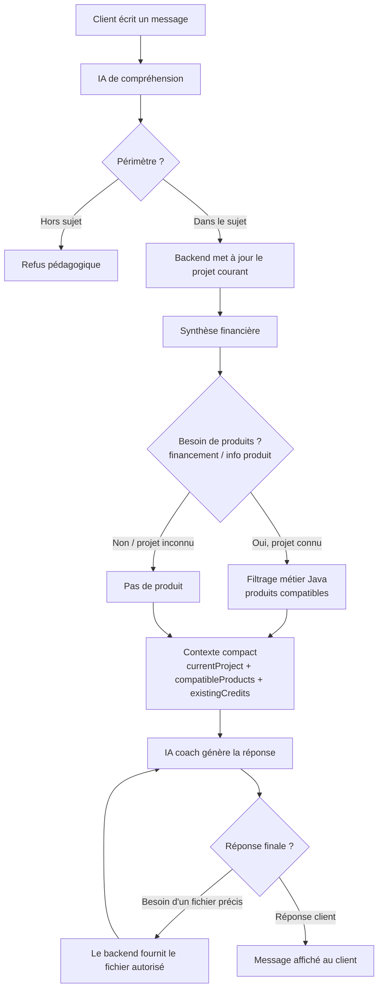
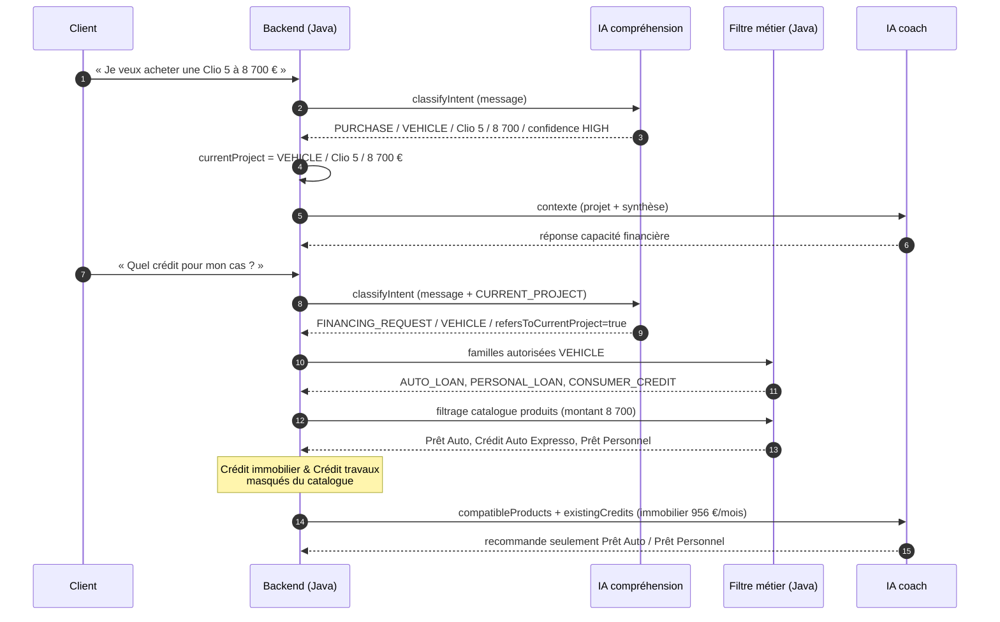
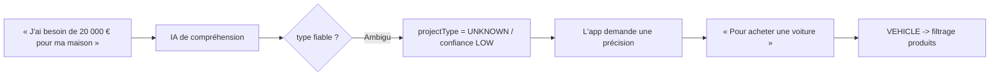
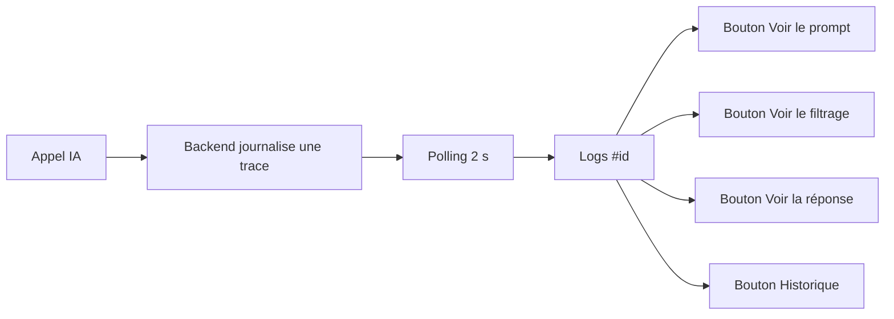
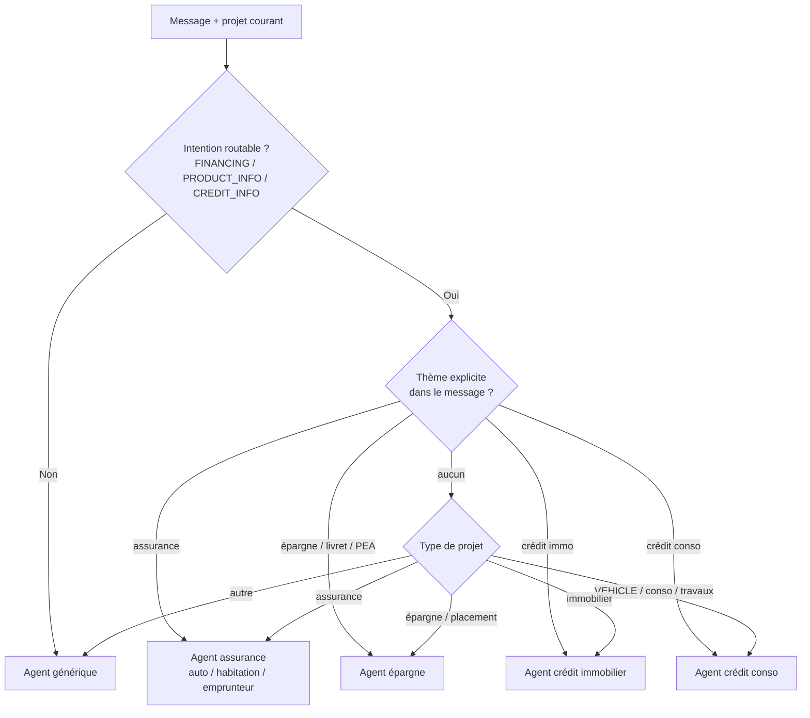

# Coach financier — Document fonctionnel

> POC « coach financier bancaire » — démonstrateur conversationnel
> Version document : 2026-09-09 (aligné sur les évolutions « agents par thème », « classification du projet + filtrage métier des produits » et « UI avancée / audio »)

---

## 1. Présentation générale

### 1.1 Le produit
Le POC est un **coach financier conversationnel** : le client discute en langage naturel de son budget, de ses projets (achat, travaux, crédit, épargne…) et reçoit des **recommandations pédagogiques** basées sur **des données bancaires de démonstration**.

Il repose sur deux IA :
- une **IA de compréhension** (classe la demande : périmètre, intention, type de projet, montant) ;
- une **IA coach** (analyse, compare, explique), déclinée en **agents par thème** : un agent générique par défaut, un « agent principal » et **6 agents spécialisés** (crédit conso, crédit immo, épargne, assurances auto / habitation / emprunteur). Chaque agent possède son propre prompt système et ses données dédiées (fiche produit + arbre de décision).

Et sur un **moteur métier Java déterministe** qui applique les règles de filtrage des produits — principe clé :

> **LLM = comprendre · JAVA = décider des règles métier et calculer · LLM = expliquer**

### 1.2 Objectif principal de l'évolution
Empêcher structurellement l'IA de recommander ou de mentionner un produit bancaire **incompatible avec le projet du client** (ex. crédit immobilier pour l'achat d'une voiture).

---

## 2. Fonctionnalités principales

| # | Fonctionnalité | Description |
|---|---|---|
| F1 | Chat coach | Dialogue libre en français, réponses pédagogiques |
| F2 | Compréhension du besoin | Détection intention + type de projet + montant + objet |
| F3 | Projet courant | Mémorisation du projet dans la conversation (« mon cas », « en 3 fois »…) |
| F4 | Filtrage métier produits | Seuls les produits compatibles avec le projet sont présentés |
| F5 | Séparation engagements / offres | Crédits existants (charges) ≠ produits proposés (solutions) |
| F6 | Clarification | Si le type de projet est inconnu / confiance faible, l'app demande une précision |
| F7 | Synthèse financière | Indicateurs agrégés (revenus, dépenses, épargne, crédits) |
| F8 | Logs des appels IA | Observabilité : statut, données envoyées, prompt, filtrage |
| F9 | Agents IA éditables | Page « Agents » : éditer les prompts (générique, agent principal, agents spécialisés) sans redémarrage |
| F10 | Modes de réponse | GPT / DeepSeek (LLM réel) ou « Mode démo » (Mock, sans clé) |
| F11 | Cascade produit | Règles de recommandation produit (« arbres de décision ») jointes au contexte |
| F12 | Sélection d'agent | Routage du message vers l'agent spécialisé du thème (produit, épargne, assurance…) |
| F13 | Réglages avancés | Interrupteur « Avancé » : fournisseur IA, audio, garde-fou hors-sujet, accès Logs/Agents |
| F14 | Audio | Micro 🎤 (dictée, Web Speech API) et lecture vocale 🔊 / synthèse des réponses |
| F15 | Rendu Markdown | Gras / italique / code des réponses IA affichés proprement |

### 2.1 Pages / écrans (frontend React, routage par hash, pas de react-router)

| Route | Page | Contenu |
|---|---|---|
| `#/` | **Chat coach** | Conversation + panneau « Vue d'ensemble » (solde, revenus, dépenses, crédits, taux). Interrupteur « Avancé » : fournisseur IA (GPT/DeepSeek/Mock), Audio, garde-fou hors-sujet, accès Logs & Agents (nouveaux onglets) |
| `#/logs` | **Logs des appels IA** | Traces : statut, session, agent utilisé, message client, caractères, données envoyées/demandées, boutons « Voir le prompt », « Voir le filtrage », « Voir la réponse », « Historique » |
| `#/agents` | **Agents IA** | Édition des prompts par agent : générique (défaut), agent principal, 6 agents spécialisés. Injecté à chaque appel |

---

## 3. Parcours utilisateur — flux fonctionnels

### 3.1 Flux global du chat

### 3.2 Scénario « achat d'une voiture »

**Résultat attendu** : le crédit immobilier **n'apparaît jamais** dans la réponse.

### 3.3 Cas « projet inconnu » (clarification)

### 3.4 Page Logs (observabilité)

Pour chaque trace, la page affiche : statut (`ANSWER`/`NEED_DATA`), session, message client, **agent utilisé**, **caractères envoyés**, données envoyées (pastilles), données demandées par l'IA (pastilles), et plusieurs vues dépliables :
- **« Voir le prompt »** : prompt système + payload utilisateur, **sans le contenu des données jointes** ;
- **« Voir le filtrage »** : bloc `[INTENT]` / `[PRODUCT_FILTER]` / `[COACH]` ;
- **« Voir la réponse »** : réponse brute renvoyée par l'IA pour cette trace ;
- **« Historique »** : historique complet de la conversation (messages client/coach).

### 3.5 Sélection de l'agent par thème

Principes :
- **Agent générique par défaut** pour les questions factuelles (budget, dépenses, synthèse) tant que le besoin n'est pas rattaché à un produit ;
- dès que la demande est **routable** (financement, information produit/crédit) et **rattachée à un thème**, on bascule vers l'agent spécialisé du thème ;
- le **sous-thème assurance** (auto / habitation / emprunteur) est déduit du message + du projet courant ;
- le prompt système de l'agent actif = **gabarit générique** (`generic.txt`) + contenu de l'**agent principal** (balise `[agent_principal]`) + prompt de l'agent spécialisé (balise `[agent]`).

---

## 4. Règles de filtrage métier (règles produit)

### 4.1 Mapping type de projet → familles de produits autorisées

| Type de projet | Familles autorisées |
|---|---|
| `VEHICLE` | AUTO_LOAN, PERSONAL_LOAN, CONSUMER_CREDIT, YOUNG_ACTIVE_LOAN, REVOLVING_CREDIT |
| `HOME_WORK` | HOME_IMPROVEMENT_LOAN, PERSONAL_LOAN, CONSUMER_CREDIT, YOUNG_ACTIVE_LOAN, REVOLVING_CREDIT |
| `ELECTRONICS` / `FURNITURE` | INSTALLMENT_PAYMENT, PERSONAL_LOAN, CONSUMER_CREDIT, YOUNG_ACTIVE_LOAN, REVOLVING_CREDIT |
| `TRAVEL` / `WEDDING` / `HEALTH_EXPENSE` | PERSONAL_LOAN, CONSUMER_CREDIT, REVOLVING_CREDIT |
| `EDUCATION` | PERSONAL_LOAN, CONSUMER_CREDIT, STUDENT_LOAN, DRIVER_LICENSE_LOAN, YOUNG_ACTIVE_LOAN, REVOLVING_CREDIT |
| `CASH_NEED` | PERSONAL_LOAN, CONSUMER_CREDIT, REVOLVING_CREDIT, YOUNG_ACTIVE_LOAN |
| `DEBT_RESTRUCTURING` | PERSONAL_LOAN, CONSUMER_CREDIT, DEBT_CONSOLIDATION |
| `REAL_ESTATE_PURCHASE` | MORTGAGE, HOME_SAVINGS |
| `SAVINGS` | SAVINGS_PRODUCT, TERM_DEPOSIT, HOME_SAVINGS, LIFE_INSURANCE |
| `INVESTMENT` | SAVINGS_PRODUCT, TERM_DEPOSIT, LIFE_INSURANCE, RETIREMENT_SAVINGS, EQUITY_INVESTMENT |
| `INSURANCE` | INSURANCE_AUTO, INSURANCE_HOME, INSURANCE_BORROWER |
| `BUDGET` / `OTHER_FINANCIAL` / `UNKNOWN` | *(aucun produit automatique)* |

### 4.2 Restriction du catalogue visible (contexte financement)
Quand le message relève d'un **besoin de financement** et que le projet est connu :
- les fichiers **hors `/data/catalogue/`** restent visibles (transactions, synthèse) ;
- parmi les fichiers `/data/catalogue/*.json`, seuls ceux dont les familles documentées croisent les familles autorisées sont visibles.

Exemple concret (projet VEHICLE) : `credit_conso.json` est **visible** ; `credit_immo.json`, `epargne.json`, `assurance_*.json` sont **cachés** — à la fois dans le catalogue présenté à l'IA **et** dans la whitelist de récupération (l'IA ne peut pas les obtenir, même en les demandant).

### 4.3 Produits vs engagements existants
- `existingCredits` : crédits **déjà souscrits** (ex. crédit immobilier 956 €/mois) → utilisés pour l'endettement/le reste à vivre, **jamais** proposés comme solution.
- `compatibleProducts` : produits **compatibles** avec le projet → seuls ceux-ci peuvent être recommandés.

---

## 5. Synthèse financière affichée

Panneau « Vue d'ensemble » :
- **Solde du compte courant** (ex. 1 516,89 €) ;
- **Épargne** totale (Livret A + LDDS, ex. 14 695,18 €) ;
- **Revenu mensuel moyen**, **dépenses mensuelles**, **crédits/mois** ;
- **Santé financière** : taux d'endettement, **taux d'épargne sur les 3 derniers mois complets** (avec libellé, ex. « 3 derniers mois · juin – août 2026 ») ;
- **Contexte** : période analysée, nombre de transactions.

Règles de calcul importantes :
- les **virements internes d'épargne** (vers épargne / retours depuis épargne) sont **exclus** des revenus/dépenses de consommation ;
- le taux d'épargne affiché = Σ épargne / Σ revenus sur les **3 derniers mois entiers** (le mois civil courant partiel est ignoré).

---

## 6. Données de démonstration

Le jeu de données simule **14 mois (07/2025 → 08/2026)** d'un compte courant avec :
- revenus (salaire…) ;
- dépenses de consommation ;
- crédit immobilier existant (956 €/mois, fin 2035) ;
- comptes d'épargne (Livret A, LDDS) ;
- un catalogue de produits et de règles (« cascade »).

Toutes les données sont **fictives** et servent uniquement la démonstration.

---

## 7. Critères d'acceptation (rappel)

1. Le premier appel IA retourne un type de projet structuré ;
2. Le projet courant est conservé dans la session ;
3. Les références (« mon cas », « en trois fois », « celui-ci ») utilisent le projet courant ;
4. Le backend possède un mapping `ProjectType → ProductFamily` ;
5. Le catalogue est filtré côté Java ;
6. Seuls les produits compatibles sont envoyés au coach ;
7. Les crédits existants sont séparés des produits proposés ;
8. Un crédit immobilier existant influence l'analyse mais n'est jamais proposé pour une voiture ;
9. `UNKNOWN` / confiance faible → demande de précision ;
10. Aucune mensualité/taux inventé ;
11. Les calculs déterministes sont côté Java ;
12. Les produits ne sont chargés que si l'intention le nécessite ;
13. Le contexte envoyé au LLM reste compact ;
14. Scénarios voiture / travaux / immobilier / ambigu passent.

---

## 8. Limites connues (POC)
- Fournisseur par défaut **côté backend** : Mode démo (MOCK) — classification enrichie réelle uniquement avec GPT/DeepSeek configuré ; l'écran choisit DeepSeek par défaut ;
- Clés API **externalisées** via variables d'environnement (`OPENAI_API_KEY`, `DEEPSEEK_API_KEY`, …) — aucune clé en dur ;
- Logs et conversations **en mémoire** (perdus au redémarrage) ;
- Un seul « projet courant » géré (le remplacement est accepté pour le POC).
