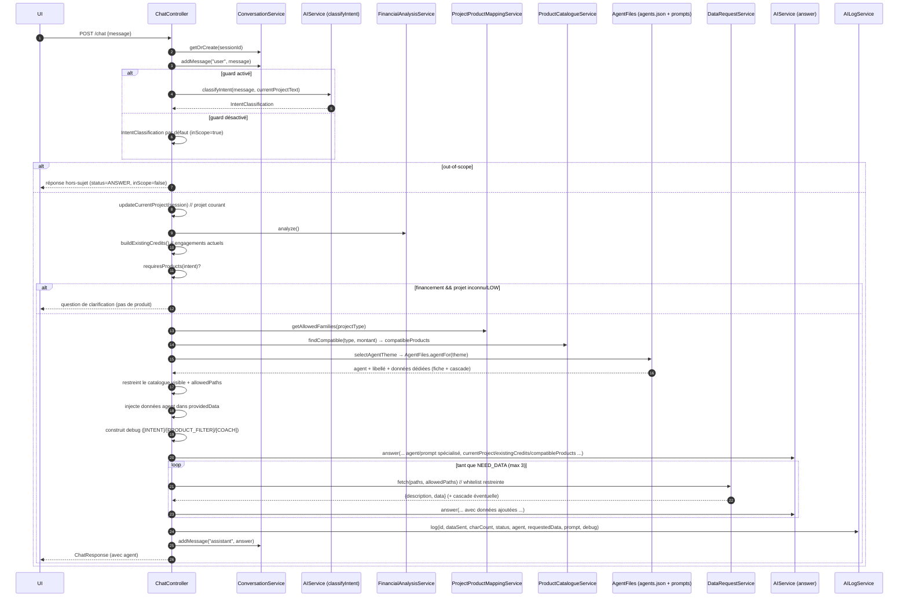
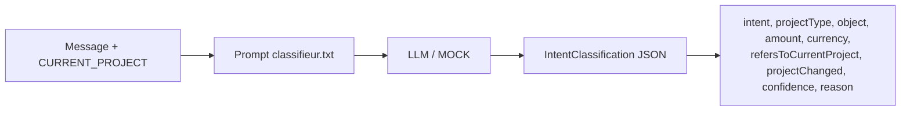
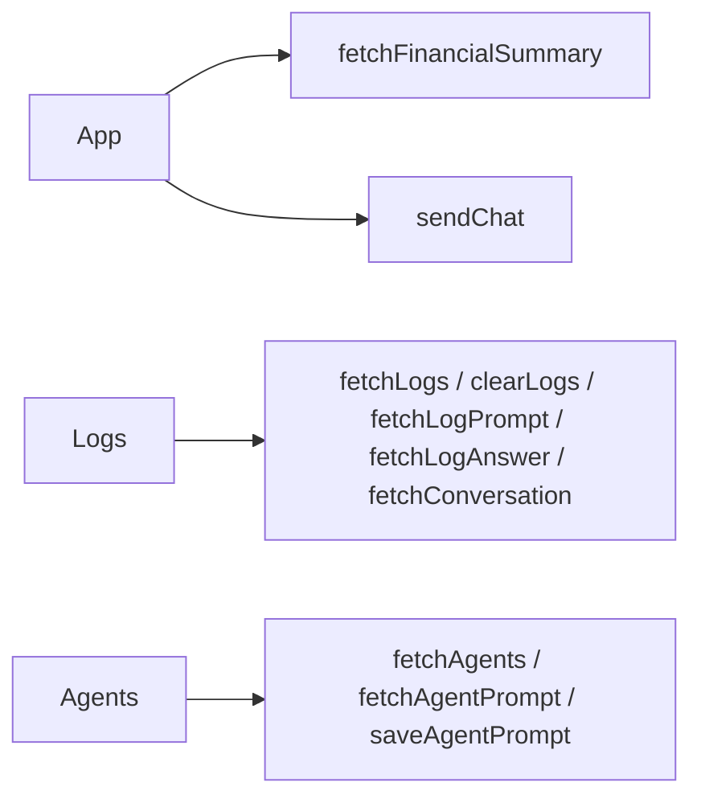

# Coach financier — Document technique

> Architecture détaillée, flux, données et API du POC
> Version : 2026-09-09

---

## 1. Vue d'ensemble

```mermaid
flowchart TB
    subgraph Frontend [Frontend React + Vite (port 9898)]
        UI[App.tsx · Logs.tsx · Agents.tsx]
        API[api.ts]
    end
    subgraph Backend [Backend Spring Boot (port 9797)]
        CTRL[Controllers /api/*]
        ORCH[ChatController]
        AI[AIServiceFactory → RemoteAIService / MockAIService]
        AGENTS[Agents: générique + principal + 6 spécialisés]
        METIER[Services métier Java]
        LOG[AILogService]
    end
    subgraph Data [Système de fichiers ./data]
        DATAJSON[data.json · products.json · synthese_financier.json]
        BANK[banking_demo_normalized.json]
        CAT[catalogue/*.json + cascade/*.txt]
        TX[transaction/*.json]
    end
    UI --> API
    API --> CTRL
    CTRL --> ORCH
    ORCH --> AGENTS
    AGENTS --> AI
    AI --> METIER
    METIER --> DATA
    ORCH --> LOG
```

**Stack** : Java 17+, Spring Boot (web, validation, RestClient), Jackson ; React 18 + Vite + TypeScript + lucide-react ; pas de base de données (état en mémoire, données en fichiers).

---

## 2. Structure du code

### 2.1 Backend (`src/main/java/com/coach/financier`)
```
controller/
  ChatController          # orchestration d'un message (POST /api/chat)
  FinancialController     # GET /api/financial-summary, /api/banking-data
  LogsController          # GET /api/logs, GET /api/logs/{id}/prompt, /{id}/answer, /stats, DELETE /api/logs
  AgentPromptController   # GET /api/agents, GET/PUT /api/agents/{key}/prompt
  ConversationController  # GET /api/conversations/{sessionId}
  HealthController        # /api/health
service/
  ConversationService          # sessions en mémoire (sessionId → Conversation)
  FinancialAnalysisService     # calcul de la synthèse financière (analyze())
  FinancialSynthesisStore      # lecture de synthese_financier.json (FS puis classpath)
  DataRequestService           # catalogue data.json + fetch des fichiers + cascade + whitelist restreinte
  ProductCatalogueService      # lecture products.json + filtrage produits compatible
  ProjectProductMappingService # mapping déterministe ProjectType → ProductFamily
  CreditSimulationService      # calcul déterministe de mensualité (TAEG)
  AILogService                 # tampon en mémoire des traces (500 max)
  AgentPromptStore             # édition prompts agents (./agent/<file> + copie classpath)
repository/
  BankingDataRepository        # charge banking_demo_normalized.json (FS puis classpath)
ai/
  AIService (interface)        # classifyUserRequest, classifyIntent, answer
  RemoteAIService (abstrait)   # implémentation LLM réelle (OpenAI/DeepSeek)
  OpenAIService / DeepSeekService
  MockAIService                # mode démo (déterministe, sans réseau)
  AIServiceFactory             # sélection GPT / DEEPSEEK / MOCK
  AgentFiles                   # agents.json + prompts système par agent (./agent puis classpath)
config/
  JacksonConfig  WebConfig
model/
  AIModels, ChatModels, FinancialSummary, BankingModels, ConversationModels
  IntentClassification, CurrentProject, ProjectType, FinancialIntent, AgentDefinition,
  ProductFamily, ConfidenceLevel, BankProduct, CreditSimulation(Request), LogEntry
```

### 2.2 Rôles des services

| Service | Rôle |
|---|---|
| `ChatController` | Orchestrateur : comprend → sélectionne l'agent → filtre → fait répondre → journalise |
| `ConversationService` | Sessions en mémoire (création, messages, résumé, projet courant) |
| `FinancialAnalysisService` | Calcule les agrégats (revenus, dépenses, soldes, taux 3 mois) |
| `DataRequestService` | Catalogue + accès fichiers (whitelist, cascade, restriction) |
| `ProjectProductMappingService` | **Règle métier** type de projet → familles autorisées |
| `ProductCatalogueService` | Charge les produits (`products.json`) et filtre (famille + montant) |
| `CreditSimulationService` | Mensualité déterministe si montant/durée/TAEG fournis |
| `AILogService` | Journal des appels IA (consultable par l'UI) |
| `AgentPromptStore` | Édition des prompts d'agents (page « Agents ») + copie classpath |
| `AgentFiles` | Lecture de `agents.json` et du prompt système de l'agent actif |

---

## 3. Données (fichiers)

Tous les fichiers sont lus **depuis le système de fichiers `./data`** (racine du projet), avec repli classpath.

| Fichier | Contenu |
|---|---|
| `data.json` | Catalogue `[{path, description}]` envoyé à l'IA (hors cascade, auto-gérée) |
| `banking_demo_normalized.json` | Comptes, mois 07/2025→08/2026, épargne, crédits |
| `catalogue/products.json` | **52 produits** machine : id, name, family, allowedProjectTypes, min/max, durées, taeg |
| `catalogue/*.json` | Fiches produits pédagogiques (credit_conso, credit_immo, epargne, assurances…) |
| `catalogue/cascade/*.txt` | Arbres de décision produit (attachés à la volée à la fiche parente) |
| `synthese_financier.json` | Synthèse mensuelle + globale |
| `transaction/transactions_YYYY_MM.json` | Transactions mensuelles |
| `agent/agents.json` | Déclaration des agents `[{id, libelle, theme, prompt, data[]}]` |
| `agent/*.txt` | Prompts : `generic.txt` (gabarit), `principal.txt` (agent principal), `classifieur.txt`, 6 prompts spécialisés (+ copies dans `src/main/resources/agent`) |

> Les **fiches produits** (`catalogue/*.json`) documentent des familles via la table `catalogueDocFamilies` (ex. `credit_immo` → MORTGAGE/HOME_IMPROVEMENT_LOAN). C'est ce qui permet la **restriction du catalogue** en contexte financement.

---

## 4. Configuration (`application.yml`)

```yaml
server.port: ${SERVER_PORT:9797}
app.data.dir: ${DATA_DIR:./data}
app.data.banking-file: ${BANKING_FILE:./data/banking_demo_normalized.json}
app.ai.openai.model: ${OPENAI_MODEL:gpt-4o-mini}
app.ai.deepseek.base-url: ${DEEPSEEK_BASE_URL:https://api.deepseek.com}
app.ai.deepseek.api-key: ${DEEPSEEK_API_KEY:}
app.ai.deepseek.model: ${DEEPSEEK_MODEL:deepseek-chat}
app.ai.default-provider: ${AI_PROVIDER:MOCK}
app.ai.synthesis-file: ${SYNTHESIS_FILE:./data/synthese_financier.json}
cascade: true          # activation de la jointure des fichiers cascade
```

- Clés API : `OPENAI_API_KEY`, `DEEPSEEK_API_KEY` — **aucune clé en dur** (variables d'environnement).
- CORS (`WebConfig`) : `/api/**` avec `allowedOriginPatterns("*")` (dev : localhost + IP LAN / accès réseau), méthodes GET/POST/PUT/DELETE/OPTIONS, headers autorisés.

---

## 5. API REST

| Méthode | URL | Rôle |
|---|---|---|
| POST | `/api/chat` | Envoyer un message (voir §6) |
| GET | `/api/financial-summary` | Synthèse financière (carte « Vue d'ensemble ») |
| GET | `/api/banking-data` | Données bancaires brutes (non utilisé par l'UI) |
| GET | `/api/logs` | Liste des traces IA (polling 2 s) |
| GET | `/api/logs/{id}/prompt` | Prompt envoyé (sans données jointes) |
| GET | `/api/logs/{id}/answer` | Réponse brute de l'IA pour une trace |
| GET | `/api/logs/stats` | Compteur de traces |
| DELETE | `/api/logs` | Vider les logs |
| GET | `/api/conversations/{sessionId}` | Historique complet d'une conversation `{sessionId, summary, messages[]}` |
| GET | `/api/agents` | Liste des agents éditables `[{key, libelle, file}]` |
| GET/PUT | `/api/agents/{key}/prompt` | Lire / écrire le prompt d'un agent |
| GET | `/api/health` | Healthcheck (expose le fournisseur par défaut) |

### Exemple — POST /api/chat
```json
// Requête
{ "sessionId": "web-1725...", "message": "Quel crédit pour mon cas ?",
  "provider": "DEEPSEEK", "disableOutOfScopeGuard": false }

// Réponse
{ "sessionId": "...", "provider": "DEEPSEEK",
  "category": "CREDIT", "inScope": true,
  "status": "ANSWER",
  "answer": "Pour l'achat de votre Clio…",
  "financialSummary": { "...": "..." },
  "conversationSummary": "...",
  "agent": "Crédit à la consommation" }
```

---

## 6. Flux détaillé d'un message (ChatController)

### 6.1 Diagramme de séquence backend



### 6.2 Contenu du payload envoyé au coach

`RemoteAIService.answer` construit un payload dont les clés utiles sont :
- `customerMessage` ; `classification` ;
- `financialSummary` : agrégats (synthèse) ;
- `bankingData` : **catalogue de données restreint** (contexte financement) ;
- `additionalData` :
  - `providedData` : fichiers déjà fournis `[{description, data}]` (synthèse + **données dédiées de l'agent actif**) ;
  - `currentProject` : `{type, object, amount, currency}` (projet courant) ;
  - `existingCredits` : engagements actuels `[{type, label, monthlyPayment}]` ;
  - `compatibleProducts` : produits filtrés (compact) `[{id, name, family, min/max, durées, taeg}]` ;
  - `agent` / `agentLibelle` : agent actif (pour le prompt système et les logs) ;
- `conversationHistory`.

> Le **prompt système** utilisé est celui de l'agent actif (gabarit générique + principal + spécialisé), choisi par `ChatController` (`selectAgentTheme`) puis chargé par `AgentFiles.systemPromptFor(theme)` — et non plus un prompt unique fixe.

### 6.3 Boucle NEED_DATA
- L'IA répond `ANSWER`, ou `NEED_DATA` + `dataRequest.paths` (chemins EXACTS du catalogue).
- Le backend lit les fichiers demandés **si et seulement s'ils sont dans la whitelist autorisée** (`allowedCatalogPaths`), puis re-appelle le coach. **Maximum 3 itérations consécutives** ; sinon réponse de repli.

### 6.4 Restriction du catalogue (structurelle)
En contexte financement (projet connu) :
1. `allowedFamilies = mappingService.getAllowedFamilies(projectType)` ;
2. pour chaque entrée du catalogue : hors `/data/catalogue/` → **visible** ; sinon visible si `familles documentées du fichier ∩ allowedFamilies ≠ ∅` ;
3. les chemins retenus constituent `allowedCatalogPaths` (whitelist de `fetch`).

Ainsi `credit_immo.json` est **structurellement inaccessible** pour un projet véhicule : il est absent du catalogue présenté **et** de la whitelist.

---

## 7. Flux de classification d'intention



- **RemoteAIService.classifyIntent** : appelle le LLM avec `agent/classifieur.txt` et parse le JSON dans `IntentClassification` (tolérant aux champs inconnus).
- **MockAIService.classifyIntent** : heuristique par mots-clés (sans réseau) pour le mode démo.
- **Règles backend** : `needsClarification()` quand `projectType == UNKNOWN` ou `confidence == LOW` ; `requiresProducts()` vrai pour `FINANCING_REQUEST` et `PRODUCT_INFORMATION`.
- **Sélection d'agent** (déterministe, `ChatController`) : pour les intentions routables (`FINANCING_REQUEST`, `PRODUCT_INFORMATION`, `CREDIT_INFORMATION`), on détecte un thème explicite (assurance, épargne/livret/PEA, crédit immo/conso) dans le message ; sinon on déduit l'agent du **type de projet** (immo → `credit_immo`, épargne/placement → `epargne`, assurance → sous-thème auto/habitation/emprunteur, conso/travaux/véhicule → `credit_conso`) ; défaut : agent générique.

---

## 8. Calculs déterministes

### 8.1 Synthèse financière (`FinancialAnalysisService`)
- Regroupe transactions par mois (07/2025→08/2026) ;
- **Exclut** des revenus/dépenses les virements internes d'épargne :
  - dépenses exclues : `LOGITEL` / `VERS COMPTE EPARGNE` ;
  - revenus exclus : `VIR RECU` + `MARTIN` ;
- Indicateurs : revenus/dépenses moyens, épargne, solde courant (dernier `nouveau_solde`), taux d'endettement, **taux d'épargne sur les 3 derniers mois entiers** (Σ épargne / Σ revenus ; si le dernier mois de données est le mois courant partiel, on recule d'un mois) ;
- `emptySummary()` si aucune transaction.

### 8.2 Simulation de crédit (`CreditSimulationService`)
- Annuité constante : `M = C·r / (1 − (1+r)^−n)` avec `r = TAEG/12` ;
- Retourne `null` si montant, durée ou TAEG **absent** (on n'invente jamais un taux) ;
- Pour un TAEG = 0 : `M = C/n`, coût total = 0.

---

## 9. Flux des prompts & agents

### 9.1 Modèle « agents »
- `agent/agents.json` déclare **7 agents** : générique (thème `generic`), crédit conso, crédit immo, épargne, assurance auto, assurance habitation, assurance emprunteur. Chaque agent : `{id, libelle, theme, prompt, data[]}`.
- `agent/generic.txt` : **gabarit** du prompt système (règles du coach, clés du payload, format de réponse).
- `agent/principal.txt` : contenu de l'**agent principal**.
- 6 prompts spécialisés (`credit-conso.txt`, `credit-immo.txt`, `epargne.txt`, `assurance-auto.txt`, …) : expertise du thème + la fiche produit est fournie via `data`.

### 9.2 Construction du prompt système
À chaque appel, `AgentFiles.systemPromptFor(theme)` :
1. charge **toujours** `generic.txt` (gabarit) ;
2. remplace la balise `[agent_principal]` par le contenu de `principal.txt` ;
3. remplace la balise `[agent]` par le prompt de l'agent spécialisé actif (vide si l'agent actif est le générique lui-même, pour éviter une inclusion récursive).

`AgentFiles.mainSystemPrompt()` = `systemPromptFor(GENERIC_THEME)` (compatibilité).

### 9.3 Lecture / écriture
- Lecture : `./agent` d'abord, puis classpath (`src/main/resources/agent`), puis texte par défaut.
- Les fichiers sont **relus à chaque appel IA** → une sauvegarde est prise en compte immédiatement, sans redémarrage.
- Écriture (page Agents) : `AgentPromptStore.write` met à jour `agent/<file>` **et** la copie classpath.

### Cascade produit
Quand l'IA demande un JSON `/data/catalogue/*.json` et que `cascade=true`, `DataRequestService.fetch` joint automatiquement `/data/catalogue/cascade/<même_nom>.txt` (arbres de décision) en plus de la fiche. Les données de chaque agent (`data[]` = fiche + cascade) sont par ailleurs injectées **d'office** dans `providedData`.

---

## 10. Journalisation des appels IA (Logs)

- `LogEntry` : `id, timestamp, sessionId, clientMessage, dataSent[], historyCount, charCount, status, agent, requestedData[], prompt(@JsonIgnore), debug, answer(@JsonIgnore)`.
- `AILogService` : tampon **500** traces, en mémoire, `log(...)`, `latest()`, `promptOf(id)`, `answerOf(id)`, `clear()`.
- `charCount` = longueur du prompt système + payload utilisateur JSON (compté côté `ChatController`).
- `debug` = bloc `[INTENT] / [PRODUCT_FILTER] / [COACH]` généré par `buildDebugLog` (classification + familles autorisées + compteurs catalogue avant/après + nb produits compatibles + nb crédits existants + agent actif). Aucune donnée bancaire sensible.
- Frontend : polling `GET /api/logs` toutes les 2 s ; boutons dépliables « Voir le prompt » (lazy `GET /api/logs/{id}/prompt`), « Voir le filtrage » (`debug` embarqué), « Voir la réponse » (lazy `GET /api/logs/{id}/answer`) et « Historique » (lazy `GET /api/conversations/{sessionId}`).

---

## 11. Frontend

### 11.1 Structure
```
frontend/src/
  main.tsx       # routage par hash : #/logs, #/agents, sinon App
  App.tsx        # page coach (chat + vue d'ensemble + réglages avancés/audio)
  Logs.tsx       # page logs (polling, prompt/filtrage/réponse/historique)
  Agents.tsx     # page édition des prompts d'agents
  api.ts         # client API (fetch, API_BASE_URL dynamique)
  types.ts       # types partagés
  styles.css     # classes préfixées (logs-*, agent-*, …)
  vite-env.d.ts  # référence vite/client
```

### 11.2 Flux API frontend



### 11.3 Points notables
- `API_BASE_URL` dynamique : `localhost` → `http://localhost:9797/api` ; accès par IP → `http://<hostname>:9797/api` (surchargeable par `VITE_API_BASE_URL`).
- Le type `AiLog` reflète `LogEntry` (avec `debug?`, `agent`) ; `ChatResponse` expose `agent`.
- `FinancialSummary` côté TS reflète le record Java (dont `savingsToIncomeRatio3Months`, `savingsRatePeriodLabel`) ;
- `formatPercent` (2 décimales fr-FR) pour le taux d'épargne ; `formatMoneyCents` pour le solde ;
- Rendu **Markdown léger** des réponses (gras `**`, italique `*`, code) via segmentation React ; texte nettoyé avant synthèse vocale ;
- **Audio** : micro 🎤 dictée et lecture vocale 🔊 (Web Speech API), activables via le réglage « Audio » du panneau « Avancé » ;
- Interrupteur « Avancé » : masque/affiche fournisseur IA (GPT/DeepSeek/Mock), garde-fou hors-sujet, réponses vocales, accès Logs & Agents (onglets séparés).
- Fournisseur IA par défaut côté UI : **DeepSeek** (préférence mémorisée en localStorage).

---

## 12. Mode démo (MOCK) vs fournisseurs réels

| Point | MOCK (défaut backend) | GPT / DeepSeek |
|---|---|---|
| Classification d'intention | Heuristique mots-clés | LLM via `classifieur.txt` |
| Réponse coach | Message générique (mode démo) | LLM via le prompt de l'agent actif (`generic.txt` + `principal.txt` + spécialisé) |
| Réseau / clé API | Aucun | Requis (`OPENAI_API_KEY`, `DEEPSEEK_API_KEY`) |
| Simulation / calculs | Identiques (Java) | Identiques (Java) |

> L'écran choisit **DeepSeek par défaut** ; le backend conserve `MOCK` comme fournisseur de secours si aucun n'est transmis (`default-provider: ${AI_PROVIDER:MOCK}`).

---

## 13. Démarrage & variables d'environnement

Backend :
```powershell
$env:AI_PROVIDER = "DEEPSEEK"   # MOCK | GPT | DEEPSEEK
$env:DEEPSEEK_MODEL = "deepseek-chat"
$env:DEEPSEEK_API_KEY = "sk-..."  # clé DeepSeek (ou OPENAI_API_KEY pour GPT)
# lancer l'app Spring Boot (IDE ou mvnw spring-boot:run) → http://localhost:9797
```
Frontend :
```powershell
cd frontend; npm install; npm run dev   # http://localhost:9898 (host 0.0.0.0 → IP LAN)
```
`VITE_API_BASE_URL` (défaut dynamique : `http://localhost:9797/api`, ou `http://<ip>:9797/api` quand on accède par IP) ; CORS ouvert à toutes origines en dev (localhost + IP).

---

## 14. État & limites techniques

- État **en mémoire** : sessions, logs, projet courant → perdus au redémarrage ; données en fichiers relues **au démarrage** (`BankingDataRepository`, `ProductCatalogueService`) → redémarrer le backend après une modification des JSON (sauf les prompts d'agents et `agents.json`, relus à chaque appel).
- Clés API **externalisées** via variables d'environnement (`OPENAI_API_KEY`, `DEEPSEEK_API_KEY`) — aucune clé en dur dans `application.yml`.
- L'écran exige un **contexte sécurisé** (HTTPS ou localhost) pour certaines API navigateur (micro/lecture vocale, `crypto.randomUUID`) ; un repli est prévu pour l'accès HTTP par IP.
- Un seul `currentProject` par session (le POC remplace plutôt que de gérer plusieurs projets).
