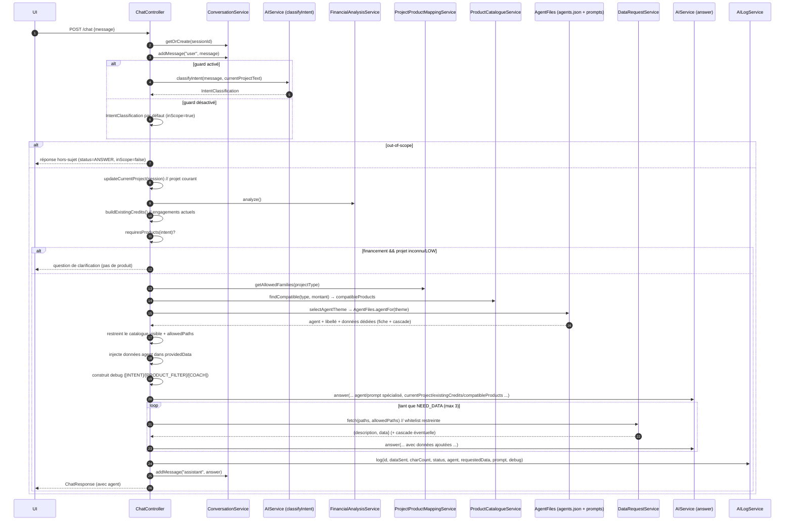
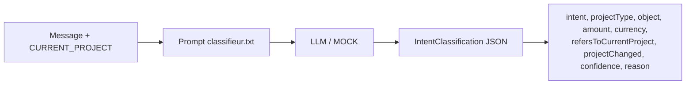
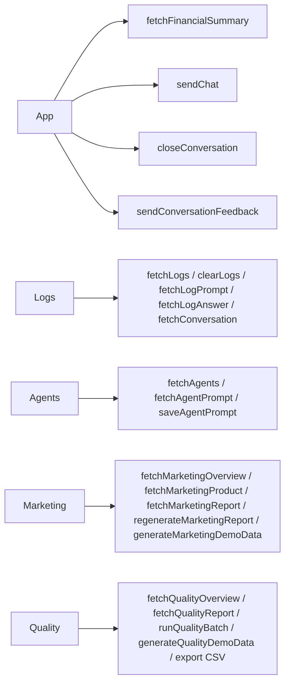
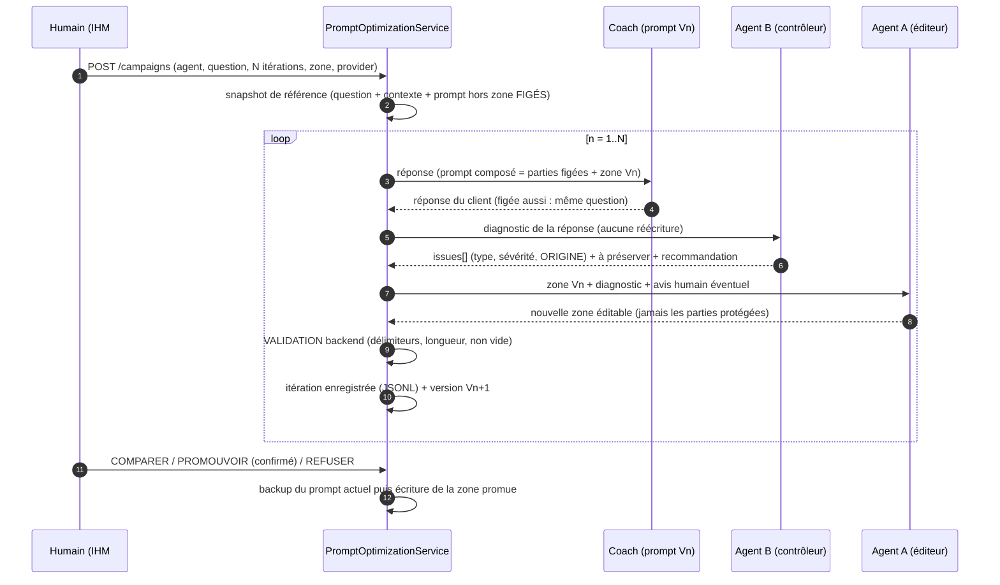
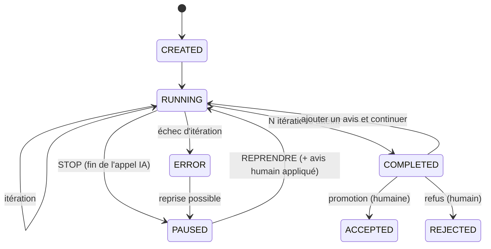

# Coach financier — Document technique

> Architecture détaillée, flux, données et API du POC
> Version : 2026-09-11

---

## 1. Vue d'ensemble

```mermaid
flowchart TB
    subgraph Frontend [Frontend React + Vite (port 9898)]
        UI[App.tsx · Logs.tsx · Agents.tsx · Marketing.tsx · Quality.tsx · FeedbackPopup.tsx · PromptLab.tsx]
        API[api.ts]
    end
    subgraph Backend [Backend Spring Boot (port 9797)]
        CTRL[Controllers /api/*]
        ORCH[ChatController]
        AI[AIServiceFactory → RemoteAIService / MockAIService]
        AGENTS[Agents: générique + principal + 6 spécialisés<br/>+ agents suivi et analyste marketing]
        METIER[Services métier Java]
        CLOSE[ConversationClosureService + MailService]
        MKT[Marketing: extraction, store, analyse, batch, rapport]
        QLT[Qualité: feedback, contrôles, analyse, batch, rapport]
        PLAB[Atelier prompts: PromptOptimizationService<br/>+ Store + AgentPromptHistoryStore]
        LOG[AILogService]
    end
    subgraph Data [Système de fichiers ./data]
        DATAJSON[data.json · products.json · synthese_financier.json]
        BANK[banking_demo_normalized.json]
        CAT[catalogue/*.json + cascade/*.txt]
        TX[transaction/*.json]
        MKTFS[marketing/events/*.jsonl · aggregates/*.json · reports/*.json]
        QLTFS[quality/feedback/*.jsonl · checks/*.jsonl · aggregates/*.json · reports/*.json]
        PLABFS[prompt-optimization/campaigns/&lt;id&gt;/*<br/>+ history/ (sauvegardes de prompts)]
    end
    UI --> API
    API --> CTRL
    CTRL --> ORCH
    CTRL --> CLOSE
    CTRL --> MKT
    ORCH --> AGENTS
    AGENTS --> AI
    AI --> METIER
    METIER --> DATA
    CLOSE --> AI
    CLOSE --> MKT
    CLOSE --> QLT
    PLAB --> AGENTS
    PLAB --> AI
    PLAB --> PLABFS
    MKT --> MKTFS
    QLT --> QLTFS
    ORCH --> LOG
```

**Stack** : Java 17+, Spring Boot (web, validation, RestClient), Jackson ; React 18 + Vite + TypeScript + lucide-react ; pas de base de données (état en mémoire, données en fichiers).

---

## 2. Structure du code

### 2.1 Backend (`src/main/java/com/coach/financier`)
```
controller/
  ChatController          # orchestration d'un message (POST /api/chat)
  FinancialController     # GET /api/financial-summary, /api/banking-data
  LogsController          # GET /api/logs, GET /api/logs/{id}/prompt, /{id}/answer, /stats, DELETE /api/logs
  AgentPromptController   # GET /api/agents, GET/PUT /api/agents/{key}/prompt
  ConversationController  # GET /api/conversations/{sessionId}, POST /{sessionId}/close, POST /{sessionId}/feedback
  MailController          # GET /api/mail/status
  MarketingController     # GET/POST /api/marketing/**
  QualityController       # GET/POST /api/quality/**
  AdvisorFeedbackController # GET/POST /api/advisor-feedback/**
  PromptOptimizationController # GET/POST /api/prompt-optimization/** (atelier Agent A / Agent B)
  HealthController        # /api/health
service/
  ConversationService          # sessions en mémoire (sessionId → Conversation)
  FinancialAnalysisService     # calcul de la synthèse financière (analyze())
  FinancialSynthesisStore      # lecture de synthese_financier.json (FS puis classpath)
  DataRequestService           # catalogue data.json + fetch des fichiers + cascade + whitelist restreinte
  ProductCatalogueService      # lecture products.json + filtrage produits compatible
  ProductUrlIndex              # index id → URL officielle des produits (whitelist anti-invention)
  ProjectProductMappingService # mapping déterministe ProjectType → ProductFamily
  CreditSimulationService      # calcul déterministe de mensualité (TAEG)
  AILogService                 # tampon en mémoire des traces (500 max)
  AgentPromptStore             # édition prompts agents (agent/<file>, source de vérité)
  ConversationClosureService   # FIN DE CONVERSATION : dossier de suivi conseiller (+ événements marketing)
  EmailAttachmentBuilder       # brouillon d'email client → pièce jointe (.eml/.html/.txt)
  UrlLinkRenderer              # rendu/litage des liens [URL|nom|url] (texte + HTML)
  MailService                  # envoi SMTP (multipart) + diagnostic d'indisponibilité
  AnonymousIdService           # pseudonymisation client (SHA-256 salé)
  MarketingEventStore          # événements JSONL par jour (append + dédoublonnage)
  MarketingExtractionService   # brouillons IA → événements enrichis (PII masquées)
  MarketingAnalyticsService    # agrégats DÉTERMINISTES (KPI, scores, tendances, cross-sell)
  MarketingBatchService        # batch quotidien (fichiers d'agrégats + rapport), idempotent
  MarketingReportStore         # lecture/écriture des rapports JSON
  MarketingReportService       # génération du rapport via l'agent analyste marketing
  MarketingDemoDataService     # jeu de démonstration déterministe (demo=true)
  JsonlFiles                   # utilitaires JSONL partagés (un fichier par jour, lignes invalides comptées)
  QualityFeedbackService       # pop-in : enregistrement du feedback (facultatif, idempotent, jamais bloquant)
  QualityFeedbackStore         # feedbacks JSONL + déduplication par feedbackId ET par session
  QualityCheckStore            # contrôles JSONL (un événement par contrôle exécuté, ids déterministes)
  CoachQualityCheckService     # contrôles AUTOMATIQUES de conformité (6 implémentés)
  QualityAnalyticsService      # agrégats DÉTERMINISTES satisfaction + conformité + croisement
  QualityBatchService          # batch quotidien (agrégat consolidé + fichiers par section + rapport)
  QualityReportService/Store   # rapport IA qualité (agent qualite_coach_client.txt)
  QualityDemoDataService       # avis + contrôles de démonstration (source=DEMO)
  AdvisorFeedbackService       # saisie conseiller (facultative, idempotente, versionnée, jamais bloquante)
  AdvisorFeedbackStore         # feedbacks conseiller JSONL (déduplication + historique des versions)
  AdvisorFeedbackCandidatesService # dossiers proposés à l'évaluation + catalogue produits
  AdvisorFeedbackAnalyticsService  # KPI DÉTERMINISTES (évaluations, zones, produits, intérêts, emails)
  AdvisorFeedbackReportService     # rapport IA (agent feedback_conseiller.txt) + batch quotidien
  AdvisorFeedbackDemoDataService   # feedbacks de démonstration (source=DEMO)
  AdvisorDossierService            # dossier évaluable : persistance + LIEN D'ÉVALUATION du mail conseiller
  AdvisorDossierStore              # dossiers JSONL (1 par clôture, résolu par sessionId)
  CoachContextBuilder              # construit le CoachContext d'un message (extrait de ChatController)
  PromptZoneService                # zone éditable [[[ … ]]] : parse, validation, recomposition, hash SHA-256
  PromptOptimizationService        # ATELIER : machine à états, itérations, avis humain, promotion
  PromptOptimizationStore          # persistance des campagnes (JSON/JSONL atomiques, verrou par campagne)
  AgentPromptHistoryStore          # sauvegardes du prompt AVANT promotion (retour arrière possible)
repository/
  BankingDataRepository        # charge banking_demo_normalized.json (FS puis classpath)
ai/
  AIService (interface)        # classifyUserRequest, classifyIntent, answer, summarizeConversation, analyzeMarketing
  RemoteAIService (abstrait)   # implémentation LLM réelle (OpenAI/DeepSeek)
  OpenAIService / DeepSeekService
  MockAIService                # mode démo (déterministe, sans réseau)
  AIServiceFactory             # sélection GPT / DEEPSEEK / MOCK
  AgentFiles                   # agents.json + prompts système par agent (agent/ puis repli classpath)
config/
  JacksonConfig  WebConfig  MarketingProperties  QualityProperties  AdvisorFeedbackProperties
  PromptOptimizationProperties
model/
  AIModels, ChatModels, FinancialSummary, BankingModels, ConversationModels
  IntentClassification, CurrentProject, ProjectType, FinancialIntent, AgentDefinition,
  ProductFamily, ConfidenceLevel, BankProduct, CreditSimulation(Request), LogEntry
  SuiviModels, MarketingModels, QualityModels, AdvisorFeedbackModels
  PromptOptimizationModels  # diagnostics Agent A/B, versions, itérations, snapshot, campagne
```

### 2.2 Rôles des services

| Service | Rôle |
|---|---|
| `ChatController` | Orchestrateur : comprend → sélectionne l'agent → filtre → fait répondre → journalise |
| `ConversationService` | Sessions en mémoire (création, messages, résumé, projet courant) |
| `FinancialAnalysisService` | Calcule les agrégats (revenus, dépenses, soldes, taux 3 mois) |
| `DataRequestService` | Catalogue + accès fichiers (whitelist, cascade, restriction) |
| `ProjectProductMappingService` | **Règle métier** type de projet → familles autorisées |
| `ProductCatalogueService` | Charge les produits (`products.json`) et filtre (famille + montant) |
| `CreditSimulationService` | Mensualité déterministe si montant/durée/TAEG fournis |
| `AILogService` | Journal des appels IA (consultable par l'UI) |
| `AgentPromptStore` | Édition des prompts d'agents (page « Agents ») — `agent/<file>` uniquement |
| `AgentFiles` | Lecture de `agents.json` et du prompt système de l'agent actif |
| `CoachContextBuilder` | Construit le contexte complet d'un message (synthèse, projet, crédits, catalogue filtré, restriction, `providedData`, debug) — **extrait de `ChatController`** pour être réutilisable et testable, et pour que l'atelier puisse construire **exactement** le même contexte |
| `PromptZoneService` | Zone éditable `[[[ … ]]]` : détection, validation (zone unique, non vide, délimiteurs interdits dans la zone), recomposition `prefix + zone + suffix`, empreinte SHA-256 |
| `PromptOptimizationService` | **Atelier** : démarre une campagne (snapshot figé), exécute une itération (Coach → Agent B → Agent A → validation backend), gère STOP/reprise/avis humain, et **promotion** en production |
| `PromptOptimizationStore` | Persistance de l'atelier (JSON/JSONL, écriture atomique, verrou par campagne, redémarrage sans perte) |
| `AgentPromptHistoryStore` | Sauvegarde du prompt **avant** promotion + index chronologique (rollback) |
| `ConversationClosureService` | **Fin de conversation** : construit le dossier de suivi (agent `suivi.txt`), valide les produits/URLs, envoie **un seul** email au conseiller avec le brouillon client en pièce jointe, journalise la tentative, puis persiste les événements marketing |
| `EmailAttachmentBuilder` / `UrlLinkRenderer` | Pièce jointe (`.eml`/`.html`/`.txt`) et rendu des liens `[URL|nom|url]` |
| `MailService` | Envoi SMTP multipart + `unavailabilityReason()` / `describeTarget()` (origine des erreurs) |
| `MarketingAnalyticsService` | **Tous les calculs** du module marketing (KPI, scores, taux, tendances, cross-sell) |
| `MarketingEventStore` | Stockage file : JSONL par jour, dédoublonné, tolérant aux lignes invalides |
| `MarketingBatchService` | Agrégats quotidiens en fichiers + rapport (réexécutable sans doublon) |
| `MarketingReportService` | Rapport IA du jour (`agent/marketing.txt`) à partir des agrégats déjà calculés |
| `MarketingDemoDataService` | Jeu de démonstration déterministe (`demo=true`), pour la page Marketing |
| `QualityFeedbackService` / `QualityFeedbackStore` | Feedback de la pop-in : facultatif, idempotent (une seule réponse par conversation), stockage anonymisé |
| `CoachQualityCheckService` | Contrôles **automatiques** de conformité : exécutés à chaque clôture, indépendants de la satisfaction |
| `QualityAnalyticsService` | **Tous les calculs** du module Qualité (satisfaction, conformité, croisement) |
| `QualityBatchService` / `QualityReportService` | Batch quotidien + rapport IA à partir des agrégats calculés |

---

## 3. Données (fichiers)

Tous les fichiers sont lus **depuis le système de fichiers `./data`** (racine du projet), avec repli classpath.

| Fichier | Contenu |
|---|---|
| `data.json` | Catalogue `[{path, description}]` envoyé à l'IA (hors cascade, auto-gérée) |
| `banking_demo_normalized.json` | Comptes, mois 07/2025→08/2026, épargne, crédits |
| `catalogue/products.json` | **52 produits** machine : id, name, family, allowedProjectTypes, min/max, durées, taeg |
| `catalogue/*.json` | Fiches produits pédagogiques (credit_conso, credit_immo, epargne, assurances…) |
| `catalogue/cascade/*.txt` | Arbres de décision produit (attachés à la volée à la fiche parente) |
| `synthese_financier.json` | Synthèse mensuelle + globale |
| `transaction/transactions_YYYY_MM.json` | Transactions mensuelles |
| `agent/agents.json` | Déclaration des agents `[{id, libelle, theme, prompt, data[]}]` |
| `agent/*.txt` | Prompts : `generic.txt` (gabarit), `principal.txt` (agent principal), `classifieur.txt`, `suivi.txt`, `marketing.txt`, 6 prompts spécialisés (+ copies dans `src/main/resources/agent`) |
| `marketing/events/marketing_events_<date>.jsonl` | Événements marketing (1 par ligne, append-only, dédoublonnés par `eventId`) |
| `marketing/aggregates/*.json` | Agrégats figés du jour (batch) |
| `marketing/reports/marketing_report_<date>.json` | Rapport IA du jour |
| `quality/feedback/coach_feedback_<date>.jsonl` | Avis clients (note, motifs, commentaire nettoyé) |
| `quality/checks/coach_quality_checks_<date>.jsonl` | Un événement par contrôle exécuté (détecté ou non) |
| `quality/aggregates/coach_quality_daily_<date>.json` | Agrégat consolidé du jour (+ fichiers par section) |
| `quality/reports/coach_quality_report_<date>.json` | Rapport IA qualité du jour |
| `advisor-feedback/events/advisor_feedback_<date>.jsonl` | 1 feedback conseiller par ligne (versions successives conservées) |
| `advisor-feedback/aggregates/advisor_feedback_daily_*.json` | Agrégats du batch (KPI, zones, produits, emails, série) |
| `advisor-feedback/reports/advisor_feedback_report_<date>.json` | Rapport IA de l'analyste Feedback Conseiller |
| `advisor-feedback/dossiers/advisor_dossier_<date>.jsonl` | Dossiers de suivi évaluables (1 par clôture) : c'est ce que le conseiller retrouve via le lien du mail |
| `prompt-optimization/campaigns/<campaignId>/campaign.json` | État d'une campagne d'optimisation (`po-AAAAMMJJ-HHMMSS-XXXX`) |
| `prompt-optimization/campaigns/<campaignId>/snapshot.json` | **Snapshot de référence** : question, classification, contexte, prompt figé, hashes |
| `prompt-optimization/campaigns/<campaignId>/iterations.jsonl` | 1 ligne = 1 itération (réponse du Coach, diagnostic Agent B, proposition Agent A, résultat) |
| `prompt-optimization/campaigns/<campaignId>/editions.jsonl` | Édition de la zone par l'Agent A **sous avis humain** (hors itération) |
| `prompt-optimization/campaigns/<campaignId>/feedback.jsonl` | Avis humains (append-only, statut appliqué/en attente) |
| `prompt-optimization/history/promotions.jsonl` + `<backupId>-<fichier>` | Sauvegardes de prompts **avant promotion** (retour arrière possible) |

> Les **fiches produits** (`catalogue/*.json`) documentent des familles via la table `catalogueDocFamilies` (ex. `credit_immo` → MORTGAGE/HOME_IMPROVEMENT_LOAN). C'est ce qui permet la **restriction du catalogue** en contexte financement.

---

## 4. Configuration (`application.yml`)

```yaml
server.port: ${SERVER_PORT:9797}
app.data.dir: ${DATA_DIR:./data}
app.chat.history-limit: ${CHAT_HISTORY_LIMIT:0}    # 0 = TOUT l'historique transmis au Coach à chaque appel
app.data.banking-file: ${BANKING_FILE:./data/banking_demo_normalized.json}
app.ai.openai.model: ${OPENAI_MODEL:gpt-4o-mini}
app.ai.openai.max-tokens: ${OPENAI_MAX_TOKENS:16384}   # plafond de sortie (maximum du modèle)
app.ai.deepseek.base-url: ${DEEPSEEK_BASE_URL:https://api.deepseek.com}
app.ai.deepseek.api-key: ${DEEPSEEK_API_KEY:}
app.ai.deepseek.model: ${DEEPSEEK_MODEL:deepseek-chat}
app.ai.deepseek.max-tokens: ${DEEPSEEK_MAX_TOKENS:8192}  # maximum de deepseek-chat (défaut fournisseur : 4096)
app.ai.synthesis-file: ${SYNTHESIS_FILE:./data/synthese_financier.json}
cascade: true          # activation de la jointure des fichiers cascade
# --- Fin de conversation (dossier de suivi) ---
app.advisor.name: ${ADVISOR_NAME:Votre conseiller}
app.advisor.email: ${ADVISOR_EMAIL:<MAIL_USERNAME>}   # SEUL destinataire automatique
app.customer.name: ${CUSTOMER_NAME:}
app.suivi.attachment-format: ${SUIVI_ATTACHMENT_FORMAT:eml}      # txt | html | eml
app.suivi.advisor-appointment-url: ${ADVISOR_APPOINTMENT_URL:…}  # lien de RDV du brouillon client
app.suivi.dossier-url: ${SUIVI_DOSSIER_URL:https://particuliers.sg.fr}  # lien « dossier client » du mail conseiller
#   (démo = site Société Générale ; en production = outil conseiller. Vide ⇒ aucun lien)
app.suivi.advisor-mail-html: ${SUIVI_ADVISOR_MAIL_HTML:true}
app.mail.enabled: ${MAIL_ENABLED:true}
app.mail.from: ${MAIL_FROM:${MAIL_USERNAME:}}
spring.mail.host: ${MAIL_HOST:smtp.gmail.com}
spring.mail.port: ${MAIL_PORT:587}
spring.mail.username: ${MAIL_USERNAME:…}
spring.mail.password: ${CLE_GOOGLE_COACH_FINANCIER:}             # mot de passe d'application Gmail
# --- Module Marketing Intelligence (fichiers, sans base de données) ---
app.marketing.enabled: ${MARKETING_ENABLED:true}
app.marketing.demo-mode: ${MARKETING_DEMO_MODE:false}
app.marketing.dir: ${MARKETING_DIR:./data/marketing}
app.marketing.hash-salt: ${MARKETING_HASH_SALT:…}
app.marketing.amount-bounds: ${MARKETING_AMOUNT_BOUNDS:2000,5000,10000,15000,30000}
app.marketing.extractor-version / prompt-version: ${…}
app.marketing.score.*: ${…}                                      # poids du score d'intérêt
# --- Module Qualité & Satisfaction (fichiers, sans base de données) ---
app.quality.enabled: ${QUALITY_ENABLED:true}
app.quality.demo-mode: ${QUALITY_DEMO_MODE:false}
app.quality.dir: ${QUALITY_DIR:./data/quality}
app.quality.hash-salt: ${QUALITY_HASH_SALT:…}
app.quality.comment-max-length: ${QUALITY_COMMENT_MAX_LENGTH:1000}
app.quality.max-comments-to-analyze: ${QUALITY_MAX_COMMENTS:30}
app.quality.sufficient-sample-size: ${QUALITY_SAMPLE_SIZE:10}
app.quality.prompt-version: ${QUALITY_PROMPT_VERSION:quality-report-v1}
app.quality.checks: ${QUALITY_CHECKS:}                            # vide = les 6 contrôles implémentés
app.quality.severity.*: ${…}                                      # sévérité par contrôle (§21)
# --- Module Feedback Conseiller (fichiers, sans base de données) ---
app.advisor-feedback.enabled: ${ADVISOR_FEEDBACK_ENABLED:true}
app.advisor-feedback.demo-mode: ${ADVISOR_FEEDBACK_DEMO_MODE:false}
app.advisor-feedback.dir: ${ADVISOR_FEEDBACK_DIR:./data/advisor-feedback}
app.advisor-feedback.hash-salt: ${ADVISOR_FEEDBACK_HASH_SALT:…}
app.advisor-feedback.comment-max-length: ${ADVISOR_FEEDBACK_COMMENT_MAX_LENGTH:1000}
app.advisor-feedback.sufficient-sample-size: ${ADVISOR_FEEDBACK_SAMPLE_SIZE:5}
app.advisor-feedback.prompt-version: ${ADVISOR_FEEDBACK_PROMPT_VERSION:advisor-feedback-v1}
app.advisor-feedback.frontend-url: ${ADVISOR_FEEDBACK_FRONTEND_URL:http://localhost:9898}  # base du lien d'évaluation
# --- Atelier d'amélioration itérative des prompts (fichiers, sans base de données) ---
app.prompt-optimization.enabled: ${PROMPT_OPT_ENABLED:true}
app.prompt-optimization.demo-mode: ${PROMPT_OPT_DEMO_MODE:false}
app.prompt-optimization.dir: ${PROMPT_OPT_DIR:./data/prompt-optimization}
app.prompt-optimization.max-iterations: ${PROMPT_OPT_MAX_ITERATIONS:10}              # plafond CUMULÉ par campagne (max dur : 50)
app.prompt-optimization.max-editable-section-length: ${PROMPT_OPT_MAX_SECTION_LENGTH:200000}
app.prompt-optimization.hash-salt: ${PROMPT_OPT_HASH_SALT:…}
```

- Clés API : `OPENAI_API_KEY`, `DEEPSEEK_API_KEY` — **aucune clé en dur** (variables d'environnement).
- CORS (`WebConfig`) : `/api/**` avec `allowedOriginPatterns("*")` (dev : localhost + IP LAN / accès réseau), méthodes GET/POST/PUT/DELETE/OPTIONS, headers autorisés.

---

## 5. API REST

| Méthode | URL | Rôle |
|---|---|---|
| POST | `/api/chat` | Envoyer un message (voir §6) |
| GET | `/api/financial-summary` | Synthèse financière (carte « Vue d'ensemble ») |
| GET | `/api/banking-data` | Données bancaires brutes (non utilisé par l'UI) |
| GET | `/api/logs` | Liste des traces IA (polling 2 s) |
| GET | `/api/logs/{id}/prompt` | Prompt envoyé (sans données jointes) |
| GET | `/api/logs/{id}/answer` | Réponse brute de l'IA pour une trace |
| GET | `/api/logs/stats` | Compteur de traces |
| DELETE | `/api/logs` | Vider les logs |
| GET | `/api/conversations/{sessionId}` | Historique complet d'une conversation `{sessionId, summary, messages[]}` |
| POST | `/api/conversations/{sessionId}/close` | **Fin de conversation** : dossier de suivi + email au conseiller (body optionnel `{advisorEmail, advisorName, attachmentFormat, send, provider}` ; `send=false` = dry-run) |
| GET | `/api/mail/status` | État de l'envoi mail `{enabled, available, from, target, reason}` |
| GET | `/api/agents` | Liste des agents éditables `[{key, libelle, file}]` (dont `suivi` et `marketing`) |
| GET/PUT | `/api/agents/{key}/prompt` | Lire / écrire le prompt d'un agent |
| GET | `/api/marketing/status`, `/overview`, `/products`, `/products/{id}`, `/projects`, `/trends`, `/rejections`, `/cross-sell`, `/unmet-needs`, `/missing-information`, `/reports/daily`, `/export/products.csv` | **Module Marketing** : lecture (paramètres `period=today\|yesterday\|7d\|30d\|custom`, `from`, `to`, filtres produit/famille/projet/événement) |
| POST | `/api/marketing/reports/daily/regenerate`, `/batch`, `/demo-data` | Génération du rapport IA, batch quotidien (agrégats + rapport), jeu de démonstration |
| POST | `/api/conversations/{sessionId}/feedback` | **Pop-in de satisfaction** : `{rating, selectedReasons[], comment}` — facultatif, idempotent par session, jamais bloquant |
| GET | `/api/quality/status`, `/overview`, `/ratings`, `/issues`, `/feedback-categories`, `/trends`, `/report`, `/export/satisfaction.csv` | **Module Qualité** : satisfaction et conformité **séparées** (paramètres `period=today\|yesterday\|7d\|30d\|custom`, `from`, `to`, `rating`, `checkType`, `severity`) |
| POST | `/api/quality/report/regenerate`, `/batch`, `/demo-data` | Rapport IA, batch quotidien, jeu de démonstration |
| POST | `/api/advisor-feedback` | **Saisie du feedback conseiller** (jamais bloquante pour le dossier) |
| GET | `/api/advisor-feedback/sessions/{sessionId}/dossier` | **Dossier évaluable** ciblé par le lien du mail (projet, produits, suivi, email préparé) + feedback éventuel + `feedbackStatus` ; **404** si le dossier n'existe pas (l'IHM affiche « Ce dossier n'est plus disponible. ») |
| GET | `/api/advisor-feedback/status`, `/candidates`, `/sessions/{id}`, `/overview`, `/issues`, `/products`, `/email-quality`, `/trends`, `/report`, `/export/summary.csv` | **Module Feedback Conseiller** (paramètres `period`, `from`, `to`, `assessment`, `area`, `productId`, `emailAssessment`) |
| POST | `/api/advisor-feedback/report/generate`, `/batch`, `/demo-data` | Bouton « Générer l'analyse IA », batch quotidien, jeu de démonstration |
| GET | `/api/prompt-optimization/agents` | **Atelier** : agents + zones optimisables, `enabled`, `demoMode`, `maxIterations` |
| GET | `/api/prompt-optimization/campaigns` | Liste des campagnes (état, compteurs) — **non utilisée par l'IHM** |
| POST | `/api/prompt-optimization/campaigns` | Démarre une campagne `{agentId, question, iterations, zoneKey, provider, controllerProvider, editorProvider}` → snapshot figé + `RUNNING` |
| GET | `/api/prompt-optimization/campaigns/{id}` | Vue complète : campagne + snapshot + itérations + versions + avis |
| POST | `/api/prompt-optimization/campaigns/{id}/iterate` | Exécute **une** itération (Coach → Agent B → Agent A → validation) |
| POST | `/api/prompt-optimization/campaigns/{id}/stop` \| `/resume` \| `/promote` \| `/reject` \| `/feedback` | Ajustements et décisions humaines (arrêt gracieux, reprise avec `additionalIterations`, **promotion**, refus, avis) |
| GET | `/api/prompt-optimization/campaigns/{id}/versions` \| `/compare` \| `/usage` | Versions, comparaison initiale ↔ courante, compteurs (itérations, appels IA, caractères, durée) | 
| GET | `/api/health` | Healthcheck (expose le fournisseur par défaut) |

### Exemple — POST /api/chat
```json
// Requête
{ "sessionId": "web-1725...", "message": "Quel crédit pour mon cas ?",
  "provider": "DEEPSEEK", "disableOutOfScopeGuard": false }

// Réponse
{ "sessionId": "...", "provider": "DEEPSEEK",
  "category": "CREDIT", "inScope": true,
  "status": "ANSWER",
  "answer": "Pour l'achat de votre Clio…",
  "financialSummary": { "...": "..." },
  "conversationSummary": "...",
  "agent": "Crédit à la consommation" }
```

---

## 6. Flux détaillé d'un message (ChatController)

### 6.1 Diagramme de séquence backend



### 6.2 Contenu du payload envoyé au coach

`RemoteAIService.answer` construit un payload dont les clés utiles sont :
- `customerMessage` ; `classification` ;
- `financialSummary` : agrégats (synthèse) ;
- `bankingData` : **catalogue de données restreint** (contexte financement) ;
- `additionalData` :
  - `providedData` : fichiers déjà fournis `[{description, data}]` (synthèse + **données dédiées de l'agent actif**) ;
  - `currentProject` : `{type, object, amount, currency}` (projet courant) ;
  - `existingCredits` : engagements actuels `[{type, label, monthlyPayment}]` ;
  - `compatibleProducts` : produits filtrés (compact) `[{id, name, family, min/max, durées, taeg}]` ;
  - `agent` / `agentLibelle` : agent actif (pour le prompt système et les logs) ;
- `conversationHistory`.

> **Historique transmis à l'IA** : à CHAQUE appel, le payload contient l'historique de la session — **tout**
> l'historique par défaut (`app.chat.history-limit = 0`), afin que le Coach sache ce qui a déjà été échangé avec le
> client. `Conversation` conserve de toute façon un **transcript complet jamais tronqué** (utilisé par le dossier de
> suivi) ; `app.chat.history-limit > 0` borne volontairement le contexte envoyé au modèle (coût / taille de requête).
> Le champ `historyCount` de la page Logs permet de vérifier le nombre de messages réellement transmis.

> Le **prompt système** utilisé est celui de l'agent actif (gabarit générique + principal + spécialisé), choisi par `ChatController` (`selectAgentTheme`) puis chargé par `AgentFiles.systemPromptFor(theme)` — et non plus un prompt unique fixe.

> **Routage de l'agent (règles durcies)** : le thème peut basculer en cours de conversation, et le sous-type
d'**assurance** est choisi par un SCORE sur les mots-clés du message + de `projectObject` (jamais par le premier mot
trouvé) : une mention INCIDENTE ne doit pas l'emporter (« assurer mon appartement … avec un crédit immobilier »
= assurance **habitation**, pas emprunteur). Les mots-clés courts sont comparés en **MOT ENTIER** : « auto » ne
déclenche pas l'assurance auto dans « prélèvement **auto**matique », et « placer » ne confond pas « **remplacer** »
mon assurance avec une demande d'épargne. Si aucun sous-type n'est identifiable, le routage se rabat sur le projet
courant, sinon sur l'agent **générique** (aucun sous-type inventé).

### 6.3 Boucle NEED_DATA
- L'IA répond `ANSWER`, ou `NEED_DATA` + `dataRequest.paths` (chemins EXACTS du catalogue).
- Le backend lit les fichiers demandés **si et seulement s'ils sont dans la whitelist autorisée** (`allowedCatalogPaths`), puis re-appelle le coach. **Maximum 3 itérations consécutives** ; sinon réponse de repli.

### 6.4 Restriction du catalogue (structurelle)
En contexte financement (projet connu) :
1. `allowedFamilies = mappingService.getAllowedFamilies(projectType)` ;
2. pour chaque entrée du catalogue : hors `/data/catalogue/` → **visible** ; sinon visible si `familles documentées du fichier ∩ allowedFamilies ≠ ∅` ;
3. les chemins retenus constituent `allowedCatalogPaths` (whitelist de `fetch`).

Ainsi `credit_immo.json` est **structurellement inaccessible** pour un projet véhicule : il est absent du catalogue présenté **et** de la whitelist.

---

## 7. Flux de classification d'intention



- **RemoteAIService.classifyIntent** : appelle le LLM avec `agent/classifieur.txt` et parse le JSON dans `IntentClassification` (tolérant aux champs inconnus).
- **MockAIService.classifyIntent** : heuristique par mots-clés (sans réseau) pour le mode démo.
- **Règles backend** : `needsClarification()` quand `projectType == UNKNOWN` ou `confidence == LOW` ; `requiresProducts()` vrai pour `FINANCING_REQUEST` et `PRODUCT_INFORMATION`.
- **Sélection d'agent** (déterministe, `ChatController`) : pour les intentions routables (`FINANCING_REQUEST`, `PRODUCT_INFORMATION`, `CREDIT_INFORMATION`), on détecte un thème explicite (assurance, épargne/livret/PEA, crédit immo/conso) dans le message ; sinon on déduit l'agent du **type de projet** (immo → `credit_immo`, épargne/placement → `epargne`, assurance → sous-thème auto/habitation/emprunteur, conso/travaux/véhicule → `credit_conso`) ; défaut : agent générique.

---

## 8. Calculs déterministes

### 8.1 Synthèse financière (`FinancialAnalysisService`)
- Regroupe transactions par mois (07/2025→08/2026) ;
- **Exclut** des revenus/dépenses les virements internes d'épargne :
  - dépenses exclues : `LOGITEL` / `VERS COMPTE EPARGNE` ;
  - revenus exclus : `VIR RECU` + `MARTIN` ;
- Indicateurs : revenus/dépenses moyens, épargne, solde courant (dernier `nouveau_solde`), taux d'endettement, **taux d'épargne sur les 3 derniers mois entiers** (Σ épargne / Σ revenus ; si le dernier mois de données est le mois courant partiel, on recule d'un mois) ;
- `emptySummary()` si aucune transaction.

### 8.2 Simulation de crédit (`CreditSimulationService`)
- Annuité constante : `M = C·r / (1 − (1+r)^−n)` avec `r = TAEG/12` ;
- Retourne `null` si montant, durée ou TAEG **absent** (on n'invente jamais un taux) ;
- Pour un TAEG = 0 : `M = C/n`, coût total = 0.

---

## 9. Flux des prompts & agents

### 9.1 Modèle « agents »
- `agent/agents.json` déclare **7 agents** : générique (thème `generic`), crédit conso, crédit immo, épargne, assurance auto, assurance habitation, assurance emprunteur. Chaque agent : `{id, libelle, theme, prompt, data[]}`.
- `agent/generic.txt` : **gabarit** du prompt système (règles du coach, clés du payload, format de réponse).
- `agent/principal.txt` : contenu de l'**agent principal**.
- 6 prompts spécialisés (`credit-conso.txt`, `credit-immo.txt`, `epargne.txt`, `assurance-auto.txt`, …) : expertise du thème + la fiche produit est fournie via `data`.

### 9.2 Construction du prompt système
À chaque appel, `AgentFiles.systemPromptFor(theme)` :
1. charge **toujours** `generic.txt` (gabarit) ;
2. remplace la balise `[agent_principal]` par le contenu de `principal.txt` ;
3. remplace la balise `[agent]` par le prompt de l'agent spécialisé actif (vide si l'agent actif est le générique lui-même, pour éviter une inclusion récursive).

`AgentFiles.mainSystemPrompt()` = `systemPromptFor(GENERIC_THEME)` (compatibilité).

**Zone éditable de l'atelier** : les prompts métier contiennent une paire de lignes `[[[` / `]]]`.
Les lignes de marqueur sont **retirées** du prompt envoyé au LLM (`AgentFiles.stripZoneMarkers`), donc le prompt de
production est **strictement identique** à ce qu'il était avant l'introduction des marqueurs. `generic.txt` (le gabarit)
n'est **pas** marqué : c'est `principal.txt` qui porte la zone « agent principal ».

La recomposition (`AgentFiles.composeSystemPrompt(template, principal, spécialisé)`) est **pure** : l'atelier peut donc
rejouer une version figée **sans** relire le disque (voir §20.8), ce qui garantit qu'une campagne compare bien une seule
chose : la zone éditable.

### 9.3 Lecture / écriture
- **Source de vérité** : `./agent/<file>` (racine du projet). Le classpath ne sert plus que de repli technique
  (`src/main/resources/agent` a été supprimé : deux copies finissaient par diverger — 4 fichiers sur 16 l'étaient
  déjà) et, à défaut, un texte par défaut minimal est utilisé.
- Les fichiers sont **relus à chaque appel IA** → une sauvegarde est prise en compte immédiatement, sans redémarrage.
- Écriture (page Agents) : `AgentPromptStore.write` met à jour `agent/<file>` **uniquement**.
- **Garde-fou** : `PromptZoneService.validateMarkerPair` refuse (400 `Enregistrement refusé : …`) une sauvegarde qui
  laisserait les délimiteurs de zone **incohérents** (un seul `[[[` ou `]]]`, paires multiples, paire inversée).
  Un prompt sans zone reste accepté (les agents hors conversation ne sont pas marqués).
  Motif : un `]]]` effacé par une édition manuelle rend l'agent inutilisable (toute composition de prompt échoue).

### 9.4 Agents hors conversation (éditables mais non sélectionnables comme coach)

| Clé page Agents | Fichier | Utilisé par | Entrée / sortie |
|---|---|---|---|
| `suivi` | `suivi.txt` | `ConversationClosureService` | Contexte de la conversation → `SuiviResult` (résumé, produits d'intérêt, brouillon client, `marketingEvents`) |
| `marketing` | `marketing.txt` | `MarketingReportService` | Agrégats **déjà calculés** → `MarketingReport` (interprétation rédactionnelle) |
| `qualite` | `qualite_coach_client.txt` | `QualityReportService` | Agrégats de satisfaction **et** de conformité + commentaires anonymisés → `QualityReport` |
| `feedback_conseiller` | `feedback_conseiller.txt` | `AdvisorFeedbackReportService` | KPI de pertinence (évaluations, zones, produits, intérêts, emails) + commentaires anonymisés → `AdvisorFeedbackReport` |
| `prompt_controller` | `prompt_controller.txt` | `PromptOptimizationService` (Agent B) | Réponse du Coach + contexte figé + score → **diagnostic** (`status`, `issues[]`, `mustPreserve[]`, recommandation) — **ne réécrit jamais** un prompt |
| `prompt_editor` | `prompt_editor.txt` | `PromptOptimizationService` (Agent A) | Zone éditable + diagnostic Agent B + avis humain → **nouvelle zone éditable** uniquement |

Ils ne figurent **pas** dans `agents.json` (donc jamais sélectionnables comme agent de coach) mais apparaissent dans `AgentPromptStore.entries()` après « Agent principal » (`SUIVI_KEY`, `MARKETING_KEY`, `QUALITY_KEY`), et sont éditables dans la page **Agents**.

### Cascade produit
Quand l'IA demande un JSON `/data/catalogue/*.json` et que `cascade=true`, `DataRequestService.fetch` joint automatiquement `/data/catalogue/cascade/<même_nom>.txt` (arbres de décision) en plus de la fiche. Les données de chaque agent (`data[]` = fiche + cascade) sont par ailleurs injectées **d'office** dans `providedData`.

---

## 10. Journalisation des appels IA (Logs)

- `LogEntry` : `id, timestamp, sessionId, clientMessage, dataSent[], historyCount, charCount, status, agent, requestedData[], prompt(@JsonIgnore), debug, answer(@JsonIgnore)`.
- `AILogService` : tampon **500** traces, en mémoire, `log(...)`, `latest()`, `promptOf(id)`, `answerOf(id)`, `clear()`.
- `charCount` = longueur du prompt système + payload utilisateur JSON (compté côté `ChatController`).
- `debug` = bloc `[INTENT] / [PRODUCT_FILTER] / [COACH]` généré par `buildDebugLog` (classification + familles autorisées + compteurs catalogue avant/après + nb produits compatibles + nb crédits existants + agent actif). Aucune donnée bancaire sensible.
- **Trace de clôture (`[SUIVI]`)** : `ConversationClosureService` écrit une trace par clôture — `clientMessage` = « Clôture de conversation — dossier de suivi », `agent` = « Agent de suivi (suivi.txt) », statut `ANSWER` (ou `ERROR` si l'appel IA a échoué, tracé **avant** de relancer l'erreur), `debug` = provider, compteurs HIGH/MEDIUM/LOW/REJECTED, format/nom de la pièce jointe, **`mailStatus`, `mailSent`, `mailTarget`, `mailError`**, conseiller, warnings, **`marketingEvents=N`**. C'est là qu'on lit l'**origine** d'un mail non envoyé (service indisponible, expéditeur/mot de passe manquant, ou exception SMTP + cause racine).
- Frontend : polling `GET /api/logs` toutes les 2 s ; boutons dépliables « Voir le prompt » (lazy `GET /api/logs/{id}/prompt`), « Voir le filtrage » (`debug` embarqué), « Voir la réponse » (lazy `GET /api/logs/{id}/answer`) et « Historique » (lazy `GET /api/conversations/{sessionId}`).

---

## 11. Frontend

### 11.1 Structure
```
frontend/src/
  main.tsx       # routage par hash : #/logs, #/agents, #/marketing, #/quality, #/prompt-lab, sinon App
  App.tsx        # page coach (chat + vue d'ensemble + réglages avancés/audio + bouton de clôture + pop-in)
  FeedbackPopup.tsx # pop-in de satisfaction de fin de conversation (note, motifs, commentaire, Passer)
  Logs.tsx       # page logs (polling, prompt/filtrage/réponse/historique)
  Agents.tsx     # page édition des prompts d'agents (dont suivi, marketing et qualité)
  Marketing.tsx  # page marketing (KPI, produits, projets, refus, rapport IA, CSV)
  Quality.tsx    # page qualité & satisfaction (satisfaction, conformité, croisement, rapport IA, CSV)
  AdvisorFeedback.tsx # page feedback conseillers (KPI, produits, emails, saisie rapide, rapport IA, CSV)
  DossierFeedback.tsx # vue ciblée #/advisor-feedback/session/<id> (ouverte depuis le mail conseiller)
  PromptLab.tsx  # ATELIER #/prompt-lab (campagne, snapshot, itérations, diff de zone, promotion)
  types.ts       # types partagés (chat, logs, agents, marketing)
  types.quality.ts # types du module Qualité
  types.advisor.ts # types du module Feedback Conseiller
  types.promptopt.ts # types de l'atelier d'optimisation des prompts
  api.ts         # client API (fetch, API_BASE_URL dynamique) + fonctions marketing et qualité + atelier prompts
  styles.css     # classes préfixées (logs-*, agent-*, mkt-*, qlt-*, afb-*, plab-*)
  vite-env.d.ts  # référence vite/client
```

### 11.2 Flux API frontend



### 11.3 Points notables
- `API_BASE_URL` dynamique : `localhost` → `http://localhost:9797/api` ; accès par IP → `http://<hostname>:9797/api` (surchargeable par `VITE_API_BASE_URL`).
- Le type `AiLog` reflète `LogEntry` (avec `debug?`, `agent`) ; `ChatResponse` expose `agent`.
- `FinancialSummary` côté TS reflète le record Java (dont `savingsToIncomeRatio3Months`, `savingsRatePeriodLabel`) ;
- `formatPercent` (2 décimales fr-FR) pour le taux d'épargne ; `formatMoneyCents` pour le solde ;
- Rendu **Markdown léger** des réponses (gras `**`, italique `*`, code) via segmentation React ; texte nettoyé avant synthèse vocale ;
- **Audio** : micro 🎤 dictée et lecture vocale 🔊 (Web Speech API), activables via le réglage « Audio » du panneau « Avancé » ;
- Interrupteur « Avancé » : masque/affiche fournisseur IA (GPT/DeepSeek/Mock), garde-fou hors-sujet, réponses vocales, accès Logs & Agents (onglets séparés).
- Fournisseur IA par défaut côté UI : **DeepSeek** (préférence mémorisée en localStorage).

---

## 12. Mode démo (MOCK) vs fournisseurs réels

| Point | MOCK (défaut backend) | GPT / DeepSeek |
|---|---|---|
| Classification d'intention | Heuristique mots-clés | LLM via `classifieur.txt` |
| Réponse coach | Message générique (mode démo) | LLM via le prompt de l'agent actif (`generic.txt` + `principal.txt` + spécialisé) |
| Synthèse de fin de conversation | **Déterministe** : niveaux d'intérêt déduits des messages (HIGH si le client cite le produit, MEDIUM si le coach, LOW sinon, REJECTED si refus explicite) + brouillon client | LLM via `suivi.txt` |
| Rapport marketing | **Déterministe** : rapport construit à partir des agrégats | LLM via `marketing.txt` (interprétation) |
| Rapport qualité | **Déterministe** : sépare satisfaction et conformité, signale les règles conformes frustrantes | LLM via `qualite_coach_client.txt` |
| Rapport feedback conseiller | **Déterministe** : KPI de pertinence, convergences produit × intérêt | LLM via `feedback_conseiller.txt` |
| Réseau / clé API | Aucun | Requis (`OPENAI_API_KEY`, `DEEPSEEK_API_KEY`) |
| Simulation / calculs / statistiques | Identiques (Java) | Identiques (Java) |

> Le fournisseur est **choisi dans l'IHM** et transmis à chaque appel (`provider`) : échanges avec l'IA **et** clôture de conversation. Le backend ne le lit plus dans `application.yml` ; il ne retombe sur `MOCK` que si aucun fournisseur n'est transmis par l'appelant.

### 12.1 Robustesse du parsing des réponses de modèle

Les modèles produisent régulièrement du JSON **imparfait** : retours à la ligne BRUTS dans une chaîne (un texte de
plusieurs paragraphes suffit), tabulations, virgule finale, encadrement Markdown ```` ```json ````, ou réponse
**tronquée** (le modèle s'arrête en plein milieu). Sans tolérance, tout l'appel échoue — deux défauts observés sur
l'étape COACH d'une campagne :

- `Réponse IA invalide: Illegal unquoted character ((CTRL-CHAR, code 10)): has to be escaped using backslash` ;
- `Réponse IA invalide: Unexpected end-of-input: expected close marker for Object (… line: 1, column: 2321)`.

Quatre protections, appliquées à **tous** les points de parsing (chat, suivi, marketing, qualité, feedback conseiller,
contrôleur, éditeur) :

- `JacksonConfig` construit son `ObjectMapper` sur une `JsonFactory` tolérante :
  `ALLOW_UNESCAPED_CONTROL_CHARS` (retours à la ligne / tabulations bruts) et `ALLOW_TRAILING_COMMA` ;
  `FAIL_ON_UNKNOWN_PROPERTIES=false` reste appliqué (catalogues et rapports évolutifs) ;
- `RemoteAIService.stripCodeFence(...)` retire un éventuel encadrement Markdown avant le parsing ;
- `ai/JsonRepair.repair(...)` répare une réponse TRONQUÉE : referme la chaîne en cours et les structures
  ouvertes, et à défaut **abandonne le dernier membre incomplet** (le texte d'origine est renvoyé si rien n'est
  réparable, donc aucune erreur n'est masquée) — le type de sortie attendu reste alors inchangé ;
- un plafond de sortie explicite par fournisseur (`app.ai.*.max-tokens`) : le laisser implicite faisait tomber
  DeepSeek sur son défaut de 4096 ;
- `READ_UNKNOWN_ENUM_VALUES_AS_NULL` : une valeur d'ÉNUMÉRATION hors liste devient `null` puis la valeur par défaut
  du bean (`OTHER` / `UNKNOWN` / `LOW`) au lieu de faire échouer TOUT l'appel. Défaut réel observé : le modèle
  renvoyait `intent = "DEBT_RESTRUCTURING"` (valeur de `projectType` !) → HTTP 500 « Réponse classification
  invalide » sur « je voudrais racheter mon crédit immobilier ». Les deux listes (`intent` / `projectType`) sont
  désormais explicitement distinguées dans `agent/classifieur.txt`, avec des exemples de désambiguïsation
  assurance / crédit / épargne (et la règle « assurance-vie = placement »).

La troncature reste **TRACÉE** : `finish_reason` et la longueur reçue sont journalisés (`[IA] … réponse JSON
incomplète RÉPARÉE …`), et le message d'erreur du Coach cite désormais la **fin de la réponse reçue**.

Tests : `JacksonConfigTest` (4 : retour à la ligne brut, tabulation + CR, virgule finale, champ inconnu) et
`RemoteAIServiceJsonTest` (7 : encadrement retiré, JSON simple inchangé, chaîne coupée refermée, structures
ouvertes refermées, dernier membre incomplet abandonné, jamais de réparation inventive, guillemet échappé).

---

## 13. Démarrage & variables d'environnement

Backend :
```powershell
$env:DEEPSEEK_MODEL = "deepseek-chat"
$env:DEEPSEEK_API_KEY = "sk-..."  # clé DeepSeek (ou OPENAI_API_KEY pour GPT)
# Fin de conversation (mail) — mot de passe d'APPLICATION Gmail
$env:MAIL_USERNAME = "coach.financier.pay@gmail.com"
$env:CLE_GOOGLE_COACH_FINANCIER = "xxxx xxxx xxxx xxxx"
$env:ADVISOR_EMAIL = "conseiller@agence.fr"   # SEUL destinataire automatique
# Marketing (facultatif — valeurs par défaut dans application.yml)
$env:MARKETING_ENABLED = "true"
$env:MARKETING_DIR = "./data/marketing"
$env:MARKETING_HASH_SALT = "sel-de-poc"
# lancer l'app Spring Boot (IDE ou mvnw spring-boot:run) → http://localhost:9797
```
Frontend :
```powershell
cd frontend; npm install; npm run dev   # http://localhost:9898 (host 0.0.0.0 → IP LAN)
```
`VITE_API_BASE_URL` (défaut dynamique : `http://localhost:9797/api`, ou `http://<ip>:9797/api` quand on accède par IP) ; CORS ouvert à toutes origines en dev (localhost + IP).

---

## 14. État & limites techniques

- État **en mémoire** : sessions, logs, projet courant → perdus au redémarrage ; données en fichiers relues **au démarrage** (`BankingDataRepository`, `ProductCatalogueService`) → redémarrer le backend après une modification des JSON (sauf les prompts d'agents et `agents.json`, relus à chaque appel).
- Clés API **externalisées** via variables d'environnement (`OPENAI_API_KEY`, `DEEPSEEK_API_KEY`) — aucune clé en dur dans `application.yml`.
- L'écran exige un **contexte sécurisé** (HTTPS ou localhost) pour certaines API navigateur (micro/lecture vocale, `crypto.randomUUID`) ; un repli est prévu pour l'accès HTTP par IP.
- Un seul `currentProject` par session (le POC remplace plutôt que de gérer plusieurs projets).

---

## 15. Fin de conversation — dossier de suivi conseiller

### 15.1 Principe et contrat

**« L'IA prépare → le conseiller contrôle → le conseiller décide → le conseiller envoie. »**

- **Un seul email automatique** : au **conseiller** (`app.advisor.email`).
- Le **brouillon d'email destiné au client** est produit par l'IA puis **joint** au mail conseiller (`.eml` par défaut, sinon `.html`/`.txt`) — il n'est **jamais** envoyé au client par le système.
- Contrat : `POST /api/conversations/{sessionId}/close` → `CloseConversationResponse` (`status`, `advisor`, `attachment`, `summary`, `productsOfInterest`, `preparedCustomerEmail`, `warnings`).

### 15.2 Déclenchement côté IHM

- **Un seul bouton** dans l'en-tête du chat (pastille rouge SG), toujours visible, à deux états selon la case **« Suivi conseiller »** (état persisté dans `localStorage['financial-coach-suivi-v2']`, **coché par défaut**) :
  - **activé** → « Terminer la conversation » : clôture puis vidage du chat ;
  - **désactivé** → « Nouvelle conversation » : simple vidage, **aucun appel réseau**.
- **Fire-and-forget** : l'IHM n'attend pas la réponse (ni chargement, ni bannière de résultat) ; les erreurs sont visibles dans la console et dans l'écran **Logs**.
- Conditions avant appel : **≥ 2 messages client** (`MIN_EXCHANGES_TO_CLOSE`) et **une seule clôture par session** (`closedSessionRef`).

### 15.3 Pipeline backend (`ConversationClosureService.close`)

1. **Session inconnue** (backend redémarré, sessions en mémoire) → **200 `status=NO_CONVERSATION`**, aucun dossier, aucun envoi (+ `log.warn`).
2. **Construction du contexte IA** : `conversationHistory` (rôle/contenu/horodatage), `customerContext` (nom, référence client, synthèse financière — jamais les transactions brutes, projets), `advisorContext`, `products` (candidats enrichis : id, nom, famille, URL officielle via `ProductUrlIndex`), `usefulUrls` (lien de RDV conseiller).
3. **Appel IA de synthèse** : `AIService.summarizeConversation(context, provider)` — prompt système `agent/suivi.txt` (Remote) ou synthèse déterministe (Mock). En sortie : `SuiviResult` (résumé, produits d'intérêt avec niveau HIGH/MEDIUM/LOW/REJECTED, `preparedCustomerEmail`, et **`marketingEvents`**).
4. **Validation Java** (`Validated`) : produits restreints aux candidats réellement présentés ; URLs limitées à la whitelist officielle (les autres neutralisées par `UrlLinkRenderer.sanitize`) ; produits **REJECTED retirés** ainsi que les lignes du brouillon client qui les mentionnent ; mention « pièce jointe » garantie.
5. **Pièce jointe** : `EmailAttachmentBuilder.build(format, preparedCustomerEmail, EmailAddresses(customer, advisor))` → `email_client_prepare_<yyyyMMdd>.<ext>`.
6. **Envoi** : `MailService.sendWithAttachments(...)` vers le **seul** conseiller (sujet + corps HTML/texte rappelant que le client n'est pas destinataire).
7. **Journalisation** (`[SUIVI]`) puis **persistance des événements marketing** (best effort, `marketingEvents=N`).

### 15.4 Un seul destinataire automatique

| Champ | Valeur |
|---|---|
| `To` du mail automatique | `app.advisor.email` (défaut = compte `MAIL_USERNAME`) |
| `From` / `To` du **brouillon joint** | `From` = adresse du conseiller, `To` = `customer.mail` du fichier bancaire (`data/banking_demo_normalized.json`) ; champ laissé **vide** si l'adresse est absente ou invalide |

### 15.5 Statuts renvoyés

| Statut | Signification |
|---|---|
| `SENT` | Dossier construit **et** mail conseiller envoyé |
| `PREPARED` | Dossier construit, envoi désactivé (`send=false`, dry-run) |
| `MAIL_UNAVAILABLE` | Service mail désactivé ou mal configuré (`MailService.unavailabilityReason()`) |
| `SEND_FAILED` | Exception SMTP (le dossier reste renvoyé et journalisé) |
| `NO_CONVERSATION` | Session inconnue (aucun contre-courrier, pas de 404) |

En cas d'**échec de l'appel IA**, la trace `[SUIVI]` est écrite **avant** l'erreur (`status=ERROR`, `mailStatus=AI_FAILED`) puis un **502** est renvoyé — sans quoi l'incident serait invisible.

### 15.6 Observabilité

Voir §10 : une trace par clôture contient `mailStatus`, `mailSent`, `mailTarget`, `mailError` (cause racine SMTP), `advisor`, `warnings` et `marketingEvents=N`, plus le prompt système `suivi.txt` et le `SuiviResult` complet (`answer`).

### 15.7 Configuration

`app.advisor.{name,email}`, `app.customer.name`, `app.suivi.{attachment-format, advisor-appointment-url, dossier-url, advisor-mail-html}`, `spring.mail.*` (`MAIL_USERNAME`, mot de passe d'application `CLE_GOOGLE_COACH_FINANCIER`), `app.mail.{enabled,from,from-name}`. Le fournisseur IA n'a **pas** de valeur par défaut en configuration : il est transmis par l'IHM à chaque appel (`AIServiceFactory.FALLBACK_PROVIDER = MOCK` uniquement en repli technique).

### 15.8 Limites assumées

- Conversations et produit courant **en mémoire** → après redémarrage, la clôture renvoie `NO_CONVERSATION` (comportement assumé, pas une erreur).
- La qualité du dossier repose sur le prompt `agent/suivi.txt` (éditable depuis la page **Agents**).
- Le POC n'envoie jamais en deux temps (relance du conseiller depuis l'IHM) : le conseiller ouvre son mail et transfère le brouillon.

---

## 16. Module Marketing Intelligence (POC, sans base de données)

### 16.1 Principe

« **Le code calcule, l'IA interprète.** » Aucun moteur analytique externe, aucun SGBD : le stockage est fait de **fichiers** (JSONL pour les événements, JSON pour les agrégats et rapports). Parquet a été écarté volontairement (dépendances Hadoop/parquet-mr inutiles à ce stade).

Trois temps :

1. **Extraction** — à chaque clôture de conversation, l'appel IA de suivi renvoie en plus un tableau `marketingEvents` (`SuiviResult.marketingEvents`). `MarketingExtractionService` enrichit ces brouillons (identifiant d'événement, horodatage, client pseudonymisé, versions d'extracteur/prompt, modèle, marqueur `demo`) et masque les données personnelles.
2. **Stockage** — `MarketingEventStore` ajoute une ligne JSONL par événement dans `events/marketing_events_YYYY-MM-DD.jsonl` (dédoublonnage par `eventId`, écriture en `CREATE`/`APPEND`, une ligne invalide est ignorée et comptée).
3. **Agrégation & interprétation** — `MarketingAnalyticsService` calcule les agrégats **à la demande** pour la fenêtre demandée ; `MarketingBatchService` pré-calcule les mêmes agrégats en fichiers quotidiens et `MarketingReportService` fait rédiger le rapport par l'agent `agent/marketing.txt`.

### 16.2 Fichiers créés (`data/marketing`, configurable via `app.marketing.dir`)

| Chemin | Contenu |
|---|---|
| `events/marketing_events_<AAAA-MM-JJ>.jsonl` | 1 événement par ligne (append-only, dédoublonné par `eventId`) |
| `aggregates/marketing_{overview,product_metrics,project_metrics,rejections,cross_sell,unmet_needs,missing_info,series}_<date>.json` | Agrégats figés du jour (batch, écrasement idempotent) |
| `reports/marketing_report_<date>.json` | Rapport IA du jour (résumé, tendances, frictions, opportunités…) |

### 16.3 Schéma d'un événement

```json
{
  "eventId": "…uuid…", "eventType": "PRODUCT_INTEREST", "timestamp": "2026-09-11T10:22:41",
  "sessionId": "…", "anonymousCustomerId": "customer_hash_1f3c…",
  "projectType": "VEHICLE", "projectAmountRange": "10000_15000",
  "productId": "sg_auto_tous_risques", "productName": "Assurance Auto…", "productFamily": "INSURANCE_AUTO",
  "interestLevel": "HIGH", "reasonCategory": "DETAIL_REQUEST", "reason": "[masqué] je veux être rappelé",
  "advisorFollowUpRecommended": true, "confidence": 0.9,
  "extractorVersion": "marketing-events-v1", "promptVersion": "marketing-extractor-v1",
  "model": "MOCK", "createdAt": "2026-09-11T10:22:42", "demo": false
}
```

Types : `PROJECT_DETECTED`, `PRODUCT_RECOMMENDED`, `PRODUCT_INTEREST`, `PRODUCT_REJECTED`, `PRODUCT_COMPARISON`, `SUBSCRIPTION_INTEREST`, `APPOINTMENT_INTEREST`, `ADVISOR_HANDOFF`, `UNMET_NEED`, `MISSING_PRODUCT_INFORMATION`, et les indicateurs qualité (`COACH_*`, comptés séparément, non imputés au client).

### 16.4 Endpoints

| Méthode | Chemin | Rôle |
|---|---|---|
| GET | `/api/marketing/status` | État du module (activé, mode démo, jours disponibles, bornes de montant) + **tables de libellés métier** (`projectTypeLabels`, `productFamilyLabels`, `rejectionReasonLabels`, `interestReasonLabels`, `unmetReasonLabels`, `missingInfoReasonLabels`) |
| GET | `/api/marketing/overview` | KPI + produits + projets + séries + tendances |
| GET | `/api/marketing/products`, `/products/{productId}` | Classement produits / détail d'un produit |
| GET | `/api/marketing/projects`, `/trends`, `/rejections`, `/cross-sell`, `/unmet-needs`, `/missing-information` | Vues analytiques |
| GET | `/api/marketing/reports/daily` | Rapport IA (204 si aucun rapport) |
| GET | `/api/marketing/export/products.csv` | Export CSV (`;` + BOM UTF-8) |
| POST | `/api/marketing/reports/daily/regenerate` | Régénérer le rapport (paramètre `provider`) |
| POST | `/api/marketing/batch` | Batch quotidien (agrégats + rapport) |
| POST | `/api/marketing/demo-data` | Jeu de démonstration déterministe (`days`, `sessionsPerDay`) |

Toutes les lectures acceptent `period` (`today`, `yesterday`, `7d`, `30d`, `custom`) avec `from`/`to`, plus `productId`, `productFamily`, `projectType`, `interestLevel`, `eventType`.

### 16.5 Règles de calcul (côté code uniquement)

- **Taux d'intérêt** = sessions intéressées / sessions où le produit a été recommandé, **plafonné à 100 %** ; `null` si le produit n'a jamais été recommandé (aucune division par zéro).
- **Score d'intérêt** = somme pondérée configurable (`app.marketing.score.*`) : recommandation +1, intérêt moyen +2, intérêt fort +3, comparaison +2, intention de souscription +4, demande de RDV +5, refus −5.
- **Évolutions** : période précédente de **même longueur** ; `null` si la base précédente est nulle ou absente.
- **Cross-sell** : nombre de sessions où deux produits sont associés, rapporté au nombre de sessions intéressées par le produit source.
- **Client unique** : `anonymousCustomerId` = SHA-256(sel + identifiant client) tronqué → aucun identifiant en clair sur disque.

### 16.6 Libellés métier (lisibilité)

Les codes techniques stockés dans les événements (`REAL_ESTATE`, `NO_SUITABLE_PRODUCT`, `MORTGAGE`…) ne sont **jamais affichés bruts** dans la page : les libellés français vivent dans `MarketingModels` (`PROJECT_TYPE_LABELS`, `PRODUCT_FAMILY_LABELS`, `REJECTION_REASON_LABELS`, `INTEREST_REASON_LABELS`, `UNMET_REASON_LABELS`, `MISSING_INFO_REASON_LABELS`) et sont exposés par `GET /api/marketing/status` (source unique).

- `projectTypeLabel("REAL_ESTATE")` → « Projet immobilier », `unmetReasonLabel("NO_SUITABLE_PRODUCT")` → « Aucune offre adaptée au besoin », `productFamilyLabel("MORTGAGE")` → « Crédit immobilier ».
- Un code inconnu est **humanisé** (« solar panels ») : jamais de code brut, jamais d'invention de sens.
- Le code technique reste utilisé comme **valeur de filtre** et disponible en **infobulle** (`title`) pour le support.
- Le produit `UNKNOWN` (produit non identifiable par le coach) est affiché « Produit non identifié ».

### 16.7 Frontend

`Marketing.tsx` (route `#/marketing`, lien `TrendingUp` dans l'en-tête du chat) : en-tête + filtres de période, 7 cartes KPI, histogramme jour par jour, classement des produits, tableau « recommandé vs intérêt », projets, refus, cross-sell, besoins non couverts, informations manquantes, rapport IA (avec avertissement « rapport généré par IA »), tableau triable/filtrable et tiroir de détail produit. Types dans `types.ts`, appels dans `api.ts`, styles `.mkt-*` dans `styles.css`.

### 16.8 Commandes utiles

```powershell
# Batch du jour + rapport IA (MOCK par défaut)
curl -X POST http://localhost:9797/api/marketing/batch
# Jeu de démonstration (30 jours) puis lecture des KPI
curl -X POST "http://localhost:9797/api/marketing/demo-data?days=30&sessionsPerDay=8"
curl "http://localhost:9797/api/marketing/overview?period=30d"
```

### 16.8 Limites assumées

- Les conversations vivent **en mémoire** : une session perdue (redémarrage) ne produit pas d'événement.
- Les événements de démonstration (`demo=true`) et réels cohabitent : le bandeau de la page le signale ; filtrer/supprimer `data/marketing` avant toute lecture sérieuse.
- L'extraction dépend de la qualité du prompt `agent/marketing.txt` (le taux de `confidence` faible est conservé, pas corrigé).

---

## 17. Module Qualité & Satisfaction du Coach IA (POC, sans base de données)

### 17.1 Principe : deux dimensions jamais fusionnées

| Dimension | Question | Source | Calcul |
|---|---|---|---|
| **Satisfaction client** | « Le client a-t-il apprécié son expérience ? » | Note 1 à 5, motifs, commentaire | `QualityAnalyticsService` (déterministe) |
| **Qualité / conformité** | « Le Coach a-t-il correctement fonctionné ? » | Contrôles automatiques | `CoachQualityCheckService` + agrégations |

> **Règle absolue** : une mauvaise note n'est jamais convertie en anomalie du Coach. Une plainte devient une anomalie **uniquement** si un contrôle automatique la confirme.

### 17.2 Fichiers (`data/quality`, configurable via `app.quality.dir`)

| Chemin | Contenu |
|---|---|
| `feedback/coach_feedback_<AAAA-MM-JJ>.jsonl` | 1 avis par ligne (idempotent par `feedbackId` **et** par session) |
| `checks/coach_quality_checks_<AAAA-MM-JJ>.jsonl` | 1 ligne par contrôle **exécuté** (avec `detected`, sévérité, détail) |
| `aggregates/coach_quality_daily_<date>.json` | Agrégat consolidé du jour + fichiers par section (satisfaction, conformité, notes, motifs, thèmes, contrôles, croisement, série) |
| `reports/coach_quality_report_<date>.json` | Rapport IA qualité du jour |

### 17.3 Format d'un avis client

```json
{
  "feedbackId": "fb-37520825-1890-335a-901f-b57ca0751a0b",
  "timestamp": "2026-09-11T09:42:29", "sessionId": "web-…",
  "anonymousCustomerId": "customer_hash_97cd4fd9c04f522a",
  "rating": 2, "customerSelectedReasons": ["TOO_REPETITIVE", "MISSING_INFORMATION"],
  "aiDetectedReasons": [], "comment": "… rappelez-moi au [numéro masqué]",
  "source": "END_CONVERSATION_POPUP", "createdAt": "2026-09-11T09:42:29"
}
```

Motifs (`user`/`client`) : `NOT_ANSWERING_QUESTION`, `HARD_TO_UNDERSTAND`, `TOO_LONG`, `TOO_REPETITIVE`, `PRODUCT_NOT_RELEVANT`, `MISSING_INFORMATION`, `ACTION_NOT_POSSIBLE`, `OTHER`. Les libellés affichés sont séparés des codes (reformulables sans casser l'analytique).

### 17.4 Contrôles automatiques réellement implémentés (§15 à §21)

| Contrôle | Sévérité par défaut | Ce qui est détecté |
|---|---|---|
| `CREDIT_SIMULATION_VIOLATION` | HIGH | Le Coach produit lui-même un chiffrage (mensualité, coût total, intérêts, capacité d'emprunt). Une **redirection** vers le simulateur officiel est conforme (aucune alerte) ; les rappels de crédit **existant** sont hors périmètre |
| `PRODUCT_MISMATCH` | HIGH | Une offre présentée dont la famille n'est autorisée pour **aucun** projet de la conversation (les crédits existants ne sont pas des offres) |
| `INVENTED_URL` | HIGH | URL citée (brute ou `[URL|nom|url]`) absente des fiches officielles et du lien de RDV configuré |
| `UNANSWERED_REQUEST` | MEDIUM | Conversation terminée sur un message client sans réponse, ou appel IA en erreur |
| `MISSING_DATA_NOT_RETRIEVED` | MEDIUM | Données demandées par l'IA (`NEED_DATA`) jamais fournies |
| `EXCESSIVE_REPETITION` | LOW | Phrases reformulées à l'identique (≥ 40 caractères, 2 occurrences) ou salutations répétées — contrôle volontairement prudent |

**Non implémentés** (affichés comme tels, jamais comptés comme « 0 ») : `UNNECESSARY_ADVISOR_REDIRECT`, `UNSUPPORTED_PRODUCT_CLAIM`, `INVENTED_DATA`, `CONVERSATION_CONTEXT_LOST`. La liste exécutée et les sévérités sont **configurables** (`app.quality.checks`, `app.quality.severity.*`).

### 17.5 Règles de calcul (côté code uniquement)

- **Note moyenne**, distribution, avis positifs (≥ 4) / négatifs (≤ 2) / neutres (3), taux de participation = avis / conversations terminées (dénominateur = sessions disposant de contrôles) ; `null` si dénominateur nul.
- **Croisement** satisfaction × conformité : A = satisfait + conforme, B = satisfait + anomalie, C = insatisfait + conforme (**règle correctement appliquée**), D = insatisfait + anomalie (prioritaire). Les notes neutres sont exclues.
- **Évolutions** : période précédente de même longueur ; `null` si la base est absente ou nulle.
- **Thèmes de commentaires** : heuristique locale déterministe (accents normalisés, mots-clés) — **aucun appel IA** ; l'analyse IA des commentaires est en P2 (non activée).
- **Anonymisation** : identifiant client = SHA-256 salé ; emails, téléphones et longues suites de chiffres masqués avant stockage, affichage ou envoi à l'IA.

### 17.6 Endpoints

Voir §5 (`/api/conversations/{sessionId}/feedback` et `/api/quality/**`). Le frontend ne lit **jamais** les fichiers.

### 17.7 Frontend

- `FeedbackPopup.tsx` : pop-in ouverte au clic sur « Terminer la conversation » (suivi actif **et** ≥ 2 échanges) — 5 étoiles, motifs à partir de 3 étoiles ou moins, commentaire facultatif, « Envoyer mon avis » / « Passer ». L'avis part en fire-and-forget **avant** la clôture ; un échec n'empêche rien.
- `Quality.tsx` (route `#/quality`, lien `BadgeCheck` dans l'en-tête) : filtres de période/note/sévérité, KPI satisfaction **et** conformité, distribution des notes, motifs, thèmes de commentaires, table des contrôles, croisement A/B/C/D, rapport IA, export CSV. Réutilise le design system de la page Marketing (`.mkt-*`) — pas de seconde architecture.

### 17.8 Commandes utiles

```powershell
# Jeu de démonstration (avis + contrôles marqués DEMO) puis lecture des indicateurs
curl -X POST "http://localhost:9797/api/quality/demo-data?days=21&reviewsPerDay=5"
curl "http://localhost:9797/api/quality/overview?period=30d"
# Batch du jour (agrégat consolidé + rapport IA) et export CSV
curl -X POST "http://localhost:9797/api/quality/batch?date=2026-09-11"
curl "http://localhost:9797/api/quality/export/satisfaction.csv?period=7d"
```

### 17.9 Limites assumées

- Le taux de participation ne compte que les conversations pour lesquelles des contrôles ont été exécutés (une conversation jamais clôturée n'est pas comptée).
- Les contrôles sont **heuristiques** : ils privilégient la précision à l'exhaustivité (mieux vaut manquer une anomalie que produire un faux positif) ; chaque contrôle est documenté et testé.
- Les avis de démonstration (`source=DEMO`) cohabitent avec les avis réels : le bandeau de la page le signale.
- Le rapport IA n'est qu'une **proposition** : le module ne modifie jamais automatiquement le prompt, les règles métier, les catalogues ou le code.

---

## 18. Module Feedback Conseiller (POC, sans base de données)

### 18.1 Principe : un troisième point de vue, jamais mélangé aux autres

| Module | Question posée | Source |
|---|---|---|
| Qualité | « Le client est-il satisfait ? Le Coach respecte-t-il les règles ? » | client + contrôles automatiques |
| **Feedback Conseiller** | « Le travail produit est-il **pertinent** du point de vue professionnel du conseiller ? » | conseiller bancaire |

Le seul point de jonction est le `sessionId`, ce qui prépare une vue 360° ultérieure (P2). Le module ne modifie **jamais** automatiquement un prompt, une règle, un seuil, une cascade, un catalogue ou du code.

### 18.2 Fichiers (`data/advisor-feedback`, configurable via `app.advisor-feedback.dir`)

| Chemin | Contenu |
|---|---|
| `events/advisor_feedback_<AAAA-MM-JJ>.jsonl` | 1 feedback par ligne ; une révision **ajoute** une version (l'historique est conservé) |
| `aggregates/advisor_feedback_daily_*.json` | Agrégats du batch (KPI, évaluations, zones, motifs, produits, corrections, emails, série) |
| `reports/advisor_feedback_report_<date>.json` | Rapport IA de l'analyste Feedback Conseiller |

### 18.3 Format d'un feedback

```json
{
  "feedbackId": "afb-…", "timestamp": "2026-09-11T10:27:32", "sessionId": "web-…",
  "advisorIdHash": "advisor_hash_153a6db75d187e28",
  "overallAssessment": "NEEDS_IMPROVEMENT",
  "issues": [{ "area": "INTEREST_LEVEL", "reason": "WRONG_INTEREST_LEVEL", "comment": "…" }],
  "productFeedback": [{ "productId": "sg_auto_tous_risques", "aiInterestLevel": "HIGH",
                        "advisorAssessment": "NOT_RELEVANT", "advisorInterestLevel": "LOW",
                        "reason": "INTEREST_OVERESTIMATED" }],
  "missingProductIds": ["sg_pea"],
  "nextActionAssessment": "RELEVANT", "clientEmailAssessment": "MINOR_EDITS",
  "comment": "… rappelez-moi au [numéro masqué]",
  "source": "ADVISOR_FEEDBACK", "event": "CREATED", "version": 1
}
```

Codes : évaluation globale `RELEVANT` / `NEEDS_IMPROVEMENT` / `INCORRECT` ; zones (`SUMMARY`, `CUSTOMER_NEED`, `PROJECT_DETECTION`, `PRODUCT_RELEVANCE`, `INTEREST_LEVEL`, `NEXT_ACTION`, `CLIENT_EMAIL`, `MISSING_INFORMATION`, `OTHER`) ; motifs (`WRONG`, `INCOMPLETE`, `NOT_RELEVANT`, `TOO_VERBOSE`, `TOO_GENERIC`, `MISSING_CONTEXT`, `WRONG_PRODUCT`, `WRONG_INTEREST_LEVEL`, `UNSUPPORTED_RECOMMENDATION`, `OTHER`) ; produit (`RELEVANT_PRODUCT`, `NOT_RELEVANT` + motifs `CUSTOMER_NOT_INTERESTED`, `INCOMPATIBLE_WITH_NEED`, `INTEREST_OVERESTIMATED`, `MENTION_ONLY`) ; email (`READY_TO_USE`, `MINOR_EDITS`, `MAJOR_EDITS`, `UNUSABLE`).

### 18.4 Garanties d'écriture

- **Facultatif** : seul le couple `sessionId` + évaluation globale est requis.
- **Idempotent** : empreinte du contenu → un double clic / retry renvoie `DUPLICATE` **sans nouvel événement** ; un contenu modifié crée une **version suivante** (`UPDATED`) sans écraser l'historique ; les agrégats ne comptent que la **version courante**.
- **Jamais bloquant** : `STORAGE_ERROR` est renvoyé sans impacter le dossier conseiller.
- **Anonymat** : le conseiller n'est identifié que par `advisor_hash_…` et n'apparaît jamais dans les agrégats ; les commentaires sont nettoyés (emails/téléphones masqués) et traités comme données **non fiables** (jamais des instructions).

### 18.5 KPI calculés par le backend (§18 à §21 du prompt)

Dossiers évalués, taux de feedback (dénominateur = conversations clôturées du module Qualité), % pertinent / à améliorer / incorrect, zones et motifs les plus fréquents, pertinence par produit, **corrections de niveau d'intérêt** (valeur IA ↔ valeur conseiller), produits **ajoutés** par les conseillers, distribution d'exploitabilité des emails, séries et tendances (période précédente de même longueur). Toutes les valeurs non calculables restent `null`.

### 18.6 Rapport IA

Agent `agent/feedback_conseiller.txt` (`AgentFiles.advisorFeedbackSystemPrompt()`), appelé uniquement par la génération manuelle (`POST /api/advisor-feedback/report/generate`) ou le batch. Sortie normalisée (statut, sévérité, signal, tendance, priorité) et plafonnée à **5 priorités**. En cas d'échec, un rapport « indisponible » explicite est stocké.

### 18.7 Frontend

`AdvisorFeedback.tsx` (route `#/advisor-feedback`, lien `UserCheck`) : KPI, évaluations globales, zones corrigées + motifs, pertinence produit, corrections d'intérêt, qualité des emails, **saisie rapide d'un dossier** (dossiers candidats issus des signaux Marketing et des conversations clôturées, produits détectés, sélection d'un produit manquant dans le **catalogue réel**), rapport IA, export CSV. Réutilise le design system des pages Marketing/Qualité (`.mkt-*` + `.afb-*`).

### 18.8 Commandes utiles

```powershell
curl -X POST "http://localhost:9797/api/advisor-feedback/demo-data?days=21&evaluationsPerDay=4"
curl "http://localhost:9797/api/advisor-feedback/overview?period=30d"
curl -X POST "http://localhost:9797/api/advisor-feedback/report/generate?period=30d"
curl "http://localhost:9797/api/advisor-feedback/export/summary.csv?period=7d"
```

### 18.9 Limites assumées (P2 non implémenté)
- **Comparaison automatique** version IA / version conseiller (similarité de l'email) : non implémentée — seul le niveau déclaré par le conseiller est enregistré.
- **Vue 360°** (client + Quality + conseiller) : non agrégée, mais les identifiants communs (`sessionId`) la préparent.
- La génération du rapport IA est **manuelle** dans le POC (le batch quotidien existe côté API mais n'est pas planifié).
- Les feedbacks de démonstration (`source=DEMO`) cohabitent avec les réels : le bandeau de la page le signale ; supprimer `data/advisor-feedback` pour repartir propre.

---

## 19. Lien d'évaluation dans le mail conseiller (§41 à §50)

### 19.1 Chaîne complète

```
Clôture de conversation
  → ConversationClosureService : validation du dossier (URLs, produits, refus)
  → AdvisorDossierService.persist(...)        : dossier évaluable écrit en JSONL
  → withAdvisorLinks(...)                     : liens SYSTÈME ajoutés au mail APRÈS validation
                                              (Dossier client + Évaluer le suivi du Coach)
  → MailService : envoi au SEUL conseiller (le brouillon client n'a jamais le lien)
  → clic conseiller → #/advisor-feedback/session/<sessionId> → dossier + formulaire → feedback (versionné)
```

### 19.2 Choix d'implémentation

- **Le lien est fabriqué par le backend**, jamais par l'IA : il utilise le format du dossier de suivi `[URL|nom|url]` (lien cliquable en HTML, lisible en texte) et ne peut donc pas être neutralisé par le contrôle anti-invention d'URL — il est injecté **après** `validate(...)`.
- **URL** : `app.advisor-feedback.frontend-url` + `/#/advisor-feedback/session/<sessionId>` (URL-encodé). Si la base est vide, le lien reste **relatif** (utilisable depuis le navigateur du conseiller sur le même hôte).
- **Confidentialité** (§45) : l'URL ne contient que le `sessionId` — ni nom, ni email, ni compte, ni montant, ni commentaire. Test dédié dans `ConversationClosureServiceTest`.
- **Autorisation** (§46) : le frontend ne décide jamais quel dossier charger ; `GET /api/advisor-feedback/sessions/{id}/dossier` résout le `sessionId` côté serveur et renvoie **404** si le dossier n'existe pas (l'IHM affiche « Ce dossier n'est plus disponible. » sans erreur technique).
- **Deux usages distincts** (§49) : `#/advisor-feedback` = dashboard ; `#/advisor-feedback/session/<id>` = évaluation d'un dossier (aucun KPI affiché, formulaire directement).
- **Statut d'évaluation** (§48) : `NOT_REQUESTED` / `PENDING` / `COMPLETED`, **calculé** (jamais stocké en double) : un dossier sans feedback → `PENDING`, avec feedback → `COMPLETED`. Aucune relance automatique dans le POC.
- **Extraction du « suivi conseillé »** : heuristique locale sur le mail conseiller (section « Suivi conseillé », verbes d'action, arrêt à la mention de pièce jointe) — aucune donnée inventée, simple confort d'affichage.

### 19.3 Tests

- Liens présents et **fabriqués par le backend** (jamais par l'IA, donc insensibles au contrôle
d'anti-invention d'URL) : « Dossier client » (URL de configuration `app.suivi.dossier-url`, démo = site
Société Générale) et « Évaluer le suivi du Coach » au format `[URL|nom|…/session/<id>]`, **aucune donnée
personnelle** dans l'URL, liens absents du brouillon client (`ConversationClosureServiceTest`).
- Dossier inconnu → **404** (vérifié sur l'instance) ; dossier connu → 200 avec `feedbackStatus` `PENDING` puis `COMPLETED` après envoi du feedback (vérifié sur l'instance).

---

## 20. Atelier d'amélioration itérative des prompts (POC, sans base de données)

> Livrable complet (fichiers, endpoints, règles, procédure manuelle de bout en bout) :
> **`docs/atelier-optimisation-prompts.md`**.

> Objectif : améliorer un prompt **de façon contrôlée et prouvable**, sans jamais laisser l'IA modifier la production.
> Trois garanties portent tout le module : **(1)** un contexte figé (snapshot), **(2)** une seule zone modifiable validée par le
> backend, **(3)** une promotion **humaine** explicite avec sauvegarde préalable.

### 20.1 Vue d'ensemble



### 20.2 Zone éditable et recomposition

- Marqueurs : ligne `[[[` … ligne `]]]`, **une seule paire** par prompt, zone non vide (`PromptZoneService.parse`).
- Refus explicites : aucun marqueur, plusieurs paires, marqueurs inversés, zone vide → l'agent n'est **pas** optimisable.
- Le backend **rejette** toute proposition contenant un délimiteur (`validateEditableSection`) : impossible de sortir de la zone.
- Le prompt réellement envoyé au LLM est recomposé **côté Java** : `composeSystemPrompt(gabarit, agent principal, préfixe + zone + suffixe)` — l'IA ne peut pas toucher au reste.
- Les parties hors zone sont **identiques dans toutes les versions** : la comparaison porte uniquement sur la zone.

### 20.3 Les deux agents de l'atelier

| Agent | Fichier | Contrat de sortie | Interdits |
|---|---|---|---|
| **B — contrôleur** | `agent/prompt_controller.txt` | `status` (GOOD / NEEDS_IMPROVEMENT / BAD), `summary`, `positivePoints[]`, `issues[]{type, severity, source, observation, expectedBehavior}`, `mustPreserve[]`, `recommendationForPromptEditor`, `requiresHumanOrBusinessReview` | Ne réécrit rien, ne modifie aucune règle, ne juge pas la réponse **métier** (seulement la qualité du prompt) |
| **A — éditeur** | `agent/prompt_editor.txt` | `status` (UPDATED / NO_CHANGE_REQUIRED / HUMAN_OR_BUSINESS_REVIEW_REQUIRED), `editableSection`, `changeSummary[]`, `feedbackAddressed[]`, `preservedBehaviors[]`, `unresolvedPoints[]`, `humanFeedbackApplied` | Ne renvoie **que** la zone, jamais les délimiteurs, ne modifie jamais les parties protégées |

Ordre d'autorité donné à l'Agent A : **1)** règles backend → **2)** parties protégées → **3)** décision humaine → **4)** avis humain → **5)** Agent B → **6)** ses propres choix.
Les analyses peuvent être `null` : un diagnostic peut être abandonné en cours d'itération, et l'atelier **rejoue** alors la zone précédente (conservatrice).

**Ce que reçoivent les DEUX agents** : le **contenu des fichiers réellement fournis au Coach** (`providedData` :
fiches + URL officielles + arbres de décision + synthèse) et la liste de leurs descriptions, en plus de leurs
entrées propres. `controllerContext` ajoute question, réponse du Coach, prompt système utilisé, zone éditable,
synthèse financière et `additionalData` (projet, produits compatibles, engagements) ; `editorContext` ajoute la zone
courante, le diagnostic du contrôleur, l'avis humain, `mustPreserve`, `previousChanges` et `snapshotContext`.
Ce contenu est **indispensable** : sans lui, les agents ne peuvent que supposer et signalent comme « inventée » une
URL officielle qui figurait dans les données (faux positif `INVENTED_URL` constaté ; même règle pour une règle
rédigée par l'éditeur sur un produit ou une URL absents des données).

### 20.4 Contexte du Coach extrait (`CoachContextBuilder`)

Le contexte du Coach vit désormais dans `CoachContextBuilder` / `CoachContext` (le `ChatController` ne fait plus que l'orchestration :
chat, clarification, hors-sujet, boucle `NEED_DATA`, journalisation). L'atelier réutilise **exactement** ce builder avec un **thème forcé** :
la campagne compare donc des prompts sur un contexte identique à celui de la conversation réelle.

### 20.5 Modèles (`PromptOptimizationModels`)

- Diagnostics tolérants : statuts, sévérités, **origines** (`PROMPT`, `DATA`, `BACKEND_RULE`, `MODEL_VARIABILITY`, `UNKNOWN`) et 19 types d'anomalies normalisés avec repli prudent (jamais d'exception sur une réponse IA imparfaite).
- `PromptVersion(version, editableSection, promptHash, iterationNumber)`, `Iteration` (réponse, diagnostic, édition, résultat, statut, erreur, durée), `HumanFeedback`, `Snapshot` (tout ce qui est figé + hashes), `Campaign` (état, compteurs, promotion).
- `MAX_ITERATIONS = 50` (plafond dur) ; le nombre demandé est **cumulatif** (une reprise l'augmente, elle ne le remplace pas).

### 20.6 Persistance (`PromptOptimizationStore`) et historique

- Un répertoire par campagne : `campaigns/<id>/campaign.json`, `snapshot.json`, `iterations.jsonl`, `editions.jsonl`, `feedback.jsonl`.
- Écritures **atomiques** (fichier temporaire + `ATOMIC_MOVE`), JSONL **append-only** avec dédoublonnage, feuilles illisibles comptées et ignorées.
- `promotions.jsonl` + `<backupId>-<fichier>` dans `history/` : contenu **avant** promotion, avec `contentHash` et motif.
- Les campagnes sont **relues au redémarrage** : rien n'est perdu, y compris en pause.
- Verrou par campagne (`ReentrantLock.tryLock`) : deux itérations simultanées sur la même campagne sont refusées (`« Un traitement est déjà en cours… »`).

### 20.7 Machine à états



Un `STOP` arrivé **pendant** les appels IA n'est jamais perdu : l'itération en cours est enregistrée, puis l'état de la campagne est **relu** avant écriture du statut final (`PAUSED`).

### 20.8 Déroulé d'une itération (backend, strictement séquentiel)

1. **Coach** : appel via `AIService.answerWithSystemPrompt(prompt figé, …)` — le fournisseur ne relit **pas** le disque (`resolveSystemPrompt` : override prioritaire). Si le Coach demande des données (`NEED_DATA`) : comme en **production**, les fichiers demandés et autorisés par le catalogue sont ajoutés au contexte de référence (`store.saveSnapshot`, empreinte recalculée), l'appel est **rejoué** dans la même itération (boucle bornée à `MAX_CONTEXT_COMPLETIONS = 3`, même limite qu'en production) et les données ajoutées sont **tracées** sur l'itération (`contextAddedData`). `NEED_DATA` n'étant **pas** une réponse client, **l'Agent B n'est jamais appelé** sur une demande de données : il n'intervient qu'après la réponse finale destinée au client. Si aucun fichier autorisé ne peut être fourni (ou après 3 tentatives), l'itération échoue en nommant les fichiers demandés — aucune donnée n'est inventée.
2. **Agent B** : `reviewCoachAnswer(contexte, provider)` → diagnostic ; contrat invalide → itération en échec (`Diagnostic du contrôleur invalide`).
3. **Agent A** : `editPromptSection(contexte + diagnostic + avis humain, provider)` → zone proposée.
4. **Validation backend** : délimiteurs interdits, zone vide, longueur > `max-editable-section-length` → proposition **rejetée**, version **inchangée**, itération en **échec lisible** (jamais un prompt cassé).
5. **Enregistrement** : itération (JSONL) + nouvelle version (`Vn+1`) + compteurs (appels IA, caractères, durée) + **une** trace `[PROMPT_LAB]` dans les Logs ; le statut de la campagne est ensuite recalculé.

### 20.9 Avis humain, STOP, reprise, versions

- Un **avis humain** est prioritaire : il est appliqué par l'Agent A (`editions.jsonl`) avant le prochain appel au Coach, et son application est tracée (`humanFeedbackApplied`).
- **STOP** = arrêt **gracieux** (aucune coupure d'appel) ; la campagne devient `PAUSED`.
- **REPRENDRE** accepte `PAUSED`, `STOP_REQUESTED` et **`COMPLETED`** et peut **prolonger** le cycle (`additionalIterations`, **borné au reste disponible** : `maxIterations − requestedIterations`) : les itérations réalisées sont conservées. Le champ *Itérations supplémentaires à ajouter au cycle* (défaut 3) est visible **dès que la campagne ne tourne plus** (PAUSED / COMPLETED / ERROR), avec le plafond cumulé affiché (`déjà demandées : X, encore possible : Y`) ; il alimente les deux boutons de reprise (`Ajouter mon avis et continuer (+n)` et **`CONTINUER SANS AVIS (+n)`**).
- Prolonger un cycle **déjà terminé** ne demande donc PAS d'avis : `CONTINUER SANS AVIS (+n)` appelle directement `resume(additionalIterations)` ; `AJOUTER MON AVIS ET CONTINUER` ouvre le formulaire pour donner un avis en plus.
- Le bouton de reprise transmet un avis **déjà saisi mais non enregistré** (`POST /feedback`) avant de reprendre : le texte de l'utilisateur n'est jamais perdu.
- **Arrêt automatique sur plateau** : 3 itérations consécutives sans nouvelle version (`resultingVersion ==
  promptVersion`) ⇒ la campagne passe en `PAUSED` avec un message explicite, sans consommer les itérations
  restantes (`PromptOptimizationModels.MAX_CONSECUTIVE_NO_CHANGE`). Aucun « tag » n'est demandé à l'Agent B : le
  signal est calculé par le backend. L'IHM affiche ce message en **information** (et non comme une erreur d'étape).
- Le bouton **« Enregistrer et reprendre (+n) »** ENREGISTRE d'abord l'avis (`POST /feedback`) **puis** reprend : l'ordre est essentiel, sinon le texte saisi serait perdu.
- Toutes les versions restent **consultables** avec leur prompt complet ; la seule décision sur une version est la **promotion** (les repères intermédiaires ont été retirés : rien ne doit suggérer un effet sur la production).

### 20.10 Promotion (§17) et retour arrière

Ordre des contrôles : campagne non active → version connue → dérive externe du fichier (le `prefix`/`suffix` du disque doit être **identique** au snapshot, sinon refus pour ne pas écraser une modification externe) → zone valide → zone **transverse** (agent principal) : aucune autre campagne active/pausée.
Ensuite : **sauvegarde** (`AgentPromptHistoryStore.backup`) → écriture de la zone (`AgentPromptStore.write`, fins de ligne d'origine préservées) → campagne `ACCEPTED` + `promotedVersion`.
Le contenu du prompt **hors zone** n'est jamais modifié par une promotion.

### 20.11 Mode MOCK et fournisseurs réels

`MockAIService.reviewCoachAnswer` / `editPromptSection` lèvent `IllegalStateException(NO_REAL_PROVIDER_MESSAGE)` : l'atelier
**exige un fournisseur réel** (GPT ou DeepSeek) et le dit clairement — les autres modules continuent de fonctionner en mode démo.

**Un fournisseur par étape** : `StartRequest` porte trois fournisseurs (`provider` = coach, `controllerProvider` = Agent B,
`editorProvider` = Agent A) ; les deux derniers sont facultatifs (`null` ⇒ celui du coach). Les trois sont validés
(fournisseur réel obligatoire), persistés dans `campaign.json` et recopiés sur chaque itération, puis utilisés pas à pas
dans `runIteration` (`coachAi` / `controllerAi` / `editorAi`). Le routage est affiché dans la carte « Campagne » de l'IHM
et tracé dans le bloc `[PROMPT_LAB]` (`providerCoach`, `providerController`, `providerEditor`). Une campagne antérieure
sans ces champs retombe sur le fournisseur du coach (constructeurs compacts de `Campaign` et `Iteration`).

### 20.12 Frontend (`PromptLab.tsx`, route `#/prompt-lab`)

- Configuration : agent, zone optimisée, question, nombre d'itérations, **trois fournisseurs** (coach, Agent B, Agent A — le mode MOCK n'est pas proposé).
  L'agent **Générique** est volontairement absent du sélecteur : il ne possède pas de zone propre (seule la zone
  transverse « agent principal » le concerne).
- Snapshot de référence : liste des éléments figés + détail dépliable.
- Distinction permanente **production** (fichier + version de base) vs **candidat de campagne**.
- Progression (état, _n / N_, réalisées/restantes, appels IA, caractères, durée) et barre de progression.
- Actions selon l'état : STOP, « Ajouter mon avis », REPRENDRE, « Ajouter mon avis et continuer », COMPARER, REFUSER.
- Versions : « Voir le prompt » (la **zone modifiable** est affichée directement ; le **prompt complet** — parties protégées + zone surlignée — est **replié par défaut** derrière un bouton *Afficher / Masquer le prompt complet*), « Changements » (**diff LCS maison**, seules les lignes modifiées et 2 lignes de contexte), « Promouvoir » (confirmation explicite).
- Les boutons suivent l'**état réel** : la version de production n'est ni modifiable ni promouvable (sans effet) ;
  « Changements Vn → Vn+1 » (et « Voir le prompt produit ») n'apparaît que si l'Agent A a réellement produit une
  nouvelle version — une itération « sans modification » ne propose donc jamais un diff `Vn → Vn`, et elle affiche
  à la place un repère explicite *sans modification → aucune nouvelle version* plus une phrase rappelant que le
  prompt n'a pas changé (sans quoi l'absence des boutons passait pour une anomalie).
- Tant qu'aucune version n'est produite, le tableau des versions ne contient que `V0` et les itérations affichent
  toutes « Voir le prompt utilisé (V0) » : un rappel l'explique sous le tableau (le numéro n'avance QUE lorsque
  l'Agent A réécrit réellement la zone).
- Itérations (plus récentes d'abord) : réponse du Coach, résumé Agent B, analyse complète dépliable (points à améliorer avec sévérité et **origine**, à préserver, recommandation, points non résolus), avis humains distincts.
- Les panneaux de détail (prompt d'une version, changements, confirmation de promotion) s'affichent **là où ils ont
  été demandés** : sous le bloc d'itération concerné, ou sous le tableau des versions si l'action vient du tableau
  (`OpenPanel = {version, iteration}` ; `iteration === null` ⇒ tableau). Évite tout défilement vers le haut de page.
- La boucle est **pilotée par l'IHM** : une requête = une itération (le `STOP` est vérifié entre deux itérations).

### 20.13 Tests

| Suite | Ce qu'elle verrouille |
|---|---|
| `PromptZoneServiceTest` (15) | Zone unique, non vide, marqueurs inversés/multiples, sortie de zone refusée, recomposition idempotente, empreinte, **tous les prompts métier marqués** et `generic.txt` non optimisable |
| `AgentFilesPromptTest` (8) | Composition pure du prompt système, `[agent_principal]` / `[agent]`, retrait des marqueurs, repli sans fichier |
| `PromptOptimizationModelsTest` (8) | Normalisation tolérante des diagnostics et des statuts |
| `PromptOptimizationStoreTest` (14) | Écriture atomique, append-only, ids invalides refusés, redémarrage, verrou concurrent, `promotion` refusée si état illisible |
| `PromptOptimizationServiceTest` (34) | Snapshot figé, déroulé d'une itération, **repli quand un diagnostic est manquant**, proposition hors zone rejetée (version conservée), STOP pendant l'appel + reprise, avis humain appliqué, refus de promotion, fins de ligne préservées, `zones()`, **un fournisseur par étape** |
| `AgentPromptHistoryStoreTest` (5) | Sauvegarde + relecture, index chronologique, `latestFor` non périmé |
| `RemoteAIServicePromptResolutionTest` (4) | Le prompt **figé** gagne sur le disque ; repli sur le prompt d'agent sinon |
| `MockAIServiceAtelierTest` (2) | Refus explicite de l'atelier en mode MOCK |
| `CoachContextBuilderTest` (5) / `ChatControllerTest` (5) | Contexte et orchestration du chat inchangés après extraction |

### 20.14 Limites assumées

- Pas de file de tâches : la boucle est pilotée par l'IHM (une requête = une itération), l'onglet doit rester ouvert.
- Pas de scoring automatique : l'Agent B **diagnostique**, l'humain décide.
- Deux agents de test (`prompt_controller.txt`, `prompt_editor.txt`) sont volontairement **non optimisables** (pas de marqueurs) : l'atelier ne s'auto-optimise pas.
- Les prompts de `src/main/resources/agent` doivent rester la copie de référence des fichiers de `./agent` (l'écriture met les deux à jour).
