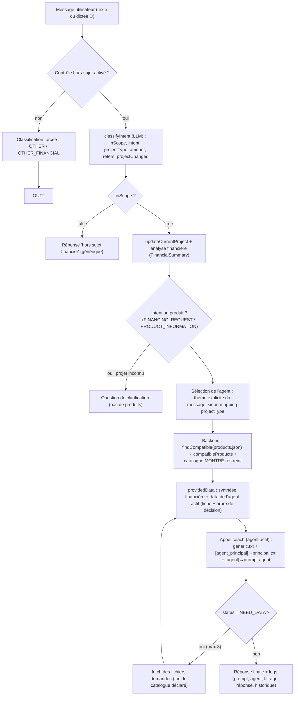
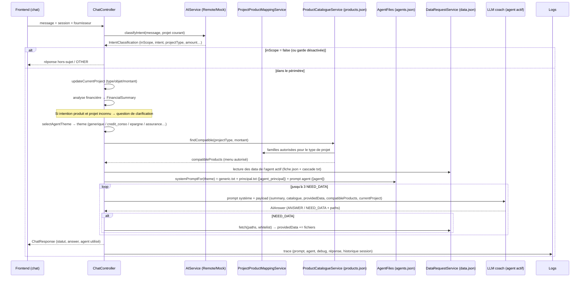
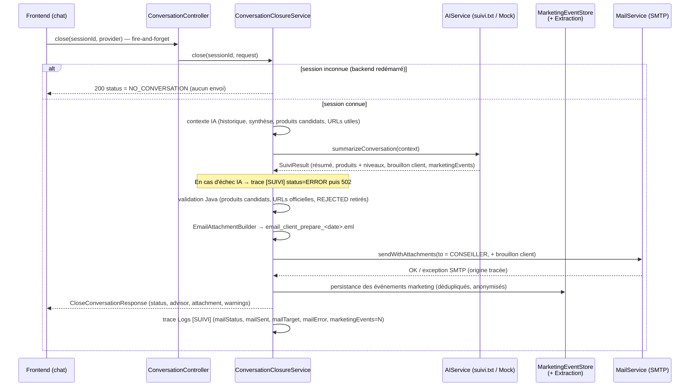
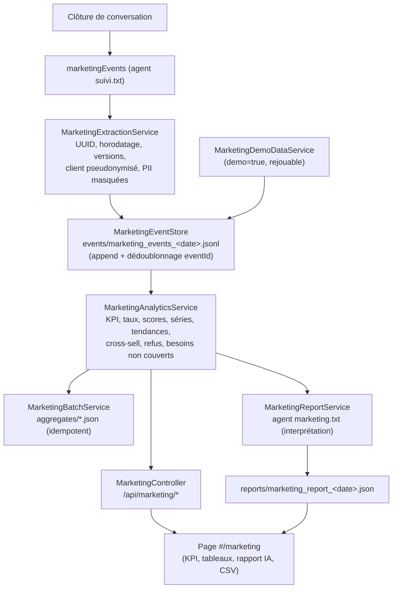
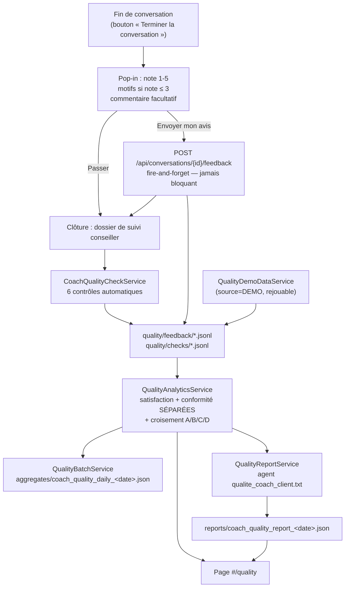
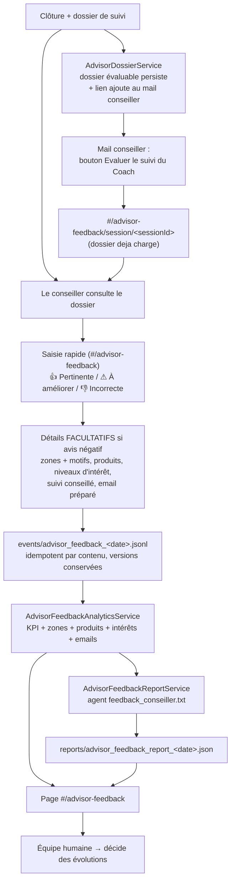
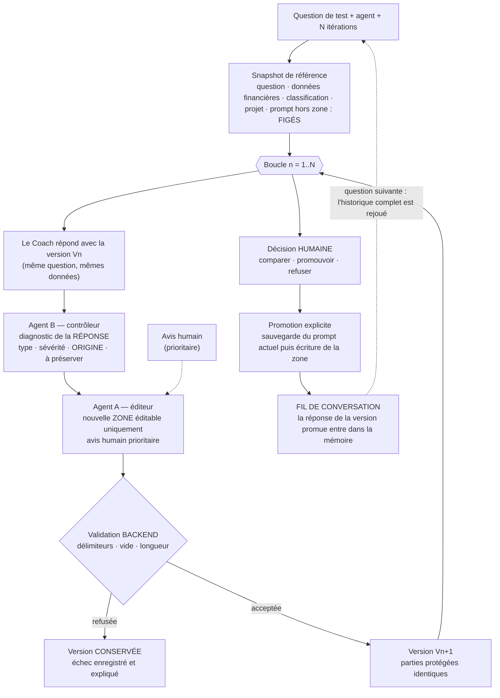

# Flux complet du coach financier (POC)

> Version : 2026-09-11 · Repose sur le modèle « agents spécialisés par thème » + filtrage métier Java,
> complété par la **fin de conversation (dossier de suivi conseiller)** et le **module Marketing Intelligence**.

## 1. Principe général : 3 couches

| Couche | Qui | Rôle |
|---|---|---|
| **Comprendre** | IA (LLM) : `classifyIntent` | périmètre, intention, type de projet, montant |
| **Décider** | Java : agents, mapping, `products.json`, `DataRequestService` | quel agent, quels produits possibles, quelles données fournir |
| **Expliquer / recommander** | IA (agent actif) | réponse pédagogique, choix final dans le périmètre autorisé |

Règle d'or : **le LLM comprend et explique, Java décide/filtre/calcule.**

---

## 2. Vue d'ensemble (schéma)



---

## 3. Séquence détaillée d'un échange (`POST /api/chat`)



---

## 4. Qui décide quoi (détail)

| Étape | Décision | Composant / fichier |
|---|---|---|
| Hors sujet | `inScope = false` si aucun lien financier | `classifieur.txt` (LLM) — repli `MockAIService` |
| Intention + type de projet | `intent`, `projectType`, montant, `refersToCurrentProject`, `projectChanged` | `classifyIntent` → `IntentClassification` |
| Projet courant | mise à jour de la session (remplacement si nouveau thème) | `ChatController.updateCurrentProject` |
| Besoin de produits | intention ∈ {FINANCING_REQUEST, PRODUCT_INFORMATION} | `requiresProducts` (Java) |
| Clarification | projet inconnu/confiance basse en demande produit | `ChatController` (pas de produits) |
| **Agent actif** | thème explicite du message (assurance, épargne, crédit immo…) sinon mapping `projectType → thème` | `selectAgentTheme` + `agents.json` |
| **Menu produits autorisé** | famille autorisée (par type de projet) + type autorisé + bornes montant | `ProjectProductMappingService` + `products.json` (`findCompatible`) |
| Restriction catalogue | catalogue MONTRÉ = hors `/catalogue` + fiches des familles autorisées ; tout fichier du catalogue est **fourni sur demande** | `CoachContextBuilder.isCatalogueEntryAllowed` / `catalogueDocFamilies` |
| **Données de l'agent** | fiches + arbres de décision injectés d'office | `AgentFiles` (`agent.data`) + `DataRequestService.readEntry` |
| Prompt système | `generic.txt` (gabarit) + `principal.txt` ([agent_principal]) + prompt de l'agent ([agent]) | `AgentFiles.systemPromptFor` |
| Choix de l'offre finale | l'agent choisit parmi le menu en appliquant les règles des fiches | LLM (fiches + cascade + compatibleProducts) |
| Calcul mensualité | annuité constante (taux mensuel actuariel `(1+TAEG/100)^(1/12)−1`) à partir de la **grille de taux** ; rien si tranche (montant, durée) absente, crédit renouvelable, ou TAEG > taux d'usure de la grille | `CreditRateGridService` + `CreditSimulationService` |
| Logs / historique | prompt, agent, debug `[AGENT]`, réponse, conversation | `AILogService`, `LogsController`, `ConversationController` |
| **Fin de conversation** | déclenchement (case suivi + ≥ 2 échanges), synthèse, validation produits/URLs, envoi au **seul** conseiller | `App.tsx` (bouton) → `ConversationClosureService` → `MailService` |
| **Statistiques marketing** | types d'événements extraits, agrégats, scores, tranches de montant | IA (`suivi.txt`) **propose** → Java (`MarketingExtractionService`, `MarketingAnalyticsService`) **calcule et stocke** |
| **Rapport marketing** | rédaction à partir des **agrégats déjà calculés** | agent analyste `marketing.txt` (`analyzeMarketing`) |
| **Feedback de satisfaction** | note 1 à 5, motifs, commentaire — TOUJOURS facultatif, jamais bloquant | pop-in `App.tsx`/`FeedbackPopup.tsx` → `QualityFeedbackService` |
| **Conformité du Coach** | contrôles automatiques exécutés à la clôture, indépendants du ressenti client | `CoachQualityCheckService` → `QualityCheckStore` |
| **Rapport qualité** | interprétation de la satisfaction ET de la conformité, tenues séparées | agent analyste `qualite_coach_client.txt` (`analyzeQuality`) |
| **Feedback conseiller** | évaluation de la PERTINENCE du travail produit (résumé, besoin, produits, intérêts, suivi, email) | IHM `#/advisor-feedback` → `AdvisorFeedbackService` |
| **Rapport feedback conseiller** | interprétation des KPI de pertinence + convergences produit × intérêt | agent analyste `feedback_conseiller.txt` (`analyzeAdvisorFeedback`) |

---

## 5. Les agents (prompts) et leurs données

`agents.json` déclare chaque agent : `{id, libelle, theme, prompt, data[]}`.
- **Générique** (theme `generic`) : questions factuelles, budget, dépenses… `data` = derniers mois de transactions.
- **Spécialisés** : Crédit conso, Crédit immo, Épargne, Assurance auto / habitation / emprunteur → `data` = fiche `catalogue/*.json` + arbre `cascade/*.txt` du thème.

**Gabarit `generic.txt`** (toujours chargé) :
```
[contenu commun coach]

[agent_principal]   ← remplacé par principal.txt (agent principal)
[agent]             ← remplacé par le prompt de l'agent spécialisé concerné (vide si générique)
```

Les prompts/agents sont éditables dans la page **Agents** (`#/agents`) et relus à chaque appel (sauvegarde immédiate).

Deux prompts **ne sont pas des agents de coach** (ils n'apparaissent donc pas dans `agents.json`, mais restent éditables sur la page **Agents**) :
- **`suivi.txt`** — agent de **fin de conversation** : produit le dossier de suivi conseiller (+ brouillon client + événements marketing). Appelé uniquement par `ConversationClosureService` (`AgentFiles.suiviSystemPrompt()`).
- **`marketing.txt`** — agent **analyste marketing** : rédige le rapport à partir des agrégats déjà calculés. Appelé uniquement par `MarketingReportService` (`AgentFiles.marketingSystemPrompt()`).
- **`qualite_coach_client.txt`** — agent **analyste qualité & satisfaction** : rédige le rapport qualité à partir des agrégats de satisfaction **et** de conformité. Appelé uniquement par `QualityReportService` (`AgentFiles.qualitySystemPrompt()`).
- **`feedback_conseiller.txt`** — agent **analyste Feedback Conseiller** : rédige le rapport de pertinence à partir des KPI calculés et des commentaires anonymisés de conseillers. Appelé uniquement par `AdvisorFeedbackReportService` (`AgentFiles.advisorFeedbackSystemPrompt()`).

---

## 6. Les deux catalogues produits (pourquoi deux fichiers ?)

| Fichier | Usage | Consommé par |
|---|---|---|
| `products.json` | **Catalogue machine** : id/name/family/min-max montant/durées/TAEG → sert au **filtrage Java** (`compatibleProducts`) | `ProductCatalogueService`, chargé au **démarrage** (redémarrer le backend après modification) |
| `catalogue/*.json` (fiches) + `cascade/*.txt` | **Connaissances** : offres détaillées, tarifs, règles d'éligibilité → servent à l'**IA** (recommandation/pédagogie) | agent actif (`providedData`) + catalogue data.json |

Ce n'est **pas un doublon** : `products.json` = « ce qui est présentable » (Java décide), les fiches = « que recommander et pourquoi » (IA choisit dans le menu). Les deux partagent les mêmes `id` pour rester alignés.

---

## 7. Fin de conversation et module Marketing

### 7.1 Principe commun : « l'IA prépare, Java décide et calcule »

Les deux dispositifs prolongent le même contrat que le chat : **l'IA comprend et rédige, Java filtre, valide et calcule, le conseiller humain reste décisionnaire**.

- **Fin de conversation** → un **seul** email automatique, au **conseiller**, avec le **brouillon client en pièce jointe** (jamais envoyé au client).
- **Marketing** → l'IA ne fait que **proposer des événements** et **interpréter des agrégats** ; tous les chiffres (KPI, taux, scores, tendances) sont calculés par le code, sur des fichiers (JSONL/JSON), **sans base de données**.

### 7.2 Clôture de conversation (`POST /api/conversations/{id}/close`)



Statuts possibles : `SENT`, `PREPARED` (dry-run `send=false`), `MAIL_UNAVAILABLE`, `SEND_FAILED`, `NO_CONVERSATION`. Le **client n'est jamais destinataire** ; le brouillon qui lui est destiné reste une **pièce jointe** du mail conseiller.

### 7.3 Chaîne Marketing (extraction → stockage → agrégats → interprétation)



Règles structurantes :
- **Le LLM ne calcule aucun chiffre** : il reçoit les agrégats sérialisés et renvoie une interprétation (`MarketingReport`).
- **Aucune donnée personnelle sur disque** : identifiant client = SHA-256 salé (`customer_hash_…`) et, dans les motifs, les emails et téléphones détectés sont remplacés par `[masqué]`.
- **Aucun SGBD** : JSONL (événements) + JSON (agrégats, rapports) ; Parquet écarté volontairement (POC).
- **API à la demande** vs **batch** : la page interroge l'API pour la période choisie ; le batch fige les mêmes agrégats en fichiers quotidiens (réexécutable sans doublon).
- **Traçabilité** : chaque génération de rapport mentionne le prompt utilisé (`promptVersion`, `model`, `aiGenerated`).

### 7.4 Chaîne Qualité & Satisfaction (satisfaction client × conformité du Coach)



Règles structurantes :

- **Séparation stricte** : la satisfaction vient du client, la conformité vient des contrôles. Une mauvaise note **ne crée jamais** d'anomalie ; une plainte ne devient une anomalie que si un contrôle la confirme.
- **Cas C (important)** : client insatisfait + Coach conforme → l'amélioration porte sur la **pédagogie** (expliquer la règle, mieux guider vers le simulateur officiel), **jamais** sur la suppression du garde-fou.
- **Cas D (prioritaire)** : client insatisfait + anomalie confirmée → traitement conjoint.
- **Aucune statistique inventée** : un indicateur non calculable reste `null`/vide ; un contrôle **non implémenté** est listé à part et n'apparaît jamais comme un « 0 ».
- **Anonymat** : identifiant client pseudonymisé, commentaires nettoyés (emails/téléphones masqués) avant stockage, affichage ou envoi à l'IA ; le commentaire reste une donnée **non fiable** (jamais une instruction).
- **Idempotence** : `feedbackId` déterministe + une seule réponse par conversation ; identifiants de contrôle déterministes ; batch réexécutable.
- **L'IA propose, l'humain décide** : le module ne modifie jamais le prompt, les règles métier, les catalogues ou le code.

### 7.5 Boucle Feedback Conseiller (le conseiller juge le travail du Coach)



Règles structurantes :

- **Un feedback positif ne demande rien d'autre** : l'évaluation globale suffit (quelques secondes).
- **Le lien d'évaluation est injecté par le backend dans le mail conseiller** (`[URL|Évaluer le suivi du Coach|…/#/advisor-feedback/session/<sessionId>]`), APRÈS la validation anti-invention d'URL ; l'URL ne contient **que** le `sessionId`. Un second lien, « Ouvrir le dossier du client » (`/#/centre-appels/<sessionId>`), ouvre **directement la pop-in du dossier** dans la page Centre d'appels (le conseiller y lit aussi la conversation ; le lien d'historique a été retiré du mail).
- **Idempotence + historique** : un double clic ne crée pas de doublon ; une révision crée une version suivante ; les agrégats ne comptent que la **version courante**.
- **Valeur IA conservée** : une correction de niveau d'intérêt stocke **les deux** valeurs (IA et conseiller).
- **Aucun produit inventé** : un produit « oublié » est choisi dans le **catalogue réel**.
- **Confidentialité** : conseiller identifié par un hash uniquement ; commentaires nettoyés et traités comme données **non fiables** (jamais exécutés comme instructions).
- **Aucune modification automatique** : le module produit des **recommandations** ; l'humain décide (pas d'auto-apprentissage, pas de changement de seuil).
- **Indépendance** : Qualité (client + règles) et Feedback Conseiller (pertinence métier) restent deux familles séparées, reliées par le seul `sessionId`.

---

## 8. Atelier d'amélioration itérative des prompts (Agents A, B et C)

### 8.1 Principe : rendre l'amélioration d'un prompt **prouvable**

Un prompt s'améliore d'habitude « au feeling » : on ne sait pas **quoi** a changé, ni si le gain vient du prompt ou d'une autre conversation.
L'atelier impose trois contraintes qui rendent l'expérience reproductible : **un contexte figé**, **une seule zone modifiable**, **une promotion humaine**.



Le **fil de conversation** est ce qui permet de tester un prompt sur un échange **qui continue** : la mémoire
n'accepte que les échanges **validés par une promotion** (une question sans version promue n'a pas de réponse
figée, elle n'est jamais rejouée), elle est **gelée dans le snapshot** de chaque cycle, et elle est fournie au
Coach, à l'Agent B et à l'Agent A. Contrat de jugement : l'Agent B **lit tout l'historique** mais **ne juge que
le dernier échange** (les réponses déjà validées ne sont jamais réévaluées).

**Agent C — le client simulé** : au lieu d'écrire chaque question, on décrit un **client** (brief) et l'IA **mène
la conversation** : elle pose la question, lit la réponse de la version promue (avec tout l'historique) et pose la
suivante — jusqu'à la **profondeur** choisie. Elle ne reçoit que le brief et **trois chiffres** (compte courant,
épargne, mensualité de crédit en cours) : elle ne conseille jamais et n'invente aucun chiffre. La boucle reste
celle du schéma ci-dessus, simplement **pilotée par le client** : `STOP` (arrêt gracieux du cycle en cours puis du
scénario) et `CONTINUER` (question suivante) restent à portée de main, et la **promotion** peut être **automatique
sur demande explicite** (case à cocher, décochée par défaut) — sinon c'est l'humain qui valide, comme ci-dessus.

**Bilan de conversation** : à la fin du scénario, le bouton *comparer le prompt initial et le prompt final* relit
les campagnes du fil — la version de référence du **premier** cycle face à la **dernière version promue** — et
renvoie un `ConversationComparison` (zones, prompts complets, diff, cycles/itérations/promotions). Comme les noms de
version sont **locaux au cycle**, le bilan décrit la **zone** (tailles) plutôt qu'un « V0 → V0 » trompeur ; lecture
pure, il n'écrit jamais rien.

### 8.2 Qui décide quoi

| Acteur | Fait | Ne fait pas |
|---|---|---|
| **Backend Java** | Fige le contexte, compose le prompt (`préfixe + zone + suffixe`), valide chaque proposition, persiste tout, applique la promotion | N'invente aucune amélioration |
| **Agent B** (contrôleur) | Diagnostique la réponse du Coach **du dernier échange** : points à améliorer, sévérité, **origine** (prompt / données / règle backend / variabilité du modèle), comportements à préserver — en lisant tout l'historique pour comprendre le contexte | Ne réécrit rien, ne juge pas le métier, ne réévalue jamais une réponse déjà validée |
| **Agent A** (éditeur) | Réécrit **la seule zone éditable** en suivant un ordre d'autorité (règles → parties protégées → décision humaine → avis humain → Agent B → lui-même) | Ne touche ni au reste du prompt, ni aux règles, ni au code |
| **Agent C** (client simulé) | Joue le client : pose la question suivante à partir du brief, des **trois chiffres** du dossier et de la conversation ; peut clore le scénario | Ne conseille jamais, ne cite aucun chiffre hors des trois, ne révèle jamais qu'il est une IA, ne dépasse jamais la profondeur (borne tenue par l'IHM) |
| **Humain** | Donne un avis prioritaire, arrête/reprend, retient une version, **promouvoit** et enchaîne les questions (la conversation de l'atelier) — ou laisse l'**Agent C** mener la conversation, avec promotion automatique s'il le demande | — |

### 8.3 Les trois garanties

1. **Reproductibilité** : toutes les itérations utilisent la même question, les mêmes données, la même classification d'intention et le même projet ; seule la zone éditable change. `STOP` n'interrompt jamais un appel en cours : la réponse est enregistrée puis la campagne passe en pause, et une reprise continue le cycle.
2. **Sécurité du prompt** : la zone est délimitée (`[[[` … `]]]`) et **jamais** envoyée telle quelle au LLM ; toute proposition qui sort de la zone, contient un délimiteur, est vide ou trop longue est **rejetée** et la version précédente est conservée. Les deux agents de l'atelier eux-mêmes **ne sont pas** optimisables.
3. **Souveraineté humaine** : le passage en production est **confirmé dans l'IHM** par défaut et le prompt précédent est **sauvegardé** (retour arrière). La **promotion automatique** n'existe que si l'utilisateur la demande **explicitement** (case à cocher du mode Agent C, décochée par défaut) : c'est toujours lui qui décide qui promeut. L'atelier ne modifie **qu'un texte de prompt** — ni règle métier, ni seuil, ni catalogue, ni code.

