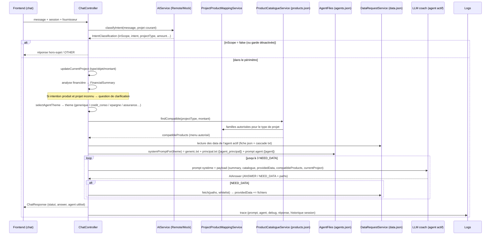

# Flux complet du coach financier (POC)

> Version : 2026-09-08 · Repose sur le modèle « agents spécialisés par thème » + filtrage métier Java.

## 1. Principe général : 3 couches

| Couche | Qui | Rôle |
|---|---|---|
| **Comprendre** | IA (LLM) : `classifyIntent` | périmètre, intention, type de projet, montant |
| **Décider** | Java : agents, mapping, `products.json`, `DataRequestService` | quel agent, quels produits possibles, quelles données fournir |
| **Expliquer / recommander** | IA (agent actif) | réponse pédagogique, choix final dans le périmètre autorisé |

Règle d'or : **le LLM comprend et explique, Java décide/filtre/calcule.**

---

## 2. Vue d'ensemble (schéma)


---

## 3. Séquence détaillée d'un échange (`POST /api/chat`)



---

## 4. Qui décide quoi (détail)

| Étape | Décision | Composant / fichier |
|---|---|---|
| Hors sujet | `inScope = false` si aucun lien financier | `classifieur.txt` (LLM) — repli `MockAIService` |
| Intention + type de projet | `intent`, `projectType`, montant, `refersToCurrentProject`, `projectChanged` | `classifyIntent` → `IntentClassification` |
| Projet courant | mise à jour de la session (remplacement si nouveau thème) | `ChatController.updateCurrentProject` |
| Besoin de produits | intention ∈ {FINANCING_REQUEST, PRODUCT_INFORMATION} | `requiresProducts` (Java) |
| Clarification | projet inconnu/confiance basse en demande produit | `ChatController` (pas de produits) |
| **Agent actif** | thème explicite du message (assurance, épargne, crédit immo…) sinon mapping `projectType → thème` | `selectAgentTheme` + `agents.json` |
| **Menu produits autorisé** | famille autorisée (par type de projet) + type autorisé + bornes montant | `ProjectProductMappingService` + `products.json` (`findCompatible`) |
| Restriction catalogue | fichiers visibles = hors `/catalogue` + fiches des familles autorisées | `ChatController.isCatalogueEntryAllowed` / `catalogueDocFamilies` |
| **Données de l'agent** | fiches + arbres de décision injectés d'office | `AgentFiles` (`agent.data`) + `DataRequestService.readEntry` |
| Prompt système | `generic.txt` (gabarit) + `principal.txt` ([agent_principal]) + prompt de l'agent ([agent]) | `AgentFiles.systemPromptFor` |
| Choix de l'offre finale | l'agent choisit parmi le menu en appliquant les règles des fiches | LLM (fiches + cascade + compatibleProducts) |
| Calcul mensualité | annuité constante si montant+durée+TAEG connus (sinon rien) | `CreditSimulationService` |
| Logs / historique | prompt, agent, debug `[AGENT]`, réponse, conversation | `AILogService`, `LogsController`, `ConversationController` |

---

## 5. Les agents (prompts) et leurs données

`agents.json` déclare chaque agent : `{id, libelle, theme, prompt, data[]}`.
- **Générique** (theme `generic`) : questions factuelles, budget, dépenses… `data` = derniers mois de transactions.
- **Spécialisés** : Crédit conso, Crédit immo, Épargne, Assurance auto / habitation / emprunteur → `data` = fiche `catalogue/*.json` + arbre `cascade/*.txt` du thème.

**Gabarit `generic.txt`** (toujours chargé) :
```
[contenu commun coach]

[agent_principal]   ← remplacé par principal.txt (agent principal)
[agent]             ← remplacé par le prompt de l'agent spécialisé concerné (vide si générique)
```

Les prompts/agents sont éditables dans la page **Agents** (`#/agents`) et relus à chaque appel (sauvegarde immédiate).

---

## 6. Les deux catalogues produits (pourquoi deux fichiers ?)

| Fichier | Usage | Consommé par |
|---|---|---|
| `products.json` | **Catalogue machine** : id/name/family/min-max montant/durées/TAEG → sert au **filtrage Java** (`compatibleProducts`) | `ProductCatalogueService`, chargé au **démarrage** (redémarrer le backend après modification) |
| `catalogue/*.json` (fiches) + `cascade/*.txt` | **Connaissances** : offres détaillées, tarifs, règles d'éligibilité → servent à l'**IA** (recommandation/pédagogie) | agent actif (`providedData`) + catalogue data.json |

Ce n'est **pas un doublon** : `products.json` = « ce qui est présentable » (Java décide), les fiches = « que recommander et pourquoi » (IA choisit dans le menu). Les deux partagent les mêmes `id` pour rester alignés.
